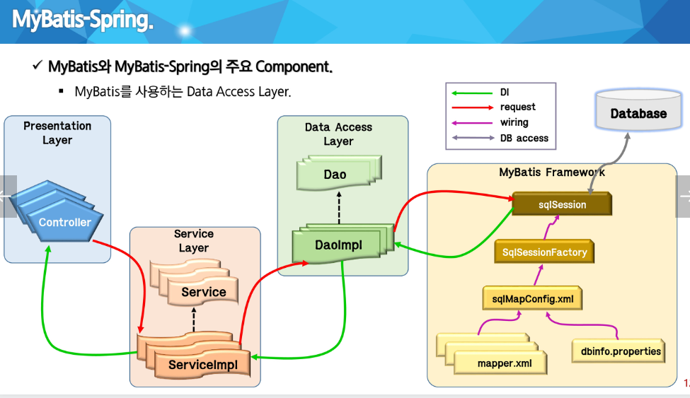
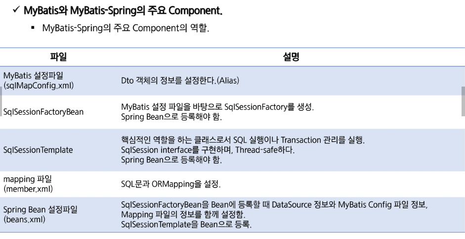

# 0425 유라 myBatis

DAO와 DB사이의 MyBatis Framework

Spring이 SqlSessionFactoryBean 객체를 만듬,

이 빈 객체에 의해 SqlSessionFactory를 만들고,

SqlSessionTemplate의 생성자에 전달, SqlSession을 구현, 실행한다.

- 커넥션 풀 개념 재정립.
- JNDI
- java:comp/env

톰캣을 읽으면 Server.xml → (META-INF) → 하단부에 context → web.xml

톰캣이 가지고 있는 특정 폴더에 DataSource 연결

DB에 연결할 일이 생겼을 때 직접 DB로 가는게 아니라,

특정 폴더에 접근하여 가지고 와서 쓰고 반납한다 = 커넥션 풀링

META-INF아래에 context.xml에서 root-context.xml

- transactinManager
- <tx:annotation-driven>
- @Transactional 어노테이션을 붙여서, 커밋 관리를 하는 매니저 객체가 있다는 것을 알려주자.

Interceptor → board4 버전으로 복습
