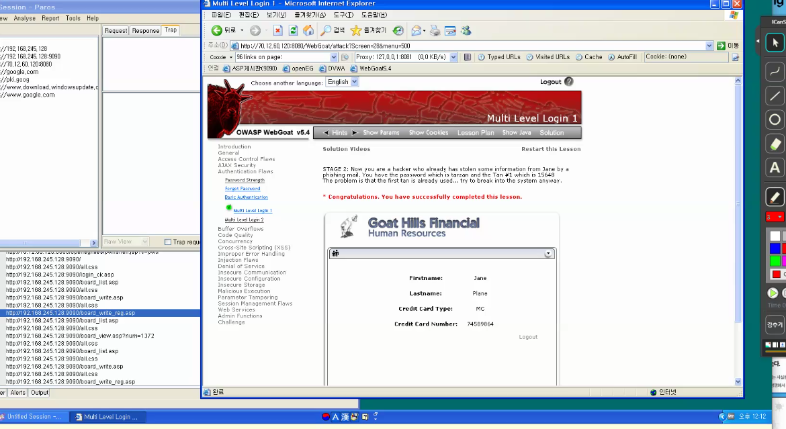
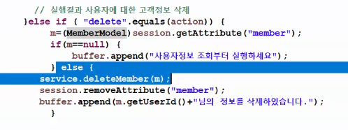
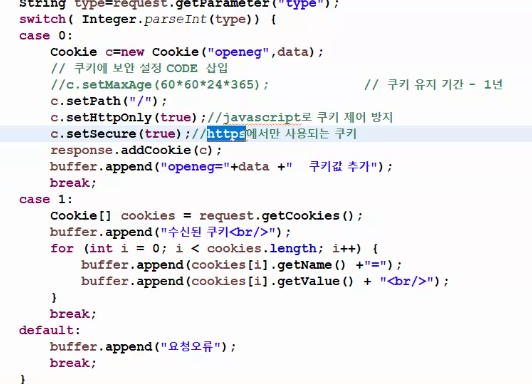
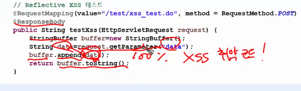
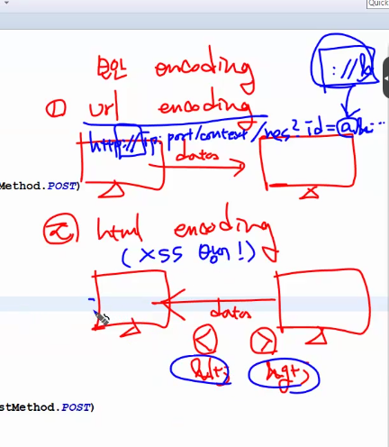
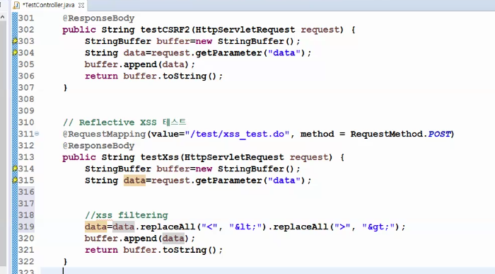
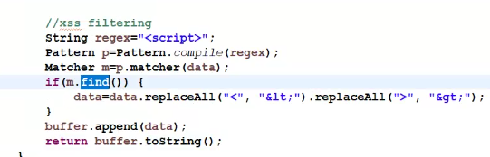
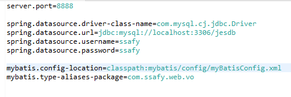

# 0426 담온

URL 요청 방식은 전부 GET 방식

- SecureCoding
    - 질문도 어려워고 찾기도 어려워야 한다. 역이용할 수 있기 때문에..

- two face 인증~ 쭉 ….
    - 인증 왔다갔다 하는 경우에서 스니핑을 당했다고 하자
        - (tan1을 아는 상황이라고 생각)
    - 인증이 tan1, tan2, tan3…. 을 순차적으로 요구한다고 가정.
    - tan2를 요구하더라도 tan2를 tan1로 바꿀 수 있는 상황이 있다.
    - 그래서, 내가 tan2를 지금 요구하는 상황이라는 것을 알아야 한다.

세션 id 탈취는 시간 만료가 되면 없어지기 때문에 .. 상대적으로 탈취에 안전

auth

identification : 구별하자. A. B, C를

authentication : 이사람이 A,B,C,인지 확인하자.

authenticator : 이 사람이 권한이 있는가?

application scope을 확인용도로 미리 저장해두는 것이 적합할까?

- 일단 application scope는 전역이기 때문에 모든 클라이언트가 볼 수 있어서 위험하다.
- 해싱?

저 박스 사이에, 해당 객체가 Delete 권한을 가진 사람인지 확인하는 작업이 필요한 것.

<aside>
💡

Application scope에 저장된 사용자 정보를 해싱하는 것은 보안 강화를 위한 좋은 방법 중 하나입니다. 해싱을 적용하면, 암호화된 사용자 정보를 저장할 수 있으므로, 데이터 유출 시 사용자 정보를 보호할 수 있습니다.

로그인 등의 서비스에서는 일반적으로 사용자가 입력한 비밀번호를 해싱한 후, 데이터베이스에 저장된 해시값과 비교하여 사용자의 신원을 확인합니다. 이를 통해, 로그인 시 사용자가 올바른 비밀번호를 입력했는지를 확인할 수 있습니다.

하지만, 이 방법은 여전히 해시값을 탈취당하면 보안이 약해지는 위험이 있습니다. 따라서, 가능하면 추가적인 보안 조치가 필요합니다. 예를 들어, salt를 추가하여 해시값을 보호하거나, 두 개 이상의 해시 함수를 사용하여 보안을 강화할 수 있습니다.

또한, 로그인 시 사용자의 신원을 확인하는 것 외에도, 추가적인 보안 기능을 구현할 수 있습니다. 예를 들어, 2단계 인증, IP 주소 기반 접근 제어, 블랙리스트/화이트리스트 등을 활용하여 보안을 강화할 수 있습니다.

</aside>

- XSS 공격
    - Escape 처리
    - Content Security Policy
    - HTML Encoding으로 방어 = **`입력값 필터링`**
    
    <aside>
    💡
    
    XSS(Cross-Site Scripting) 공격은 악의적인 공격자가 웹 페이지에 스크립트 코드를 삽입하여, 다른 사용자들이 해당 페이지를 열람할 때 스크립트가 실행되어 악의적인 행위를 수행하도록 하는 공격입니다.
    
    XSS 공격은 주로 웹 어플리케이션에서 발생하며, 일반적으로 아래와 같은 방법으로 이루어집니다.
    
    1. Reflected XSS
    - 사용자로부터 입력받은 값을 서버에서 검증하지 않고, 응답 데이터에 그대로 출력하는 경우 발생합니다.
    - 악의적인 사용자가 스크립트 코드를 입력하여, 그 결과 해당 페이지를 열람하는 다른 사용자들의 브라우저에서 실행되도록 만듭니다.
    1. Stored XSS
    - 악의적인 사용자가 서버에 스크립트 코드를 저장하여, 해당 페이지를 열람하는 모든 사용자들이 실행되도록 만드는 공격입니다.
    - 주로 게시판, 블로그, 채팅 등에서 발생합니다.
    1. DOM-based XSS
    - 웹 페이지의 JavaScript 코드에서 발생하는 XSS 공격입니다.
    - 클라이언트 측에서 스크립트를 실행하는 것으로, 서버와의 통신 없이 이루어집니다.
    
    XSS 공격의 결과로는, 쿠키 정보, 세션 ID, 브라우저 내의 캐시, 민감한 정보 등이 탈취될 수 있습니다. 따라서, XSS 공격을 방지하기 위해서는, 사용자 입력값의 검증, Escape 처리, 쿠키 설정 등의 방법을 활용하여 보안을 강화할 필요가 있습니다.
    
    </aside>
    

- 쿠키 세팅 확인 (Http에서만 사용할 수 있게 하고, https에서만 사용되는 쿠기 등..)

- 데이터를 받아서 바로 담으면 100% XSS 취약 코드
- 그래서 xss filering에 대한 코드 추가가 필요

- url encoding
    - 브라우저에서 자체 지원
- html encoding
    - “<”을 텍스트 형태로 변환 = “&lt” —> 이러한 식으로 진행

- find를 matches로 하는 경우 제대로 동작 x,
    - matches는 완벽히 맞아야 수행함
    - 그러나 위의 코드도 url encode시 문제가 있음

- base64 encoding (양방향)

## XSS 방어 대책 없다. 무궁무진하다.

# SpringBoot 게시판

