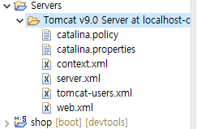
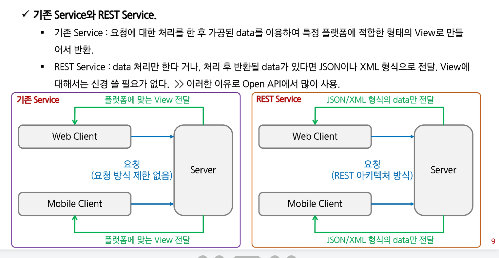
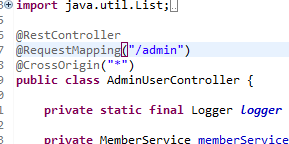

# 0426 유라



여기에 있는건 ‘내거’라 생각하고 아무렇게 수정해봐도 원본에 영향 미치지 않음

export war = web archive file

해당 archive file을 apache tomcat의 webapps 아래에다 넣어두고,

startup.bat을 실행하여 서버를 실행하면 war파일이 압축이 풀림.

archive file의 이름을 [localhost:8080/](http://localhost:8080/)붙여넣기

하면 실제로 프로젝트가 열림

# REST API

[https://gmlwjd9405.github.io/2018/09/21/rest-and-restful.html](https://gmlwjd9405.github.io/2018/09/21/rest-and-restful.html)

[https://thalals.tistory.com/335](https://thalals.tistory.com/335)

- Representational State Transfer API
- OPEN API : 프로그래밍에서 사용할 수 있는 개방되어 있는 상태의 interface
- OPEN API와 함께 거론되는 기술이 REST
- 요청이 HTTP를 통해 관리되는 클라이언트-서버 아키텍처
- **`statelss` :** GET 요청 간에 클라이언트 정보가 저장되지 않음
- **`근데 이거 절대 표준이 아님`**

- **`하나의 URI는 하나의 고유한 리소스(Resource)를 대표하도록 설계된다`**는 개념에 전송 방식을 결합해서 원하는 작업을 지정
- URI에 자원을 명시하고, HTTP Method**`(POST,GET,PUT,DELETE)`**를 통해 해당 자원을 제어하는 명령을 내리는 방식의 아키텍처

- Rest 구성
    - 자원(Resource) - URI
    - 행위(Verb) - HTTP Method
    - 표현(Resprescentations) : json, xml과 같은 여러가지 언어로 표현

- 서버는 요청으로 받은 리소스에 대해 순수한 데이터를 전송
- 기존의 **`GET/POST 외에 PUT, DELETE 방식`**을 사용하여 리소스에 대한 CRUD 처리
- 자원을 표현할 때 Collection(문서, 객체의 집합)과 Document(하나의 문서, 객체) 사용.



- REST 관련 Annotation
    - RestController : Controller가 REST 방식을 처리하기 위한 것임을 명시
    - ResponseBody : JSP 같은 뷰로 전달되는 것이 아니라 데이터 자체를 전달
    - PathVariable : URL 경로에 있는 값을 파라미터로 추출
    
- ResponseEntity<?>

```java
@GetMapping(value = "/user")
	public ResponseEntity<?> userList() {
		logger.debug("userList call");
		try {
			List<MemberDto> list = memberService.listMember(null);
			if(list != null && !list.isEmpty()) {
				return new ResponseEntity<List<MemberDto>>(list, HttpStatus.OK);
//				return new ResponseEntity<List<MemberDto>>(HttpStatus.NOT_FOUND);
			} else {
				return new ResponseEntity<Void>(HttpStatus.NO_CONTENT);
			}
		} catch (Exception e) {
			return exceptionHandling(e);
		}
		
	}
```



- CrossOrigin
