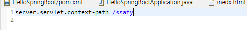

# 0427 유라

# SpringBoot

- project에 따라 사용되는 library들이 미리 조합
- 복잡한 설정을 자동으로 처리
- 내장 서버 포함 : WAS를 추가로 설치하지 않아도 개발 가능
- WAS에 배포하지 않고도 실행할 수 있는 JAR 파일로 Web Application 개발 가능
- xml 배제
- application.properties에 다 정리

- Spring Legacy Project : war파일
- SpringBoot : jar파일,

[localhost:8080/ssafy](http://localhost:8080/ssafyㄹ)로 해야 넘어가는 것.

#server.port=80

localhost만 쳐도 간다.

SpringBoot로 만든다는 거는

Restful로 만들어서 api로만 사용한다.
