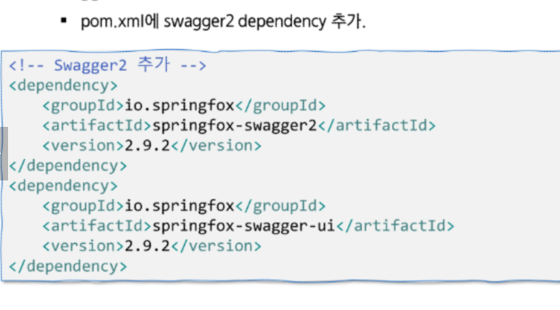

# 0501 유라 Swagger

# Swagger

- 개발 상황의 변화에 따른 API의 추가 또는 변경할 때마다 문서에 적용하는 불편함
- 프로젝트의 API 목록을 웹에서 확인 및 **테스트** 할 수 있게 해주는 library
- Controller에 정의되어 있는 모든 URL을 바로 확인할 수 있다.
    
    
    
- SpringFox가 더 많이 사용되고 있어서 사용한다

- Docket
