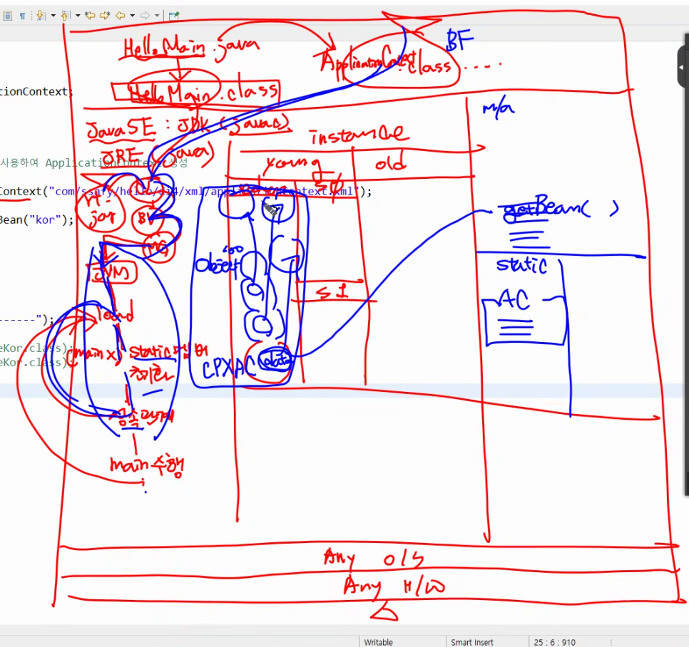
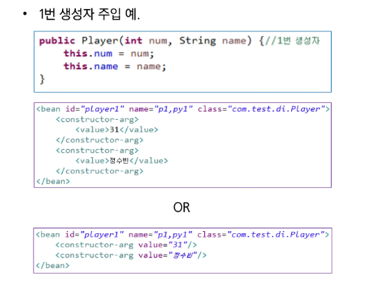
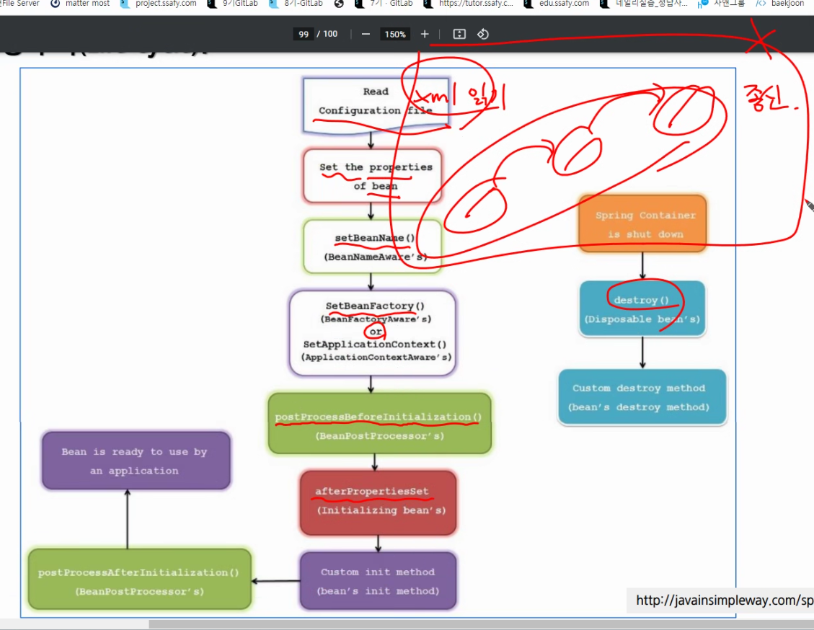

# Spring 0417 담온

- Java Bean
    - 변수 - setter / getter
    - default 생성자
    - implements Serializable

- Web Context : 어플리케이션
    - 조금 더 구체적인 의미.

- Web Container : 톰캣
    - 더 넓은 범위인데..
    
    
    
    - XMLParser, Handler 등….
    
    - Hot Deploy ( 알아보자 )
    
    - Annotation은 xml에 bean을 계속 추가할 때를 생각하면 자연스럽게 이해
        - 무진장 많아진다는 거다
    
    - Tomcat 사용시 Spring이 Servlet으로 전부 변환되서 넣어진다
        - 결국 JVM이 더 많은 일을 하게 되는 것…
        
    - Service = DAO를 사용해야 하는데 이 때
        - @Autowired : 알아서 찾아준다
            - 여러 개가 있을 때는? 이름을 명시해주어야지.
            - ambigious error
            

- 스프링 빈 의존관계 설정 - xml
    - <Constructor-arg>
        
        
        
    - argument list 찾아가고, 변환될 수 있는지 확인하여 알아서 간다
    - xml 파일을 읽을 때 이미 객체가 생성된다
        - 수명은 컨테이너에게 맡기는거다
    
    - Session Bean, Entity Bean
        - 
    
    
    
    - xml file read
    - set properties
    - set bean name
    - set bean factory
    - 생성되면 컨테이너에 객체의 수명을 맡기고 종신토록 서비스
    - 컨테이너가 없어졌을 때 같이 없어진다.
