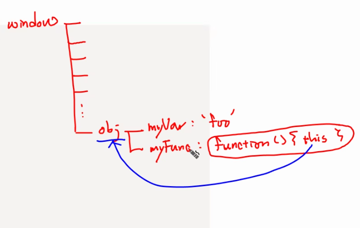
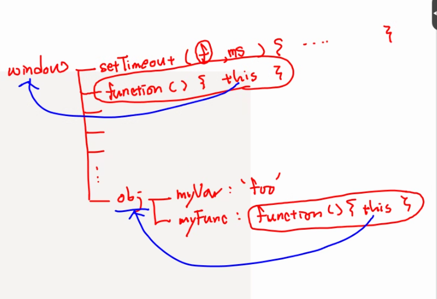
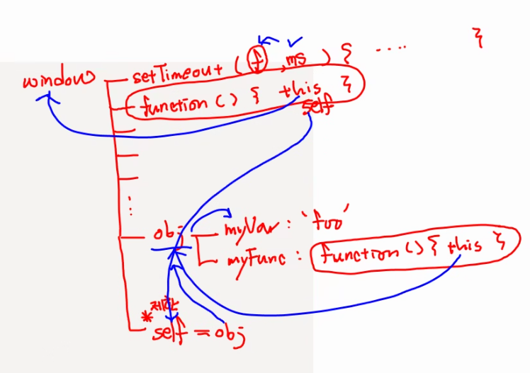
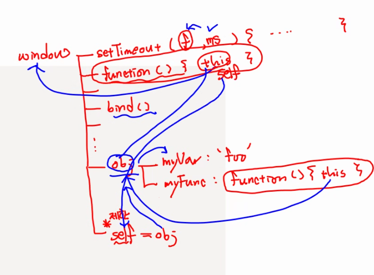
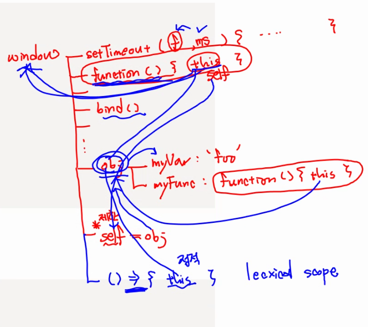
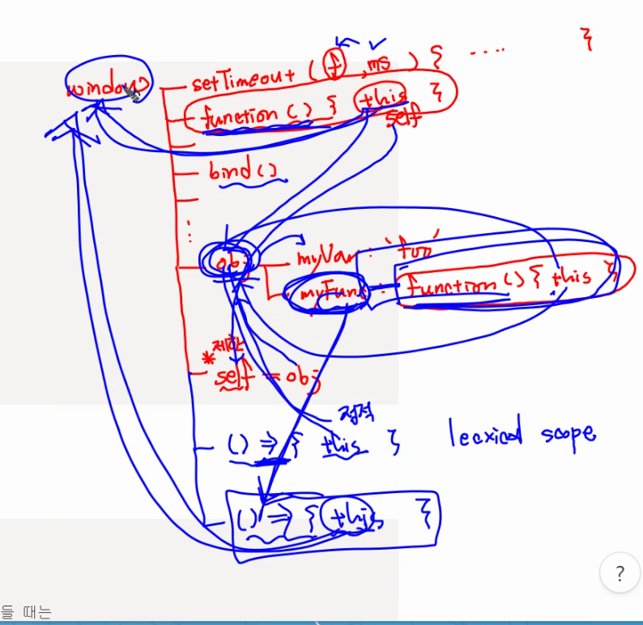

# 0503 js

```jsx
const ssafy = {
  area:"서울",
	class:10
}

ssafy.area ="대전"; 
// 위는 오류가 나지 않음. 참고

//아래는 const로 설정된 ssafy를 바꾸는 것이기 때문에 오류가 나고
ssafy = {
	area:"대전",
	class:5
}
```

```jsx
var i = 10;
for (var i=0; i<5; i++) {
	console.log(i);
}
console.log(i)

// 0 1 2 3 4 5가 찍힌다.
// var -> let으로 변경해야 0 1 2 3 4 10

// 가능하면 var보다 let을 쓰는게 좋다

```

## Concise method

```jsx
const id = "ss";
const name ="안효인";
const age =32;
const user = {
	id : id,
	name : name,
	age : age,
	info:function() {
		console.log(this.name + "(" + this.id + ") 나이 : " + this.age)
	}
}

//this는 상위로 'user'가 된다.

//아래는 ES6 적용 이후 간단 문법

const id = "ss";
const name ="안효인";
const age =32;
const user = {
	id,
	name,
	age,
		info() {
		console.log(this.name + "(" + this.id + ") 나이 : " + this.age)
	}
}
```

## DestructuringAssignment(구조 분해 할당)

```jsx

// ES6 이전 배열
const areas = ["서울", "대전", "구미", "광주", "부울경"]
{
	const a1 = areas[0];
	const a2 = areas[1];
	const a3 = areas[2];
	const a4 = areas[3];
	const a5 = areas[4];
}

//ES6 이후
{
	const[a1,a2,a3,a4,a5] = areas;
}

//객체
const user = {
	id: "ssafy",
	name : "안효인",
	age : 32
}

//ES6 이전
{
	let id = user.id;
	let name = user.name;
	let age = user.age;
	console.log(id,name,age)
}

//ES6 이후
//1. 객체의 property와 변수명이 같을 경우
{
	let {id,name,age} = user;
}

//2. 변수명을 객체의 property명과 다르게 만들 경우.
{
	let {id : userid,name : username,age : userage} = user;
	console.log(userid, username, userage)
}

function showUser1(user) {
	console.log("showUser1 call")
	let id = user.id;
	let name = user.name;
	let age = user.age;
	let age10 = age + 10;
	console.log(name + "님 10년 후 나이 : " + age10);
}

showUser1(user);

function showUser2({id,name,age}) {
	console.log("showUser2 cal");
	let age10 = age + 10;
	console.log(name + "님 10년 후 나이 : " + age10);
}
 
showUser2(user);
```

## Spread Syntax(전개 구문)

- Spread operator는 반복 가능한 객체에 적용할 수 있는 문법
- 배열이나 문자열 등을 풀어서 요소 하나 하나로 전개시킬 수 있다.

```jsx
const user1 = {id:"ssafy1"}
const user2 = {id:"ssafy2"}
const arr = [user1, user2];
console.log(arr)

const copyArr = [...arr];

// ...arr = arr라는 배열을 펼쳐서 copyArr에 집어넣겠다.
// copyArr = [...arr, {id: "ssafy9"}] 도 가ㅡㄴㅇ하다

let team1 = ["서울", "대전"];
let team2 = ["구미","광주"];

let team1 = [...team1, ...team2]
// 합쳐진다.

const num = [1,3,5,7]

function (a,b,c) {
	console.log (a+b+c);
}

 
```

## Default Parameter

```jsx
function print1(msg) {
	console.log(msg)
}

print1() // undefined

function print2(msg ="안녕 싸피") // 안녕 싸피가 Default
// Default parameter는 함수에 전달된 파라미터가 undefined거나 전달되지 않았을 경우
// null은 default 적용 아님!!!!!!!
```

```jsx
function func1() {
	return 100;
}

const func2 = () => {return 100};

const func4 = x => {return x + 200} ;

const func6 = (x, y) => {return x + y + 200};

let func8 = () => ({id:"ssafy9", name: "안효인"})
```

1.



2.



3.

self는 특별하게 취급된다.



4.



5.

화살표 함수 : 문맥 상 코드에 있는 내용으로 미리 묶여져 있습니다 = 정적 바인딩.



6.

function 객체가 아니라 

화살표 함수의 경우의 this




