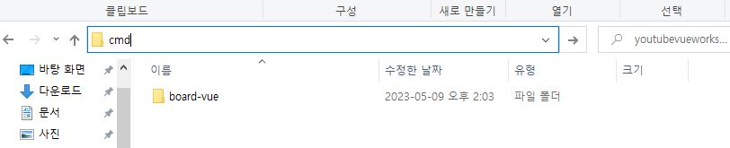
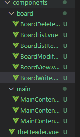
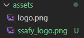
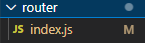
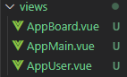
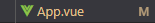
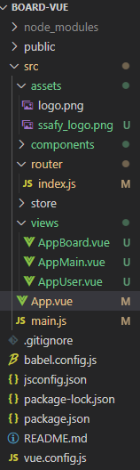
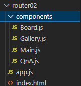
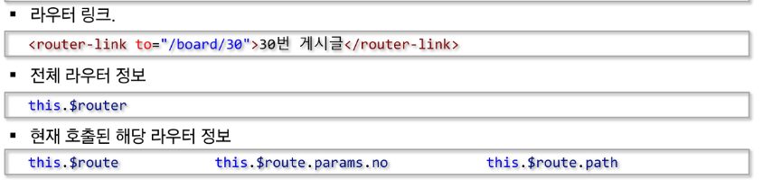
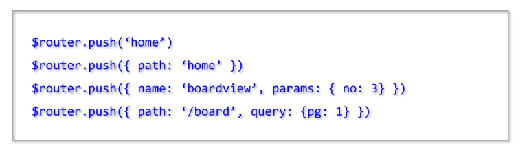

# 0509 vue.js 게시판

- 프로젝트 만들기
    - 저장하고 싶은 임의의 공간에 폴더를 하나 생성 후
    - 해당 창에서 cmd를 열기
    
    
    
    이후 **`열려진 cmd 창에서`** 아래와 같은 명령어를 순서대로 실행
    
    1. vue create <project-name>
    2. Manually select features
    3. Babel, Router, Vuex, Linter / Formatter 
        - 사용할 것들에 대한 설정, 본인이 추가로 사용하고자 하는 것을 더 설정해도 상관없다.
        
        ```
        Babel: es6이상, TypeScript로 개발 시 브라우저 버전에 상관없이 자동 전환해주는 기능
        TypeScript: TypeScript 개발시 지원해주는 기능
        Progressive Web App (PWA) Support: Web App 개발을 지원해주는 기능
        Router: Vue Router를 위한 기능
        Vuex: Vue에서 상태관리를 위한 기능
        CSS Pre-processors: CSS 작성을 위한 CSS 전 처리 기능
        Linter / Formatter: JavaScript codding Convention
        Unit Testing: 단위 테스트
        E2E Testing: end to end Testing, 통합 테스트
        ```
        
    4. 버전 2.x 선택
    5. 라우터 선택 모드(history) - Y
        
        ```
        history mode란 ? 
        - 페이지를 다시 로드하지 않고 URL을 탐색할 수 있습니다.
        
        hash mode란 ? 
        - Hash mode는 URL을 Hash(#) 형태로 서비스 합니다. 이는 URL이 변경될 때 페이지가 다시 로드되지 않습니다.
        ```
        
    6. ESLint with error prevention only
    7. Lint on save 
    8. In package.json

- 프로젝트 실행
    
    [board-vue(design)_배포.zip](board-vue(design)_%25EB%25B0%25B0%25ED%258F%25AC.zip)
    
    **`배포받은 파일`** board-vue(design)에서 
    
    assets, views, components 복사 붙여넣기
    
    1. cd 프로젝트명 (만든 프로젝트 명)
        1. 이 상태에서 **`code . 하면 VS에서 해당 폴더가 열림`**
    2. npm run serve
    3. 브라우저 : localhost:8080로 성공 확인
    

- 게시판 구조
    
    **`아래에 있는 모든 파일은 src 아래에 위치`**
    
    - 전체 화면의 단위를 뷰로 만들자
    - 전체 화면의 **`특정 부분이 바뀌는 것은 컴포넌트`**로 만들자
    1.  components
    
    
    
    1. 이미지 파일
    
    
    
    1. router 
    
    
    
    1. views 파일
    
    
    
    1. main.js 
    
    1. App.vue
    
    
    
    1. 최종 구조
    
    
    

- main.js에서 App.vue에서 사용할 것을 mount할 것임. 제일 처음 시작
    
    ```jsx
    import Vue from 'vue'
    import App from './App.vue'
    //import router from './router'
    import store from './store'
    
    // 제일 처음에 시작하는 포인트
    
    Vue.config.productionTip = false
    
    new Vue({
      //router,
      store,
      render: h => h(App) // App이라는 애를 렌더링해서 불러오면
    }).$mount('#app') // id가 app인 친구를 마운트
    ```
    
- 마운트가 완료되면 컴포넌트는 화면에 나타나고, 데이터의 변경에 따라 반응적으로 업데이트

- App.vue를 이용해서 원하는 페이지를 띄우게 만들 것임.
    - 이를 위해 띄우고자 하는 것을  **`불 - 등 - 보`**의 과정을 App.vue에 설정
        - 불러오기, 등록하기, 보여주기
    
    ```html
    <!-- 상단에 있는 header가 보여야 하고, template에는 board에 관한 내용-->
    <!-- 불러오기-> 등록하기 -> 보여주기 -->
    <!-- 
    -->
    <template>
      <div id="app"> <!-- main.js의 #app과 마운트 -->
      <!-- 3. 등록한거 보여주기 -->
        <the-header></the-header>
        <app-board></app-board>
      </div>
    </template>
    
    <script>
    
    // 1. App.vue에서는 헤더와 Board가 보여야 된다 == script에 import(불러오기)
    import TheHeader from "./components/TheHeader.vue";
    import AppBoard from "./views/AppBoard.vue";
    
    export default {
    
      // 2. components에 불러온 것들 등록한다
      components: {
        TheHeader,
        AppBoard
      }
    };
    </script>
    
    <style>
    #app {
      font-family: Avenir, Helvetica, Arial, sans-serif;
      -webkit-font-smoothing: antialiased;
      -moz-osx-font-smoothing: grayscale;
      text-align: center;
      color: #2c3e50;
    }
    
    a {
      text-decoration: none;
    }
    </style>
    ```
    

- TheHeader.vue에 해당하는 코드는 단순 상단 화면임
    
    ```jsx
    <template>
      <div class="header">
        
        <!-- @ : root(src)를 기준으로 잡는다. -->
        <div><a href="">로그인</a> | <a href="">게시판</a></div>
      </div>
    </template>
    
    <script>
    export default {
      name: "TheHeader",
    };
    </script>
    
    <style scope>
    img {
      width: 150px;
    }
    
    .header {
      padding: 30px;
      text-align: center;
      box-shadow: 0px 1px 10px rgba(159, 157, 157, 0.3);
    }
    
    a {
      font-weight: bold;
      color: #2c3e50;
    }
    
    a:hover {
      color: #42b983;
    }
    </style>
    ```
    

- App.vue에서 등록한 AppBoard를 확인하기 위해 AppBoard.vue로 이동
- AppBoard.vue는 view에 속하고 이 view 안에 Component로 BoardList를 집어넣어줘야 하는 상황
    - 그러면 여기서 Component인 BoardList를 똑같이 **`불 - 등 - 보`** 한다
    
    ```html
    <!-- AppBoard는 Board를 띄워주는 곳인데 
    board아래 BoardList가 내용을 가지고 있음-->
    <template>
      <div>
        <h2>Vue를 이용한 게시판</h2>
        <!-- 즉 여기에 List를 보여줘야 함, 그러면 BoardList 불러와야한다.-->
        <board-list></board-list> <!--3. board-list 보여주기 -->
        <board-write></board-write>
      </div>
    </template>
    
    <script>
    // 1. BoardList 불러오기
    import BoardList from "@/components/board/BoardList.vue";
    import BoardWrite from "@/components/board/BoardWrite.vue";
    
    export default {
      name: "AppBoard",
      components : { // 2. BoardList 등록하기
        BoardList,
        BoardWrite
      }
    };
    </script>
    
    <style>
    .underline {
      display: inline-block;
      background: linear-gradient(180deg, rgba(255, 255, 255, 0) 70%, cyan 30%);
    }
    
    input,
    textarea,
    .view {
      width: 100%;
      padding: 12px 20px;
      margin: 8px 0;
      display: inline-block;
      border: 1px solid #ccc;
      border-radius: 4px;
      box-sizing: border-box;
      color: #787878;
      font-size: medium;
    }
    
    label {
      display: inline-block;
      width: 80px;
    }
    
    button,
    .btn {
      width: 8%;
      background-color: #d0d3d0;
      color: rgb(80, 82, 79);
      padding: 14px 20px;
      margin: 8px 10px;
      border: 1px solid #787878;
      border-radius: 4px;
      font-size: large;
      cursor: pointer;
    }
    
    #article-list {
      border-collapse: collapse;
      width: 100%;
    }
    
    #article-list thead {
      background-color: #ccc;
      font-weight: bold;
    }
    
    #article-list td,
    #article-list th {
      text-align: center;
      border-bottom: 1px solid #ddd;
      height: 50px;
    }
    
    tr:nth-child(even) {
      background-color: #f2f2f2;
    }
    
    .regist {
      padding: 10px;
    }
    
    .regist_form {
      border-radius: 5px;
      background-color: #f2f2f2;
      padding: 20px;
    }
    </style>
    ```
    
- AppBoard.vue에서 등록한 BoardList를 확인하기 위해 Component 아래 위치한 BoardList.vue로 이동
- BoardList는 BoardListItem을 이용해야 하기 때문에 Component 아래 위치한 BoardListItem을 **`불 등 보`, articles를 v-for 태그를 이용하여 화면에 출력**
    
    ```html
    <template>
      <div>
        <h1 class="underline">도서 목록</h1>
        <div style="text-align: right">
          <button @click="movePage">도서 등록</button>
        </div>
        <div v-if="articles.length"> <!-- 게시글이 존재할 때만. -->
          <table id="article-list">
            <colgroup>
              <col style="width: 5%" />
              <col style="width: 65%" />
              <col style="width: 10%" />
              <col style="width: 5%" />
              <col style="width: 15%" />
            </colgroup>
            <thead>
              <tr>
                <th>번호</th>
                <th>제목</th>
                <th>작성자</th>
                <th>조회수</th>
                <th>작성일</th>
              </tr>
            </thead>
            <tbody>
              <!-- 여기에 글 목록 뿌리기, Component로 만들자. BoardListItem -->
              <!-- BoardListItem을 쓴다? 불 -> 등 - > 보 해야한다.-->
              <board-list-item v-for="article in articles" :key="article.articleNo" :article="article"> <!-- 부모(list)가 자식(list-item)한테 보내줄 때 props 보내기-->
    
              </board-list-item>
            </tbody>
          </table>
        </div>
        <div class="text-center" v-else>게시글이 없습니다.</div>
      </div>
    </template>
    
    <script>
    import BoardListItem from "./BoardListItem.vue";
    
    export default {
      name: "BoardList",
      components: {
        BoardListItem
      },
    
      data() {
        return {
          articles : [] // 
        };
      },
      /*
        게시판을 만든다고 생각할 때,
        서버에서 게시판을 얻어오는데
        created가 되자마자 articles를 얻어와야 함
      */
      created() {
        // 비동기
        // TODO : 글목록 얻기.
        this.articles = [
          {
            articleNo: 10,
            userName: "안효인",
            subject: "안녕하세요",
            hit: 10,
            registerTime: "2023-05-08 17:03:15",
          },
          {
            articleNo: 9,
            userName: "김싸피",
            subject: "안녕하세요2",
            hit: 102,
            registerTime: "2023-05-08 14:13:15",
          },
          {
            articleNo: 8,
            userName: "박싸피",
            subject: "안녕하세요7",
            hit: 24,
            registerTime: "2023-05-07 11:03:15",
          },
        ];
      },
      methods: {
        movePage() {},
      },
    };
    </script>
    
    <style></style>
    ```
    
- BoardListItem에서는 template으로 html을 작성해두고, 해당 값은 mustache로 뽑아서 출력
    
    ```html
    <template>
      <tr> <!-- mustache-->
        <td>{{article.articleNo}}</td>
        <td>{{article.subject}}</td>
        <td>{{article.userName}}</td>
        <td>{{article.hit}}</td>
        <td>{{article.registerTime}}</td>
      </tr>
    </template>
    
    <script>
    export default {
      name: "BoardListItem",
      props : { // 가능하면 자세하게 받기
        article: Object // 타입 정도는 지정하는 것으로
      }
    };
    </script>
    
    <style></style>
    ```
    

## vue-router

- 라우터 적용
    - 라우터 객체 생성, 라우트 컴포넌트 연결
    - router-link to와 router-view
    - router-link to = “경로명”
    - 해당 router 적용

- 유라 게시판 적용
    1. router를 적용 : main.js에서 router 주석 해제
        
        ```jsx
        import Vue from 'vue'
        import App from './App.vue'
        import router from './router'
        import store from './store'
        
        // 제일 처음에 시작하는 포인트
        
        Vue.config.productionTip = false
        
        new Vue({
          router,
          store,
          render: h => h(App) // App이라는 애를 렌더링해서 불러오면
        }).$mount('#app') // id가 app인 친구를 마운트
        ```
        
    2. router 아래에 있는 index.js에 router에 담을 정보들 등록 및 import
        
        ```jsx
        import Vue from 'vue'
        import VueRouter from 'vue-router'
        import AppMain from '../views/AppMain'
        import AppBoard from '../views/AppBoard'
        import AppUser from '../views/AppUser'
        
        Vue.use(VueRouter)
        
        const routes = [
          {
            path: "/",
            name: "main",
            component: AppMain,
          },
          {
            path: "/board",
            name: "board",
            component: AppBoard,
          },
          {
            path: "/user",
            name: "user",
            component: AppUser,
          },
        ];
        
        const router = new VueRouter({
          mode: 'history',
          base: process.env.BASE_URL,
          routes
        })
        
        export default router
        ```
        
    3. App.vue에서 원하는 것을 클릭할 때 출력하게 하기 위해서 router-link에 추가
        
        ```jsx
        <!-- 상단에 있는 header가 보여야 하고, template에는 board에 관한 내용-->
        <!-- 불러오기-> 등록하기 -> 보여주기 -->
        <!-- 
        -->
        <template>
          <div id="app"> <!-- main.js의 #app과 마운트 -->
          <!-- 3. 등록한거 보여주기 -->
            <the-header></the-header>
            <p>
                <router-link :to="{name: 'main'}">HOME</router-link>
                <router-link :to="{name: 'board'}">게시판</router-link>
                <!-- <router-link :to="{name: 'qna'}">QnA</router-link>
                <router-link :to="{name: 'gallery'}">갤러리</router-link>
                <router-link :to="{name: 'main'}">HOME</router-link> -->
            </p>
            <router-view></router-view>
          </div>
        </template>
        
        <script>
        
        // 1. App.vue에서는 헤더와 Board가 보여야 된다 == script에 import(불러오기)
        import TheHeader from "./components/TheHeader.vue";
        //import AppBoard from "./views/AppBoard.vue";
        
        export default {
        
          // 2. components에 불러온 것들 등록한다
          components: {
            TheHeader,
           // AppBoard
          }
        };
        </script>
        
        <style>
        #app {
          font-family: Avenir, Helvetica, Arial, sans-serif;
          -webkit-font-smoothing: antialiased;
          -moz-osx-font-smoothing: grayscale;
          text-align: center;
          color: #2c3e50;
        }
        
        a {
          text-decoration: none;
        }
        </style>
        ```
        

## 

- router-01
    
    ```html
    <div id="app">
          <h1>SSAFY - Router</h1>
          <p>
            <router-link to = "/">메인</router-link>
            <router-link to = "/board">자유게시판</router-link>
            <router-link to = "/qna">질문게시판</router-link>
            <router-link to = "/gallery">사진게시판</router-link>
            <!-- 홈페이지에서 개발자도구로 확인하면 a태그로 바뀌어있음-->
          </p>
    
          <!-- 현재 라우트에 맞는 컴포넌트가 렌더링 -->
          <router-view></router-view>
        </div>
    ```
    
    ```html
    <script>
          // 라우트 컴포넌트
          const Main = {
            template: "<div>메인 페이지</div>",
          };
          const Board = {
            template: "<div>자유 게시판</div>",
          };
          const QnA = {
            template: "<div>질문 게시판</div>",
          };
          const Gallery = {
            template: "<div>갤러리 게시판</div>",
          };
    
          // 라우터 객체 생성
          const router = new VueRouter({
    				mode: "history", // history모드로 변경한 것임.
    				// history모드를 하면 새로고침시 페이지가 없는 부분에 대해서 error다.
            // 직접 치고 들어가면 404 에러가 들어간다.
            // 그래서
            routes:[
              {
                path: "/",
                component: Main
              },
              {
                path: "/board",
                component: Board
              },
              {
                path: "/qna",
                component: QnA
              },
              {
                path: "/gallery",
                component: Gallery
              }
            ]
          });
          // Vue 인스턴트 라우터 주입
          const app = new Vue({
            el: "#app",
            // router: router
            router : router
          });
        </script>
    ```
    

- router-02
    
    router-01 버전과 달라진 부분은 components 아래 js 파일들을 두고
    
    app.js에서 component들을 import해준 것 
    
    
    
    아래는 app.js의 코드
    
    ```jsx
    // 라우트 컴포넌트
    import Main from './components/Main.js';
    import Board from './components/Board.js';
    import QnA from './components/QnA.js';
    import Gallery from './components/Gallery.js';
    
    // 라우터 객체 생성
    const router = new VueRouter({
      routes: [
        {
          path: '/',
          component: Main,
        },
        {
          path: '/board',
          component: Board,
        },
        {
          path: '/qna',
          component: QnA,
        },
        {
          path: '/gallery',
          component: Gallery,
        },
      ],
    });
    
    // Vue 인스턴트 라우터 주입
    const app = new Vue({
      el: '#app',
      router,
    });
    ```
    

- router-03
    - router의 routes에 컴포넌트 추가
        - path: ‘/board:no’, component: BoardView,
        
        ```jsx
        // app.js
        // 라우트 컴포넌트
        import Main from './components/Main.js';
        import Board from './components/Board.js';
        import QnA from './components/QnA.js';
        import Gallery from './components/Gallery.js';
        import BoardView from './components/BoardView.js';
        
        // 라우터 객체 생성
        const router = new VueRouter({
          routes: [
            {
              path: '/',
              component: Main,
            },
            {
              path: '/board',
              component: Board,
            },
            {
              path: '/board/:no', // /board하면 큰 화면, 큰 화면 안에 no를 보이게 하자.
              component: BoardView,
            },
            {
              path: '/qna',
              component: QnA,
            },
            {
              path: '/gallery',
              component: Gallery,
            },
          ],
        });
        
        // Vue 인스턴트 라우터 주입
        const app = new Vue({
          el: '#app',
          router,
        });
        ```
        
        
        
        ```jsx
        // BoardView.js
        
        export default {
          template: `<div>
            {{no}}번 게시물 상세정보
            <router-link to="/board">목록</router-link>
           </div>`,
          data() {
            return {
              no: 0,
            };
          },
          created() {
            console.dir(this.$router); // 라우터 전체의 정보
            console.dir(this.$route); // 현재 호출된 해당 라우터 정보
            console.log(this.$route.params.no); // 현재 라우트의 /:으로 되있는 param 중 no이름
            console.log(this.$route.path);
            this.no = this.$route.params.no;
          },
        };
        ```
        
        ```jsx
        //Board.js
        export default {
          template: `<div>
            자유 게시판
            <ul>
              <li v-for="i in 5">
                <router-link :to="'/board/' + i">{{i}}번 게시글</router-link>
              </li>
            </ul>
          </div>`,
        };
        ```
        
    

- router-04
    - router 객체 생성시 name(이름) 설정
    
    ```jsx
    const router = new VueRouter({
      routes: [
        {
          path: '/',
          name: 'main',
          component: Main,
        },
        {
          path: '/board',
          name: 'board',
          component: Board,
        },
        {
          path: '/board/:no',
          name: 'boardview',
          component: BoardView,
        },
        {
          path: '/qna',
          name: 'qna',
          component: QnA,
        },
        {
          path: '/gallery',
          name: 'gallery',
          component: Gallery,
        },
      ],
    });
    ```
    
    - index.html에서 아래와 같이 name으로 접근하는 방식
    
    ```html
    <body>
        <div id="app">
          <h1>SSAFY - Router</h1>
          <p>
            <router-link :to="{name: 'main'}">HOME</router-link>
            <router-link :to="{name: 'board'}">게시판</router-link>
            <router-link :to="{name: 'qna'}">QnA</router-link>
            <router-link :to="{name: 'gallery'}">갤러리</router-link>
          </p>
          <router-view></router-view>
          <div>만든이 : SSAFY</div>
        </div>
    
        <script type="module" src="app.js"></script>
      </body>
    ```
    
    - Board.js에서 몇번 게시글인지에 해당하는 boardView/no를 다음과 같이 접근
    
    ```jsx
    export default {
      template: `<div>
        자유 게시판
        <ul>
          <li v-for="i in 5">
            <router-link :to="{name: 'boardview', params: {no: i}}">{{i}}번 게시글</router-link>
          </li>
        </ul>
      </div>`,
    };
    ```
    

- router-05
    - 라우터의 instance 메서드, router.push를 이용 (프로그래밍 방식)
    - **`router.push`**
        - 라우터에서 제공하는 메서드,
        - 프로그래밍적으로 라우터의 상태를 변경, 새로운 경로로 이동하도록 해준다
        - 아래 예시 참고
            
            
            
        
        ```jsx
        //BoardView.js
        export default {
          template: `<div>
            {{no}}번 게시물 상세정보
            <a href="#board" @click="$router.push('/board')">게시판</a>
           </div>`,
          data() {
            return {
              no: 0,
            };
          },
          created() {
            console.dir(this.$route); // 현재 호출된 해당 라우터 정보
            this.no = this.$route.params.no;
          },
        };
        ```
        
        ```jsx
        //Board.js
        export default {
          template: `<div>
            자유 게시판
            <ul>
              <li v-for="i in 5">
                <a :href="'#' + i" @click="$router.push({name: 'boardview', params: {no: i}})">{{i}}번 게시글</a>
              </li>
            </ul>
          </div>`,
        };
        ```
        
        ```jsx
        //index.html
        <body>
            <div id="app">
              <h1>SSAFY - Router</h1>
              <p>
                <a href="#main" @click="$router.push('/')">HOME</a>
                <a href="#board" @click="$router.push('/board')">게시판</a>
                <a href="#qna" @click="$router.push({name: 'qna'})">QnA</a>
                <a href="#gallery" @click="$router.push({name: 'gallery'})">갤러리</a>
              </p>
              <router-view></router-view>
              <div>만든이 : SSAFY</div>
            </div>
        ```
        

- router-06
