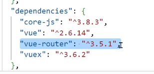
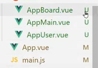

# 0510 vue.js router

Component는 보여주는 것이니 

- DOM작업 해야하고 : template
- function 해야하고 : script
- css 해야하고 : style

template + style + script =  **`.vue`**

기능만 하는 애들은 script만 필요하기 때문에 js 그대로 둘 것

Spring Boot → Rest API → JSON 데이터만 갖고 오기.

화면은 안만들겠다

# vue-router

- Vue.js의 공식 라우터, 컴포넌트와 매핑
- URL에 따라 컴포넌트를 연결하고 설정된 컴포넌트를 보여준다



다 각각임!



- vue cli로 만들면 git이 같이 만들어진다.
- 코딩하다가 router 빠졌네? 하면 안된다.

- 라우터 적용
    - 라우터 객체 생성, 라우트 컴포넌트 연결, router-link to와 router-view
        - router-link to = “경로명”
        - 해당 router 적용
            - router-view

```html
<div id="app">
      <h1>SSAFY - Router</h1>
      <p>
        <router-link to = "/">메인</router-link>
        <router-link to = "/board">자유게시판</router-link>
        <router-link to = "/qna">질문게시판</router-link>
        <router-link to = "/gallery">사진게시판</router-link>
        <!-- 홈페이지에서 개발자도구로 확인하면 a태그로 바뀌어있음-->
      </p>

      <!-- 현재 라우트에 맞는 컴포넌트가 렌더링 -->
      <router-view></router-view>
    </div>
```

```jsx
<script>
      // 라우트 컴포넌트
      const Main = {
        template: "<div>메인 페이지</div>",
      };
      const Board = {
        template: "<div>자유 게시판</div>",
      };
      const QnA = {
        template: "<div>질문 게시판</div>",
      };
      const Gallery = {
        template: "<div>갤러리 게시판</div>",
      };

      // 라우터 객체 생성
      const router = new VueRouter({
				mode: "history", // history모드로 변경한 것임.
				// history모드를 하면 새로고침시 페이지가 없는 부분에 대해서 error다.
        // 직접 치고 들어가면 404 에러가 들어간다.
        // 그래서
        routes:[
          {
            path: "/",
            component: Main
          },
          {
            path: "/board",
            component: Board
          },
          {
            path: "/qna",
            component: QnA
          },
          {
            path: "/gallery",
            component: Gallery
          }
        ]
      });
      // Vue 인스턴트 라우터 주입
      const app = new Vue({
        el: "#app",
        // router: router
        router : router
      });
    </script>
```

```jsx
const router = new VueRouter({
	routes: [
	...,
	{
		path: '/board:no',
		component: BoardView,
	},
	...
	],
});
```

```jsx
<router-link :to="{name: 'boardview', params: {no: i}}">{{i}}번 게시글</router-link>
```
