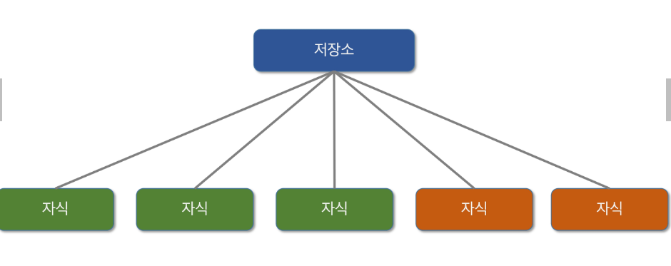
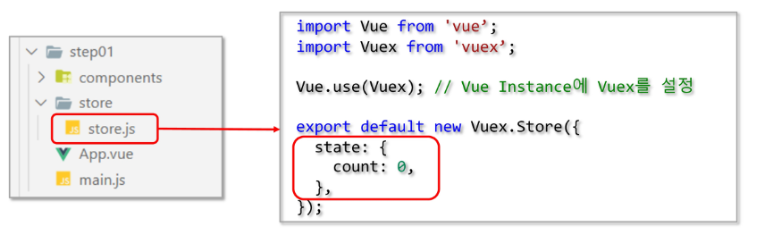
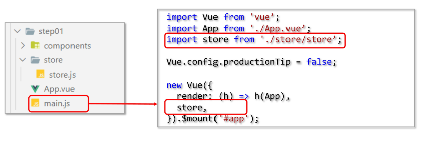
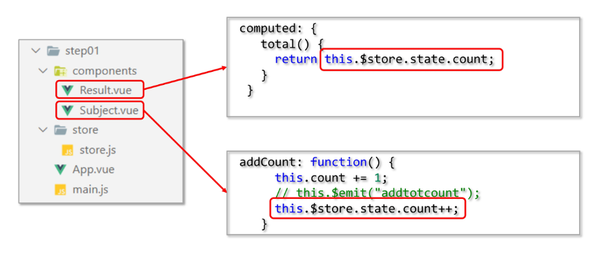

# 0515 vuex

Vue.js application에 대한 상태관리패턴 +라이브러리

- 모든 Component들의 중앙 저장소 역할



```jsx
new Vue ({
	data() {
		return {

	}
},
// 뷰
template :
	`<div>{{count}}</div>
`,
//액션
methods: {
	increment () {
		this.count++
		}
	}
});
```

- 상태는 앱을 작동하는 원본 소스 **`(data)`**
- 뷰는 상태의 선언적 매핑 **`(template)`**
- 액션은 뷰에서 사용자 입력에 대해 반응적으로 상태를 바꾸는 방법 **`(method)`**

# vuex 구성요소

### - state

- Single State Tree 사용
- 중앙에서 관리하는 모든 상태 정보를 **`state`**가 관리 (==data).
- 여러 컴포넌트 내부에 있는 특정 state를 중앙에서 관리
    - **`veux Store`**
- mutations에 정의된 method에 의해 변경
- state가 변경되면 해당 state를 공유하는 모든 컴포넌트의 DOM은 자동으로 렌더링
- 모든 Vue 컴포넌트는 Vuex Store에서 state 정보를 가져와 사용
- 각 컴포넌트는 **`dispatch()`**를 사용하여 actions 내부의 method를 호출.

### - actions

- BackEnd API와 통신하여 Data Feching 등의 작업 수행
- 항상 context가 인자로 넘어옴.
- mutations에 정의되어 있는 method를 **`commit`** method를 이용하여 호출
- state는 반드시 mutations가 가진 method를 통해서만 조작
    - 서비스 규모가 커지더라도 state 관리를 올바르게 하기 위함

### - mutations

- actions에서는 비동기 작업, mutations에서는 동기적 작업
- mutations에 정의하는 method의 첫 번째 인자에는 state가 넘어옴
- 

### - getter

- state를 변경하지 않고 활용하여 계산을 수행

# vuex 저장소 개념

- State : 단일 상태 트리, applicatio마다 하나의 저장소를 관리
- Getters : Vue Instance의 Computed같은 역할, State를 기반으로 계싼
- Mutations : State의 상태를 변경하는 유일한 방법 (동기)
- Actions : 상태를 변이시키는 대신 액션으로 변이에 대한 커밋 처리 (비동기)

# vuex 설정

```jsx
import Vue from 'vue';
import Vuex from 'vuex';

Vue.use(Vuex); // VueInstance에 vuex를 설정
```





- 저장소(Store) - state
    - application에서 공유해야 할 data 관리
    - State에 접근하는 방식 : this.$store.state.data_name



- store에 직접 접근해서 쓰지 말고, 대신 getters를 쓰고, actions를 통해 간접적으로 변경해야 하는데 이를 mutations를 통해서 한다

-
