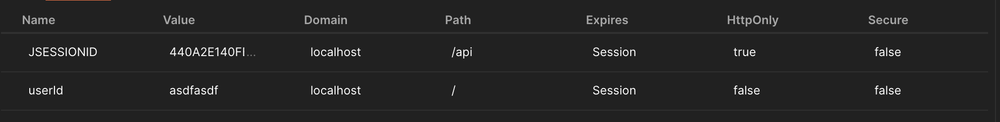
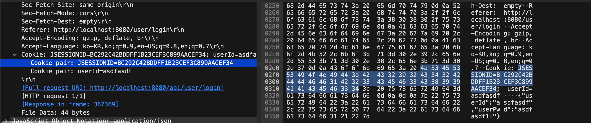
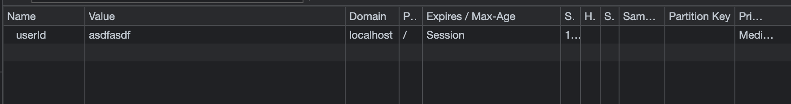

# Session WebPack Proxy에서 생긴 문제 (1)

# 문제화면





- 두가지 화면을 보면, JSESSION 결과값은 날아왔지만 Path가 다르게잡혀서 브라우저에 적용이 안되어있음을 알 수 있었음.
    
    
    
    - userId만 쿠키에 담겨져 오는 모습

- 처음 해결 방법
    - 우선 contextpath를 /api 에서 /로 변경
        
        ```java
        //application.properties
        server.servlet.context-path=/api
        
        //이후
        server.servlet.context-path=/
        ```
        

- 근데 나중에 다시 보니 브라우저에서 안떠도 JSESSIONID 사용이 가능했다
    - 이유가 뭘까?
    - 브라우저에서는 path가 /인 녀석들만 보여준다
    - 그래서 JSESSIONID가 안보임
    - /api를 root context로 가지는 요청에 대해서는 보이진 않아도 사용하게 되는 것
    - 오오
-
