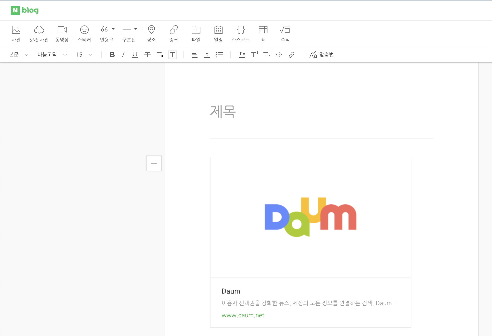

# XSS

1. v-html에서 script가 적용이 안되었음.
    1. 원인. html5에서 script 태그를 막아버림
2. 근데 naver lucy filter는 json형식의 데이터에 적용을 해주지 않는다.
3. 그래서 converter를 커스텀하기로 함.

근데 커스텀하던 도중 문제가 생김

`@EnableWebMvc`

- 이게 방해

[[Spring] 설정 자동화와 설정의 변경, @EnableWebMvc와 WebMvcConfigurer](https://mangkyu.tistory.com/176)

[[vue] v-html은 사용하고 싶지만, 크로스 사이트 스크립팅은 피하고 싶어](https://velog.io/@skyepodium/vue-v-html은-사용하고-싶지만-크로스-사이트-스크립팅은-피하고-싶어)

[Spring Boot에서 JSON API에 XSS Filter 적용하기](https://jojoldu.tistory.com/470)

### HttpMessageConverters

Spring MVC uses the `HttpMessageConverter` interface to convert HTTP requests and responses. Sensible defaults are included out of the box. For example, objects can be automatically converted to JSON (by using the Jackson library) or XML (by using the Jackson XML extension, if available, or by using JAXB if the Jackson XML extension is not available). By default, strings are encoded in `UTF-8`.

If you need to add or customize converters, you can use Spring Boot’s `HttpMessageConverters` class, as shown in the following listing:

```java
@Configuration(proxyBeanMethods = false)
public class MyHttpMessageConvertersConfiguration {

    @Bean
    public HttpMessageConverters customConverters() {
        HttpMessageConverter<?> additional = new AdditionalHttpMessageConverter();
        HttpMessageConverter<?> another = new AnotherHttpMessageConverter();
        return new HttpMessageConverters(additional, another);
    }

}
```

Any  bean that is present in the context is added to the list of converters. You can also override default converters in the same way.

- context에 있는 `HttpMessageConverter` bean은 컨버터 리스트에 자동으로 등록됨.
    - 이런 방식으로 default converter설정이 가능하다.
- 그래서 필터 적용은 성공했는데..
    - 그냥 텍스트 처리하는 것이랑 다를게 없음.



- 이렇게 링크를 어떻게 해야되지?
    - 모르겠다.
