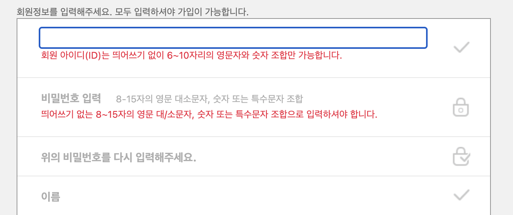
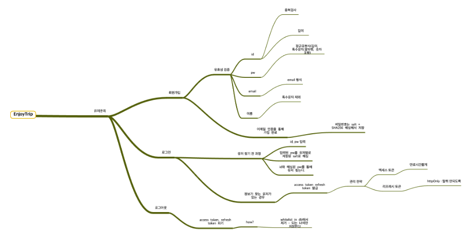

# 프로젝트 개관 (1)

# Branch 전략

- Github Flow
    - 프로젝트 규모가 크지않고 지속적 배포를 예상하고 있음.

[‣](https://app.notion.com/p/623b14051e434605b77cc1fc6a489c1a?pvs=21) 

- github에 올리면서 쭉쭉 적용시켜보고 gitlab에 나중에 다 올리기
- 기술, 구조에 대한 선택이전에 도메인에 대해 정확하게 이해하는 것이 필요해보임

# 기술 스택 + 구조

### WAS

- **SpringBoot**
- **JPA + JPQL**
    - JPQL 시간될지 정확히 모르겠는데..
    - MyBatis로 옮겨야될 거 같음

### Web Server

- Nginx or Varnish

### DB

- MySQL - 두개.

### DevOps

- Docker
- Github Action

# 보안

- **비밀번호 몇번 틀렸을 때 , 잠그는거 (id 체크 - DB 저장)**
- CSRF
    - **Referrer 체크 → 해커들이 가장 먼저 바꾸는 목록임. 이건 x**
    - ip 체크
    - 기기 번호
        - 기기 등록해놓고 가능한것만 체크하는 방식.
            - 구글  : 강제
            - 네이버 : 알림만
            - 카카오 : 강제
- **처리율 제한**
    - ex) 버킷 알고리즘
    - 각 ip별로 초당 요청 가능한 횟수를 제한시켜 브루트포스, DDOS 공격을 막는다
- ControllerAdvice를 사용한 Exception처리
    - 각각의 비즈니스 로직에 대한 커스텀 exception 클래스를 만들어서
        - 관심사 분리
        - 그리고 보안에 대한 모든 문제점을 챙기고 싶음
        - 그러면 custom exception에 대한 도메인도 생성해야 될듯

# 성능

- 전체 요청에 대한 처리율 제한
    - 서버가 터질 가능성을 낮춘다
    - 역시 버킷 알고리즘이 간편

# 구조

- Filter
    - encoding
- Interceptor
    - Authentication
    - Authorization
- AOP
    - transaction, persistence, security
    - ControllerAdvice
- 추가적으로 Response 구성 통일 시켜야 함

# 회원가입

- 이거 참고해서 제약조건 넣기
    - script 못넣게 제한조건 설정했나?
    

## Access, Refresh token 전략

[우아한테크코스 학습로그 저장소](https://prolog.techcourse.co.kr/studylogs/2272)

- 요거 체크

- httpOnly로 js code 처리가 가능
- proxy hijacking은 어떻게 해야할까?
    - 다른 링크 못누르게 해야함
    - 음.. 경고문 올리는게 최선일까
