# Java-디자인 패턴

태그: ssafy 계절학기

- 디자인 패턴은 설계 영역이다.
    - Creater, Structure, Behavior

- 디자인 패턴의 가이드
    - **`프레임워크, 라이브러리 등`**이다.
    - 이들 모두 패턴을 맞춰서 제작된다
    - 조금 더 알맞게 나오면 depcrecated되서 지양, 계속해서 변화가 되어 나온다.

# 아키텍처 패턴

- IT System의 역사
    - 1960 ~ 1980 : fragile, 깨지기 쉬운 상태
        - 오로지 메인 프레임의 성능에 의존할 수 밖에 없었던 시절
    - 1990 ~ 2000 : Robust, Distributed → 분산 환경
        - 원격으로 무언가가 된다
    - 2010~ : Anti-Fragile / Resilient(민첩성)이 중요한 시대.
        - 무결성은 조금 깨지더라도 빠르게.
        - AntiFragile
            - Auto Scaling
            - Microservices
                - 최소단위로 짜두면 장애시 다른 곳에대한 영향 최소화
            - Chaos Engineering
            - Continuos Deployments
                - DevOps Devlopment의 역할
        
    
    Distributed Architecture → RPC를 기반으로 설계
    
    - 서비스를 제공하는 쪽과 서비스를 사용하는 쪽이 따로 떨어져 있다.
    - 서비스를 제공하는 쪽은 이러한 서비스를 제공하고 있음을 알려주어야 한다 → 광고해야 한다.
    - 클라이언트는 레지스트리를 바라보고 원하는 서비스를 찾고
    - 서비스를 골라서 원격으로 요청과 응답이 왔다갔다 한다.
    - 보안 때문에 서로 직접적인 정보를 가지고 있으면 안되는데,
    - **`Proxy`**를 이용해서 해결.
    - 클라이언트의 정보는 서버가 직접 가지고 있지 않고, 클라이언트 역시 서버의 정보를 직접 가지고 있지 않음
    - 어찌됐던 클라이언트와 서버가 요청과 응답을 하는데, 개발할게 너무 많아졌다.
    - 그래서 객체지향 개념 →  Reuse!!!하자 최대한.
    - 서로 간의 통신은 어떻게? → XML(text, data structure)가지고 있음.
    
- 기업의 기술 블로그 잘 찾아보기

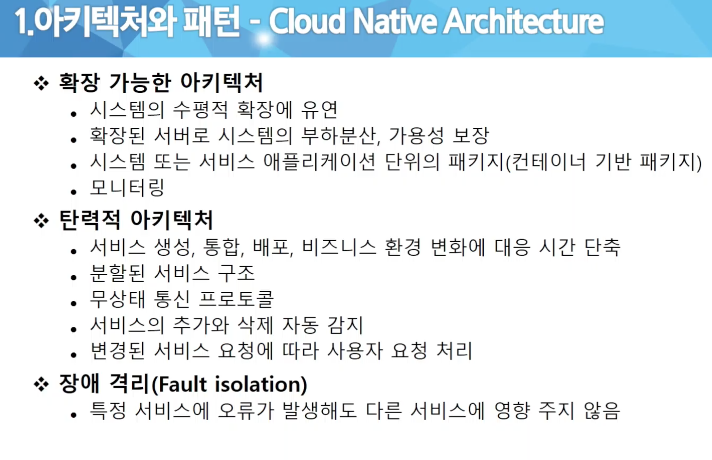

Cloud Native Architecture

- chaos engineering 모니터링 :  ELK
- 고가용성, 민첩성, 가상화, 자동화
- Jenkins

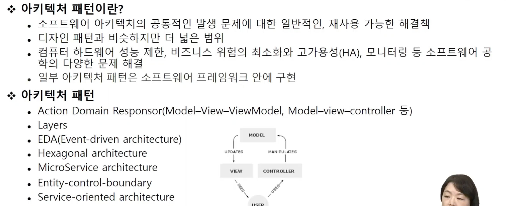

SDLC (Software Development Life Cycle)

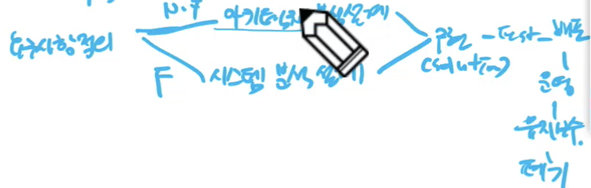

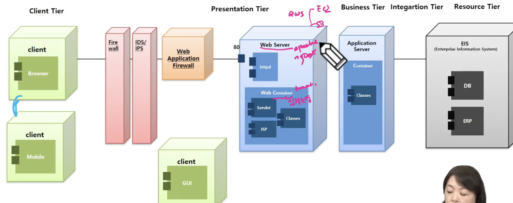

sunton architecture methodology

heavy → light = spring.

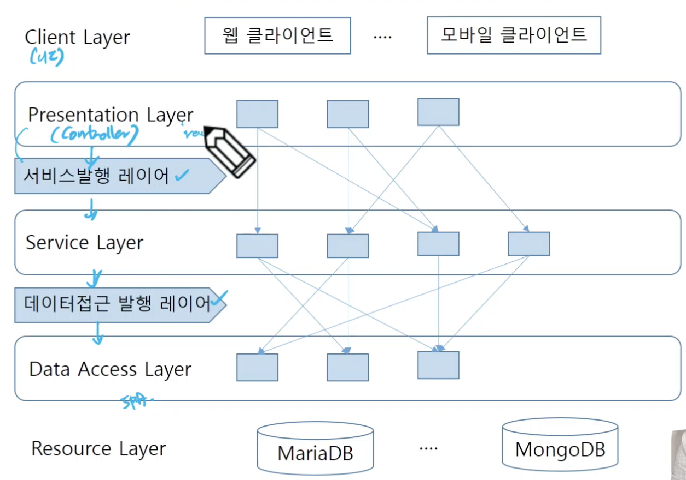

- 모든건 Reuse
- 객체지향이 잘 되도록 설계하는 것

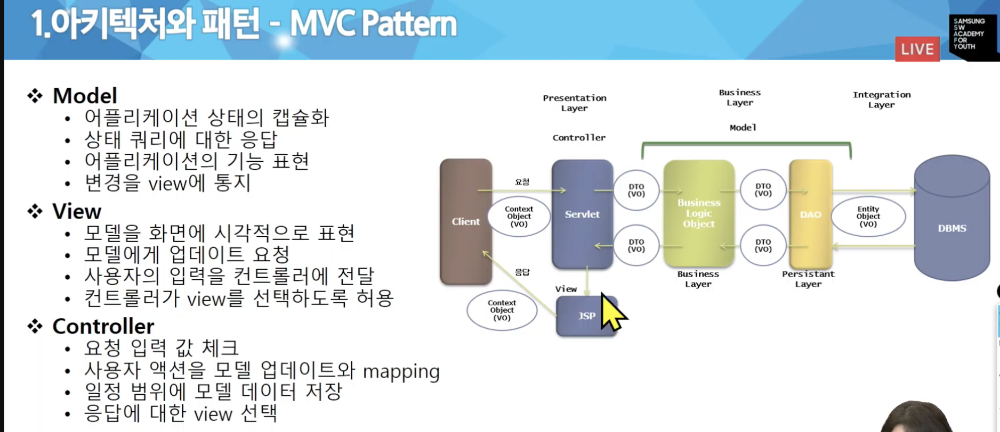

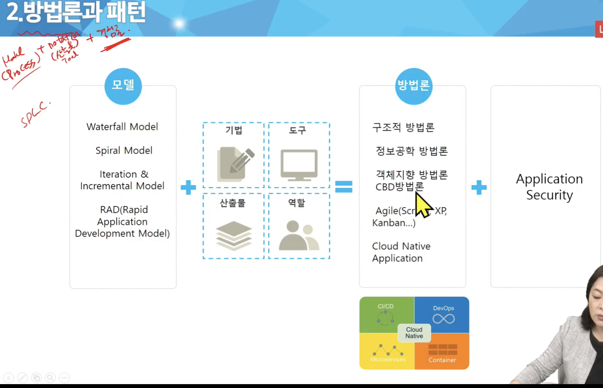

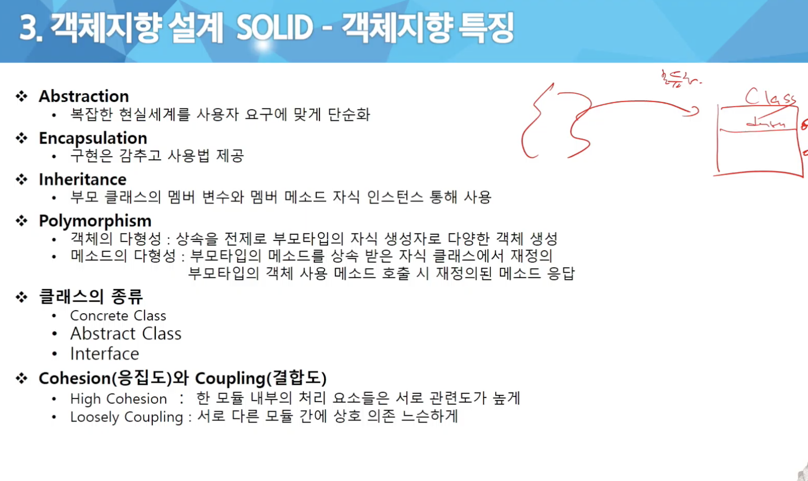

- Responsibility, 결합도는 낮고 응집도는 높게

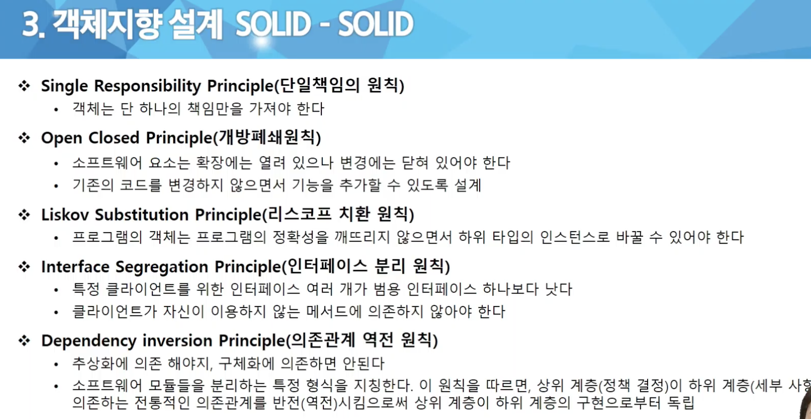


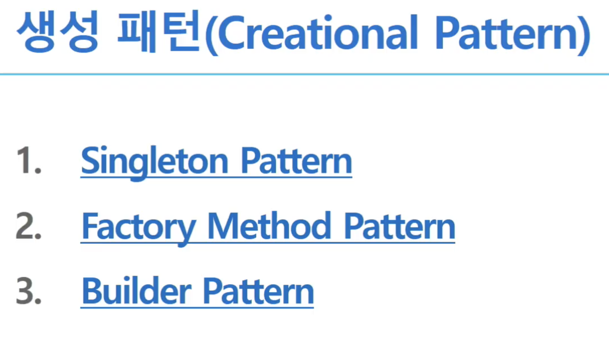

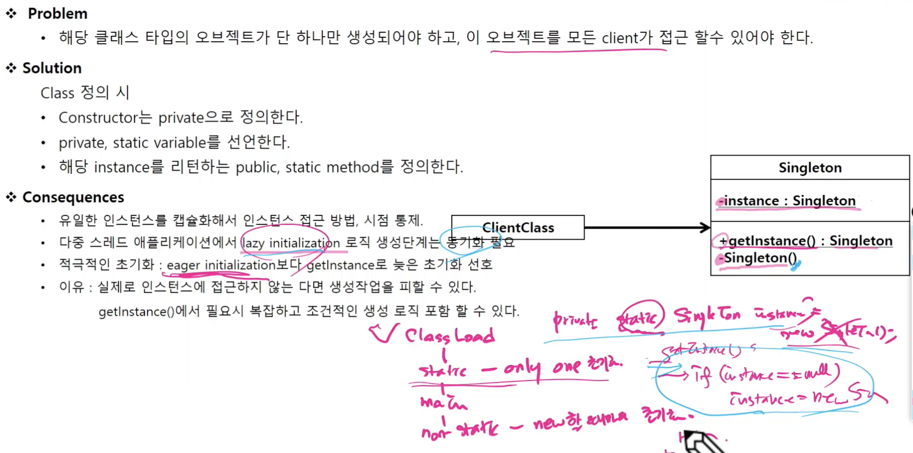

singleton → 동시성 문제 있음.

A라는 사용자가 생성할 때 B라는 사용자도 생성한다면? 

- 동기화 필요하다.
- 그래서 메서드에 lock을 걸어놓을 수 있다
    - 메서드에 lock을 걸어놓는 것은 권장되지 않음. 최소로 지정해서 **`synchronized block`**을 이용하자.

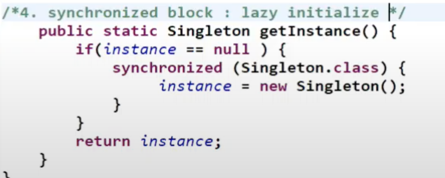

```java
private static Singleton instance;

private Singleton () {]

public static Singleton getInstance() {
	if(instance == null) {
		synchronized (Singleton.class) {
					instatnce = new Singleton();
			}
	}
	return instance;
}
```
