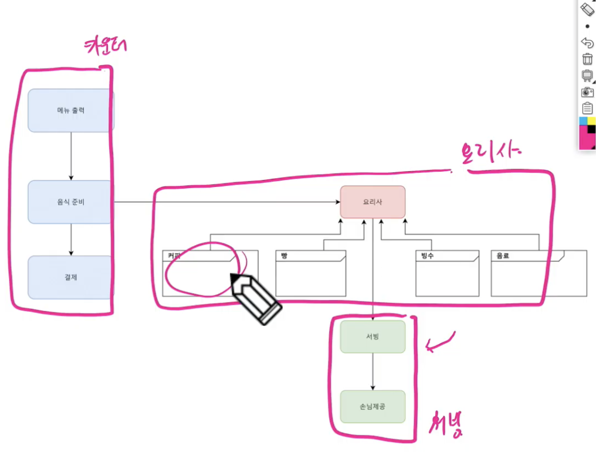
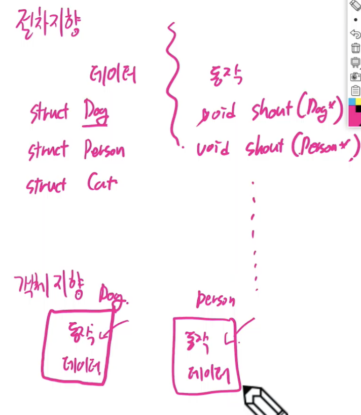
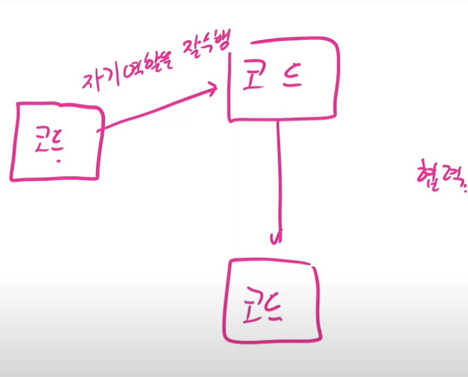

# OOP / UML / Refactoring

태그: ssafy 계절학기

- 모든 기업들이 목표로 하는 것 : “품질”

- 품질이 좋은 SW의 조건
    - 분석이 분명하고, 쉬워야 한다
        - 구조가 쉽다
    - 설계가 탄탄해야 한다
        - 테스트가 좋아야 한다
        - 유지보수가 편하다

## UML

- 객체지향설계 표기법의 표준
- 분석 / 설계의 최종 결과물
    - UML Diagram
- 수업에서는
    - 클래스 다이어그램
    - 시퀀스 다이어그램

## 리팩토링

- 외부동작은 변경하지 않고 내부 구조를 변경하는 작업

# OOP

- 절차지향에서 불편했던 점을 보완한 언어의 등장
    - 독립적으로 수행하는 역할을 나누어 운영하는 시스템화가 필요

- **`독립적인 역할`**의 수행
    - 담당 내용의 일부가 바뀌더라도, 다른 사람에게 영향을 받지 않음
        - 음식이 추가되어도 다른 사람에게 영향을 끼치지 않는다
        - 서빙 방법을 바꾸더라도 다른 사람에게 영향을 끼치지 않는다
        
        
        

- **`재사용성`**
    - 커피숍이 아닌 새로운 한정식을 오픈해도 요리사만 교체하고, 다른 모듈은 그대로 사용이 가능하다

- 객체지향 언어와 절차지향 언어의 차이
    - 데이터와 동작의 분리 측면
        - 개에서의 기능이 고장나면 객체지향은 개 자체를 고치면 된다
    
    
    

- 한 코드가 모든 것을 다하는 것이 아닌, 코드들끼리의 **`협력`**
    
    
    

- 클래스에서 변수와 함수를 묶어준다 (캡슐화 한다)
- 클래스를 통해서 객체를 만든다.
- 객체는 만들어질 때 혼자서 모든 것을 다하는 객체가 아니다.
    - **`객체끼리 협력`**하는 코드를 만든다.
    - 객체끼리의 협력은 **`메시지를 주고 받는 것`**

## Coupling : 어떤 모듈이 다른 모듈에 **`의존하는 정도`**

- 의존성을 있게 만들어야 한다.
    - 의존성이 없다면 한 클래스에 모든 것을 다 넣어야 한다
        - 의존도를 높게 만들기
        - 의존도를 낮게 만들기

- 다른 클래스에 의존했을 때,  A가 B클래스에 의존했을 때 나타날 수 있는 일
    - B클래스 변경 시 A클래스 변경 가능성 존재

- **`구현과 인터페이스의 분리` // 검색해서 파악**
    - 구현을 바꿔도 인터페이스를 이용하는 측은 큰 변경사항이 없다.

- Server Code와  Client Code
    - Client는 Readme를 읽지 않는다.
        - ArithmeticException 등.
            - 그래서 **`Server Code Level에서 제한`**해야 한다
                - 캡슐화
                - 클라이언트가 이상하게 이용하지 못하도록 처리
    - Server Code가 **`허용한 방법대로`** Client Code가 사용하도록 **`유도`**

- 캡슐화
    - 외부와 내부의 구분
    - 클라이언트는 서버의 인터페이스만 이용
    - 서버 측은 구현을 바꿀 수가 있음.
        - 변경사항에 대한 여파가 클라이언트에게 크게 가지 않도록
    - 

# 상속

- 추상화
    - 중요한 부분만 드러낸다
    - 구체적인 것들은 감춰둔다

- Override

## 다형성 (Polymorphism)

- 다양하게 변화하는 성질

- 함수 바인딩
    - 컴파일 바인딩 (이른 바인딩)
    
    - 런타임 바인딩 (늦은 바인딩)

- Interface
    - 언젠가 추가될 유지보수를 위해 확장 가능한 형태로 만듦
    - 객체를 쉽게 사용하고자 표준화

# 클래스 다이어그램

- Dependency는 임시적 사용 관계
    - 클래스가 참조를 유지하지 않는다
    -
