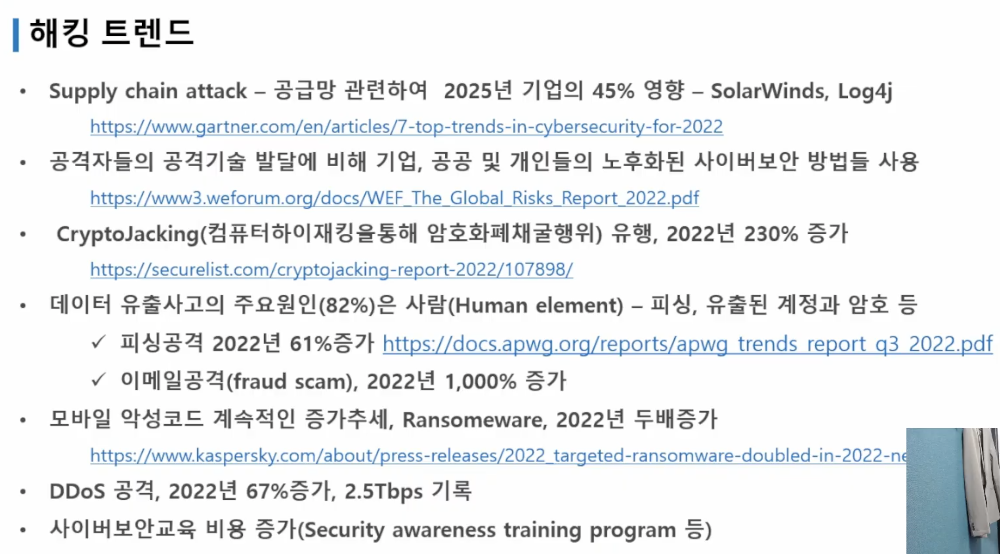
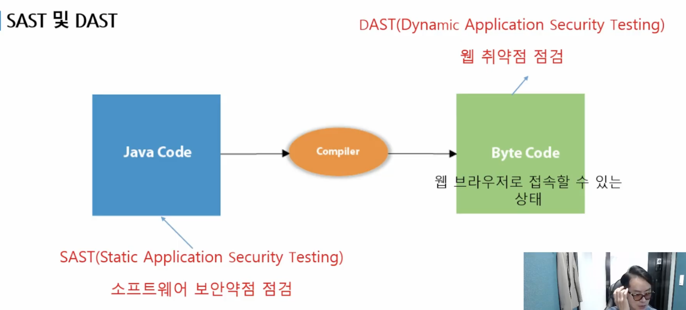
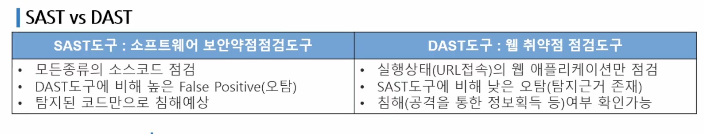
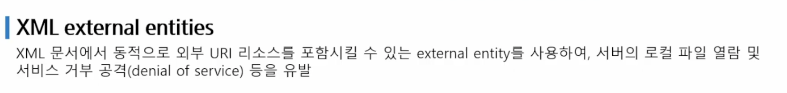
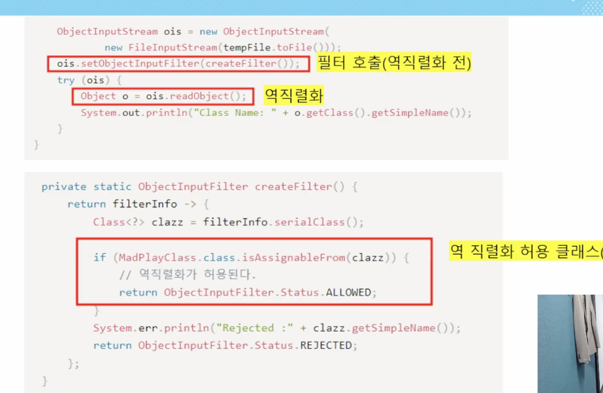

# 시큐어코딩

태그: ssafy 계절학기

- 해킹 트렌드
    - 정보유출
    - 악성코드
    - 워드드레스 플러그인 취약점
    - 공급망 공격(국내 보안인증 소프트웨어 취약점 악용)
    - 챗 GPT 인기 확산에 따른 사기, 사이버 공격(출처가 불분명한 앱)

- CWE
    - mitre라는 기관에서 다양한 개발언어에 대한 740여가지의 소스코드를 정의한 데이터베이스

# 소프트웨어 보안약점 점검기준

- 입력데이터 검증 및 표현
    - 사용자, 프로그램 입력 데이터에 대한 **`유효성 검증체계`**
    - 실패 시 처리할 수 있도록 설계
- 보안기능
    - 인증, 접근통제, 권한관리, 비밀번호 등의 정책
- 시간 및 상태
    - 자원을 사용하는 시점과 검사하는 시점이 달라서 자원의 상태변동으로 야기되는 보안 치ㅜ약점
    - **`무한반복 재귀함수`**
- 에러처리
    - 에러 또는 오류상황을 처리, 보안약점이 발생하지 않도록 설계
    - 사용자에게 너무 많은 에러를 보여주지 않는 등의 설계
- 코드 오류
- 캡슐화
    - 중요데이터에 대한 비인가자 접근 허용하지 않도록
- API
    - 비정상적인 API를 사용하지 않도록

SAST : 빌드전에 소프트웨어 점검, 오탐이 높음

DAST : 웹 URL을 통해 점검, 오탐이 낮음

SCA(Software Composition Analysis) : 오픈소스 라이브러리 취약점 점검

- SQL injection

- 다양한 툴을 이용하여 보안 체크?
    - gitlab ci / cd
    - jenkins

- XML external entities
    - XML 문서에서 동적으로 외부 URI 리소스를 포함시킬 수 있는 external entity를 사용하여, 서버의 로컬 파일 열람 및 서비스 거부 공격(denial of service) 등을 유발
    

- 역직렬화 위험성
    - 공격자가 직렬화된 데이터에 악의적인 코드 삽입, 이에 대한 대처가 필요
        - 역직렬화가 허용 가능한 클래스들을 정해두기
        
        
