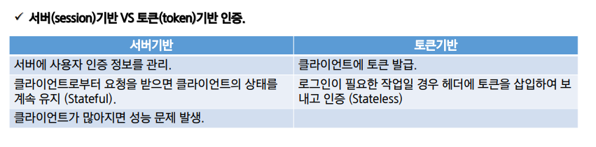
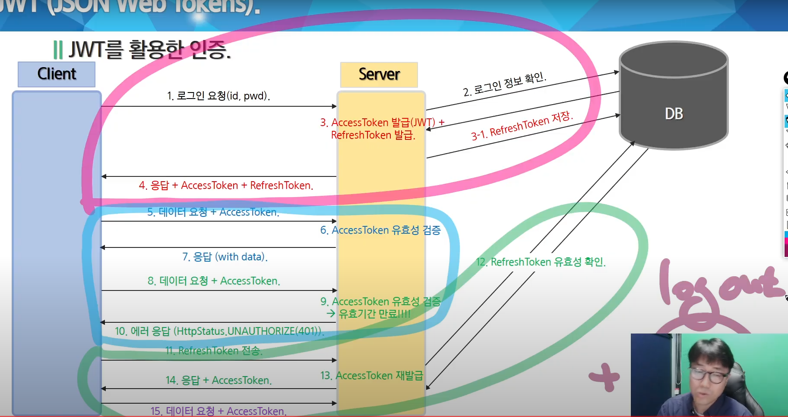

# JWT

# Token

- 클라이언트가 서버에 접속하여 사용자 인증을 했을 때 유일값인 토큰을 발급
- 서버에 요청을 보낼 때 **`헤더에 토큰`**을 넣음
- 클라이언트가 보낸 토큰이 서버에서 발급한 토큰과 **`같은지를 체크`**하여 인증
- 앱과 서버가 통신 및 인증할 때 사용

- Token 단점
    - 토큰 자체의 데이터 길이가 길다 → 네트워크 부하
    - Payload 자체는 암호화 x → 중요 정보 저장 불가
    - 네트워크 전송 방식 → 토큰 탈취 우려 = **`expire`** 설정으로 해결
    

# JWT

- 인증에 필요한 정보를 암호화시킨 **`JSON 토큰`**
- JSON 데이터를 BASE64 URL-safe-Encode를 통해 **`인코딩`**하여 직렬화
    - **`암호화가 아니다!`**
- 토큰 내부에 위변조 방지를 위한 개인키를 통한 전자서명 포함.

- JWT 구성
    - Header
        - JWT에서 사용할 토큰의 타입과 암호화 알고리즘 정보
        - key-value
    - Payload
        - 서버로 보낼 사용자 권한 정보와 데이터
        - 토큰에 담을 클레임(Claim) 정보 포함
        - 토큰에는 여러 개의 claim을 넣을 수 있으나 민감한 정보 x
    - Signature
        - Secret Key(서버의 개인키)를 포함하여 암호화
    
- Refresh Tokern
    - AccessToken을 탈취 당했을 경우에 대한 **`최소한의 대비`**
    - AccessToken의 유효기간을 짧게 설정하여 탈취 되어도 사용기간을 줄이는 효과
    - RefreshToken은 인증 정보를 담고 있찌 않고 AccessToken 재발급 용도로만 사용한다
    
- JWT를 활용한 인증

- Refresh Token을 DB, Session에 저장하는 것은 방식의 차이일 뿐
- Logout시 DB에 있던 Refresh Token을 지운다.
- Client는 발급받은 Refresh Token을 Session Storage이던 Local Storage이던 저장.
    - SS에 저장하면 브라우저 닫을 때 날라가기 때문에 이게 맞다고 생각하면 SS를 쓰는 거고, LocalStorage를 쓸 때의 장점을 가지고 가고 싶다면 LocalStorage를 사용하는 건데 **`구현 서비스의 특성에 맞게`** 양자 택일
        - LocalStorage는 브라우저가 닫아도 항상 정보를 가지고 있기 때문에 보안 측면에서는 좋지 않아보인다

- 클라이언트도 정보는 가지고 있어야한다.
- **`JWT를 보안의 개념으로 생각하지 마라`**. 인증의 개념인데, 추가적으로 보안이 필요한 조취는 취해줘야 하는 것이고 JWT 자체가 보안이 아니다
- 클라이언트에 http-only cookie주는 방법도 있다.

## 의문점

- Access 토큰이 뭐하는지를 정확히 알아야 하는데, 그대로를 따라가다 보면 Refresh토큰이 필요 없다는 결론이 나온다?
- **`서버에서 로그인 정보를 가지지 않는 것`**이 Jwt이다.
- 근데 왜 서버에 나 로그아웃 할게요 할 때를 알려주려 해야 하는가?
