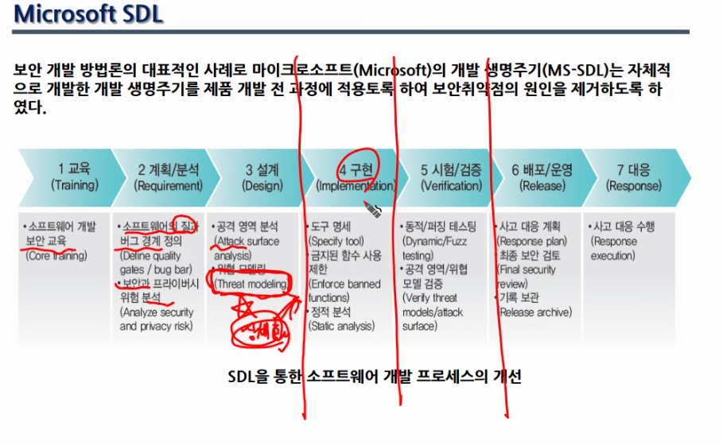
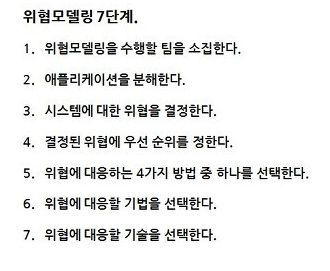
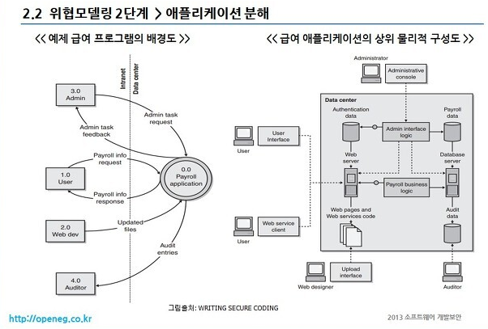
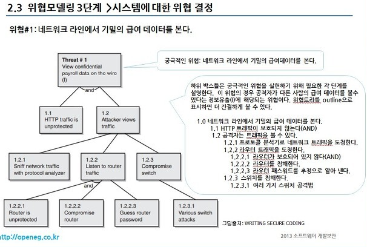

# 위협 모델링

텍스트: 보안 : 설계단계에서 끝장

[[위협모델링] 솔루션](https://openeg.tistory.com/378)

- 보안에 대한 상세화가 이루어지는 곳

- 구현 단계에서 개발자가 작성한 코드가 위협 모델링에 준수한지를 체크하는 것이 **`정적 분석(Static analysis)`**

- 애플리케이션 분해에 신경
    - Data Flow Diagram 예시

- 예상해서 위협 트리를 그리는 것
    
    
