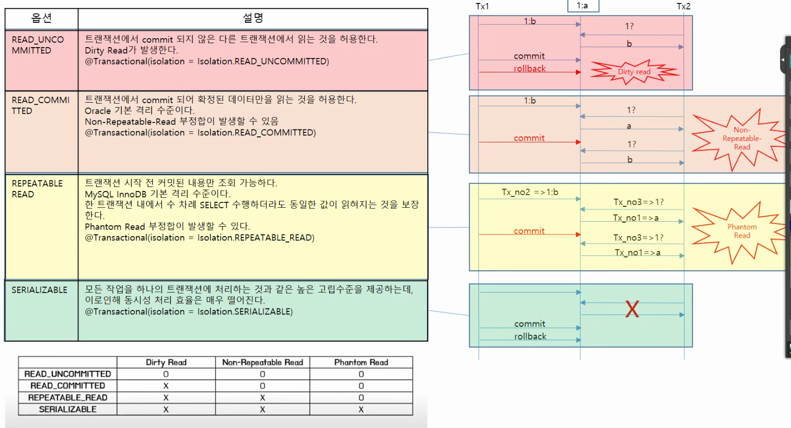
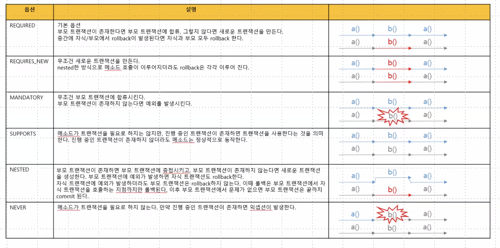

# 트랜잭션 / propagation

한 번에 진행되도록 트랜잭션을 하도록 설정해두고도 안되는 문제들이 있다.

트랜잭션 충돌을 해결하기 위해서 DB에서 가지고 있는 전략이 있는데

- Isolation level

- 원자성 : 한번에 처리되어야 할 일의 단위
- 일관성 : 한 트랜잭션안에서 일관된 데이터 사용
- 독립성 : 다른 트랜잭션의 개입 불허
- 지속성 : 결과 저장

독립성과 일관성은 아주 Critical한 문제를 가지고 있다.

READ_UNCOMMITTED

- 트랜잭션에서 commit되지 않은 다른 트랜잭션에서 읽는 것을 허용한다.
    - Dirty Read

EJB : 메서드별로 분리한다. 

스프링에서도 할 수 있음.

## 상황 가정

- 웹에서 지연된 주문 (7초), 포스트맨을 이용한 바로 주문
    - 둘의 OrderNo가 같게 나오는 상황 - REPEATABLE READ
    - SERIALIZABLE로 해결 : 하나의 트랜잭션이 끝나고 나서.
        - 내가 끝날 때까지 아무도 못들어온다.
    
    
    

Web주문도 Serializable, 키오스크 주문도 Serializable이라고 할 때

항상 완전성을 보장하지는 않음.

# Propagation 트랜잭션 전파

- 내가 insert한 트랜잭션이 update까지 하나로 묶을 것이냐,
- 아니면 둘은 분리할 것이냐

- 부모 트랜잭션
    
    
    

```java
@Transactional(isolation = Isolation.SERIALIZABLE, propagation = Propagation.REQUIRES_NEW)
```

- DB의 트랜잭션 상황과 나의 코드 상황이 일치해야 한다.

- RunTimeException의 역설적인 모습
    - RunTimeException을 남발하는 것은 코드를 제대로 다루지 않겠다는 것

- 하나의 클래스에서 메서드를 분리하고 트랜잭션을 각각 주면 예상대로 되지 않음.
- 트랜잭션을 **`객체 단위`**로 관리를 하기 때문에 **같은 클래스?**?에서 관리가 안되는 듯.

- 그래서 클래스를 분리시킨다.
- DataAccessException

[TX.pdf](../../../assets/tx.pdf)
