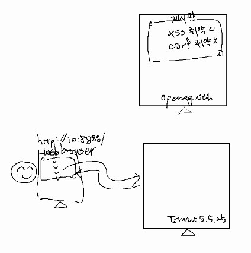
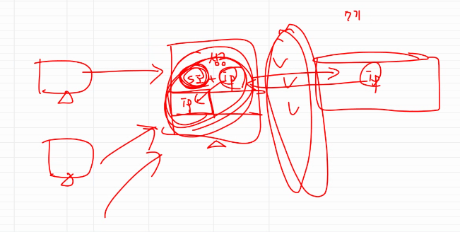
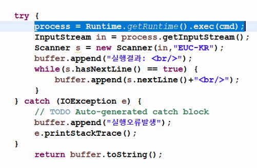

# 프로젝트 참고위한 Security

# 상황

- openeg web서버가 있고,  openeg사이트에 게시판이 있고, 게시판에는 현재 XSS 취약점은 있고 CSRF 취약점은 없음
- 톰캣 관리자는 http:/ip:8888을 통해 Tomcat 5.5.25 홈페이지로 들어갔고, 관리자 페이지로 들어가기 위해 login 하고 현재 실행되고 있는 어플들이 잘 되고 있음을 확인했다

- 해커가 등장, 해커는 톰캣에 돌아가고 있는 어플리케이션이 여러 개가 있다는 것을 알고 있으며, 이 중에 한 어플리케이션을 Stop시키는 해킹을 하고 싶다. 근데, 그 권한은 관리자만 가지고 있고, 관리자에 대한 id pw는 모르는 상황.
- 해킹 시나리오는 해커가 관리자가 잘 다니는 게시판(openeg)을 확인해보니 XSS 취약점이 있다는 것을 확인. 이사람이 클릭할 만한 제목으로 게시글을 올려두고 script를 숨겨두고 관리자가 해당 게시글을 읽으면 script를 실행하고 tomcat 5.5.25에서 어플리케이션 중지를 시킨다.
- tomcat 5.5.25에는 CSRF취약점이 있다. 근데, **`openegweb에 CSRF취약점이 없는데도 불구하고 Tomcat 5.5.25가 가지고 있기 때문에`** 둘이 상관이 없어서 해킹을 당함

# Brute Force 공격 막는 법?

- referer는 해커가 가장 신경쓰는 항목 중 하나라서 사용하지 않는 것이 좋음
    - 

- [https://drive.google.com/drive/u/4/folders/1XdyPgq9_SqrWbjMSG3L_2bm07vhmvIyS](https://drive.google.com/drive/u/4/folders/1XdyPgq9_SqrWbjMSG3L_2bm07vhmvIyS)

- JAVA로 명령어 수행.

- 초반에 방어하는 것
- 보안은 완벽한게 아니라 어렵게 만드는거
    - 이 과정이 **`분석설계`**에서 이루어져야 한다

- 개발자 VS 보안 설계자의 상충
    - 이름 규칙
        - 역할이 명확하게 나타나는 것이 무조건 좋진 않다. 이걸 보고 유추가 가능하기 때문에.
        - 그래서 **`적절한 협의점`**이 필요한 것
