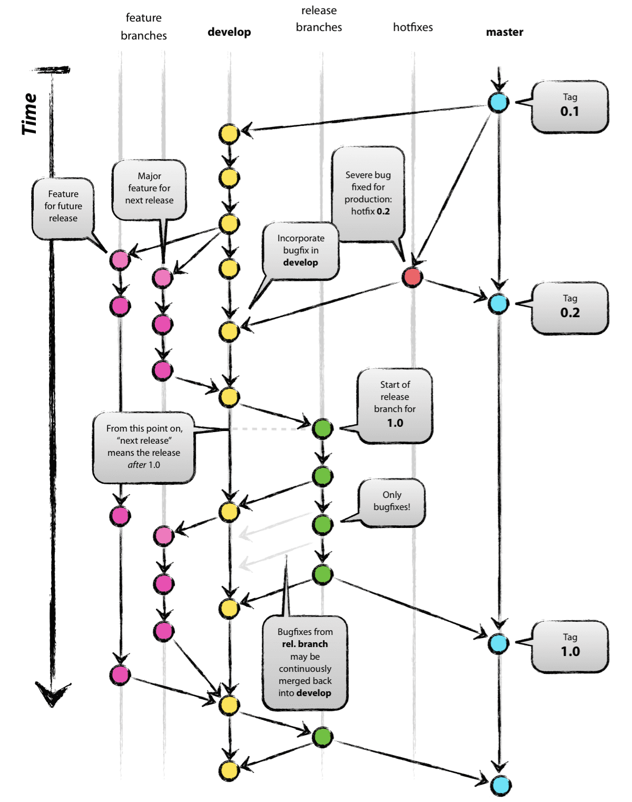

# Git Flow (참고)

[https://onethejay.tistory.com/142](https://onethejay.tistory.com/142)

# Git Flow

- 하나의 전략에 불과하다.
- **소스 코드 형상/이력 관리**를 효율적으로하고 **협업**할 때 발생할 수 있는 문제점을 최소화할 수 있는 **전략**

- master
    - 소프트웨어 제품을 배포하는 용도
- develop
    - 개발용 default branch, 여기에서 feature를 따고, 각 feature를 합친다.
- feature
    - 단위 개발용 branch
- release
    - 다음 배포를 위해 기능에 문제가 없는지 품질체크 (QA) 용도의 branch
- hotfix
    - 배포가 되고 나서(master에 배포 코드가 합쳐진 후) 버그 발생 시 긴급 수정하는 branch
- support
    - 버전 호환성을 위한 branch

1. master 에서 시작
2. master가 base인 develop 브랜치 생성
3. 개발자1 : develop이 base인 feature 브랜치를 생성하여 개발 진행

3-1. 개발자2 : develop이 base인 feature 브랜치를 생성하여 개발 진행

...

1. 개발 완료된 feature 브랜치는 develop으로 merge
2. release 나갈 브랜치를 develop base 에서 생성
3. release branch에 있는 코드에 대해 QA를 진행하면서 버그를 고쳐나감.
4. QA 통과한 release branch는 이제 배포 준비 완료된 상태
5. 배포를 위해 release branch -> develop, master로 합침
6. master 브랜치에서도 각 코드 버전에 대한 기록을 남기기 위해 태그도 추가로 생성
7. 보통은 이렇게 생성된 태그로 배포
8. 만약 배포 나간 건에 대해서 긴급히 버그 처리해야할 경우 master base 기반으로 hotfix 브랜치 생성
9. hotfix 브랜치를 master, develop에 머지

- 가장 main인 브랜치
    - develop
    - 각자 역할을 분담한 후, 한 곳에 모이는 1차 집합소
