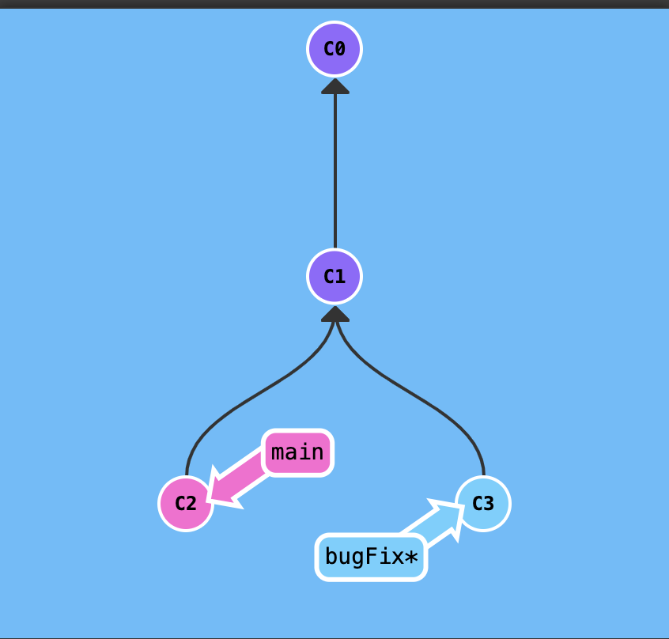
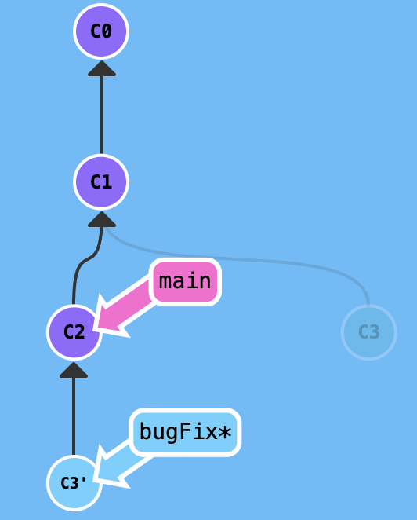
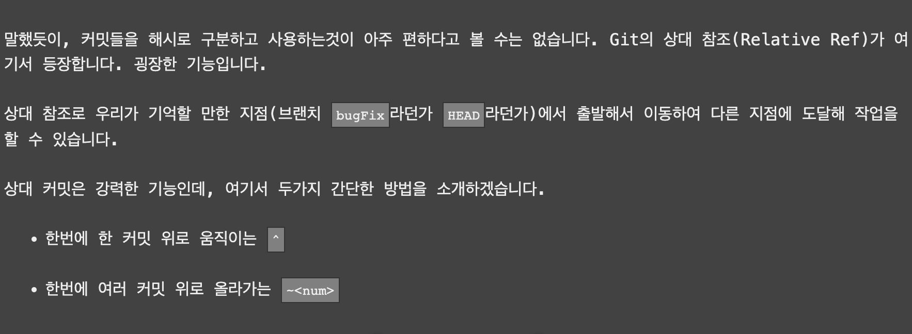
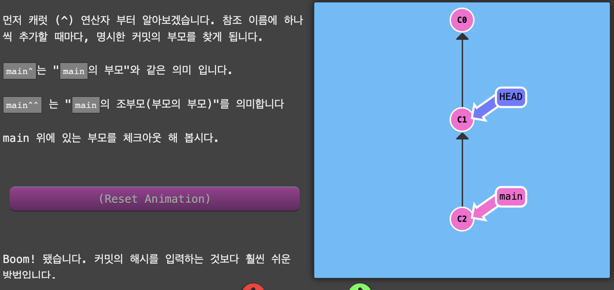

# Git 명령어

태그: learngitbranching

# git Commit

- 디렉토리에 있는 모든 파일에 대한 스냅샷을 기록
- 디렉토리 전체를 복사하는 것은 아님

# Git 브랜치

- 특정 커밋에 대한 참조(Reference)
- “하나의 커밋과 그 부모 커밋들을 포함하는 작업 내역”

# git checkout

- 새 브랜치로 이동하기 위한 명령어
- `git checkout [브랜치명]`

# git merge

- 두 개의 부모(parent)를 가리키는 특별한 커밋을 만들어낸다.
- "한 부모의 모든 작업내역과 나머지 부모의 모든 작업, *그리고* 그 두 부모의 모든 부모들의 작업내역을 포함한다"

# git rebase

- 커밋들을 모아서 복사한 뒤, 다른 곳으로 떨궈 놓는 것

- bugFix에서의 작업을 main branch로 옮김 →  **`git rebase main`** (HEAD가  bugFix인 상태)

# HEAD

- 현재 체크아웃된 커밋, 즉 현재 작업중인 커밋
- 항상 작업트리의 가장 최근 커밋을 가리킨다.

# 상대 참조(Relative ref)

- 캐럿 연산자(^)
    - main^ → main의 부모
    - main^^ → main의 조부모
    
    
    

- 틸드 연산자(~)
    - (선택적) 올라가고 싶은 부모의 갯수가 뒤에 숫자가 온다
        - ex) git checkout HEAD~4

- 상대 참조를 사용할 때, 가장 일반적인 방법은 **`브랜치를 옮길 때`**
    - ex) git branch -f main HEAD~3
        - main 브랜치를 HEAD에서 세번 뒤로 옮겼다.
    

# Git에서 작업 되돌리기 (revert가 이해가 아직 안갔다. 0530)

- 변경한 내용을 되돌리는 방법은 크게 2가지
    - git reset (HEAD의 위치 변경)
        - 애초에 커밋하지 않은 것처럼 예전 커밋으로 브랜치를 옮긴다
        - 각자의 컴퓨터에서 작업하는 로컬 브랜치의 경우 잘 사용할 수 있음
        - **`‘히스토리’를 고쳐쓰는 것`**이기 때문에 다른 사람이 작업하는 리모트 브랜치에서는 사용 X
        - **`혼자 하는 곳에서만 쓰자`**
        - 참고
            - 원격 저정소에 이미 Push한 내용을 변경하려면 force push를 해야만 합니다. 협업할 때는 force push는 절대 해서는 안 되며, 원격 저장소에서도 막아놓는 게 일반적입니다.
    - git revert (커밋의 내용을 되돌리는 **`새로운 커밋`**을 만든다)
        - 변경분을 되돌리고 되돌린 내용을 다른사람과 공유하기 위해서 사용
        - c2` 브랜치가 새로 생겨나는 개념
