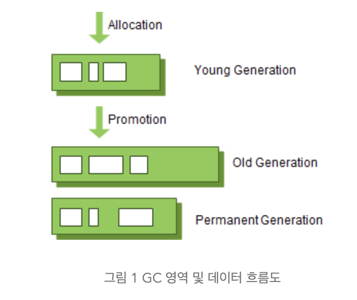

# Garbage Collector

- 출처

[Java Garbage Collection](https://d2.naver.com/helloworld/1329)

# GC(Garbage Collection)

- Java는 개발자가 메모리를 직접 해제해주는 일이 없음
    - JVM의 GC가 알아서 해줌
- 개발자가 프로그램 코드로 메모리를 명시적으로 해제하지 않기 때문에
- 유효하지 않은 메모리(Garabage)를 처리하는 것.
    - 유효하지 않은 메모리는 **`사용하지 않는 객체`**.

## stop the world

- 실행중인 애플리케이션을 멈추게 하자.
    - GC를 제외한 실행중인 쓰레드들 모두 멈춘다.
    - GC가 작업을 완료한 이후 중단한 작업 시행
- 어떤 GC 알고리즘을 사용해도 **`stop the world`**는 항상 발생
    - GC의 성능을 튜닝하는 것이 무엇일까?
        - **`stop the world의 시간을 줄이는 것`**
- GC가 계속 일을 해도 더이상 사용 가능한 메모리 영역이 없는데
    - 메모리를 계속 할당한다?
        - **OutOfMemory** → **`WAS 다운`**으로 이어질 수 있다.
    

- Java는 프로그램 코드에서 메모리를 명시적으로 지정하여 해제하지 않음
    - 어떻게 해제할까?
        - 해당 객체를 null로 바꾸기
        - **`System.gc()`**
            - 시스템의 성능에 **극악이기 때문에** 절대 권장하지 않는다고 함.
        

## weak generational hypothesis

- 2가지 가설

<aside>
💡  1.   대부분의 객체는 금방 접근 불가능 상태(unreachable state)가 된다.

1. 오래된 객체에서 젊은 객체로의 참조는 아주 적게 존재한다.
</aside>

- 이 가설의 장점을 살리기 위해
- 2개의 물리적 공간이 등장한다.
    - Young
        - 새롭게 생성한 객체들이 대부분 위치한다.
        - 1번 가설에 의해,
            - 대부분의 객체가 Young에서 사라진다.
        - Young에서 사라짐 →  **`Minor GC`**가 발동
    - Old
        - Young 영역에서 살아남은 객체들이 위치한다.
        - Young 영역보다 크기가 크게 설정된다.
        - Old에서 사라짐 → **`Major GC`**가 발동
    - **`교수님 설명`**
        - Memory 관점에서 객체는 5~15%만 살아있게 설계해야 한다.
        - 나머지는 Garbage가 되도록 설계해야 한다.

## 영역별 데이터 흐름도

- Permanent Generation 영역은 **`Method Area`**라고도 한다
    - 객체나 억류된 문자열이 저장
        - **`억류된 문자열`**
            - String Literal Pool에 저장되거나, String.intern()화된 것
            - 하나의 인스턴스로 관리하기 위한
    - 여기서 GC가 발생해도 Major GC가 count된다.

### Old 영역에 있는 객체가 Young 영역의 객체를 참조하는 경우

- Old 영역에 512 바이트의 덩어리로 되어 있는 카드 테이블이 존재
- Old → Young을 참조할 때 **`카드 테이블`**에 그 정보를 입력
    - Young 영역에서 GC가 발생하면
        - **`카드 테이블만 찾아서`** GC의 대상인지 확인한다.

## Young 영역의 구성 (3개의 영역)

- Eden
- Survivor(2개)
    - 새로 생성한 대부분의 객체는 Eden에 위치
    - GC가 한 번 발생한 후 살아남은 객체가 Survivor 영역 중 하나로 간다
    - 이미 살아남은 객체가 계속해서 Survivor로 쌓인다
    - 하나의 Survivor 영역이 가득 차면 그 중에서 살아남은 객체들을 다른 Survivor 영역으로 이동
    - 그러면 가득찬 Survivor 영역은 아무 데이터도 없는 상태로 된다.
    - 이 과정을 반복하다가 계속해서 살아남아 있는 객체는 Old 영역으로 이동하게 된다.

<aside>
💡 Survivor 영역 중 **하나는 반드시 비어있어야 한다.**
그러지 못한 상황이라면 시스템은 비정상적인 상황

</aside>

## Old 영역 GC

- 기본적으로 데이터가 가득 차면 GC를 실행한다.
- Mark sweep 알고리즘
    - 살아있는 객체를 확인하고
    - 힙의 앞 부분부터 확인하여 살아 있는 것만 남기고
    - 각 객체들이 연속되게 쌓이도록 힙의 가장 앞 부분부터 채워서 객체가 존재하는 부분과 없는 부분으로 나눈다
