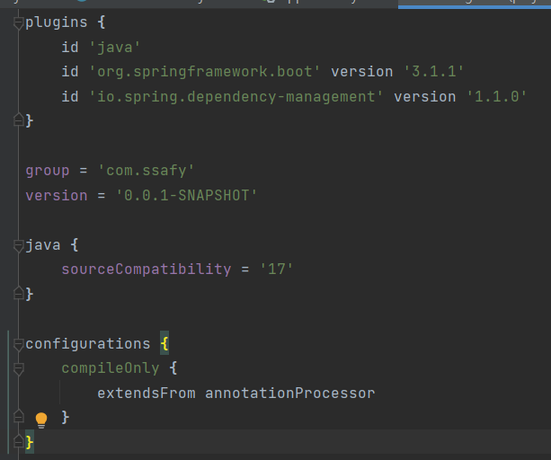
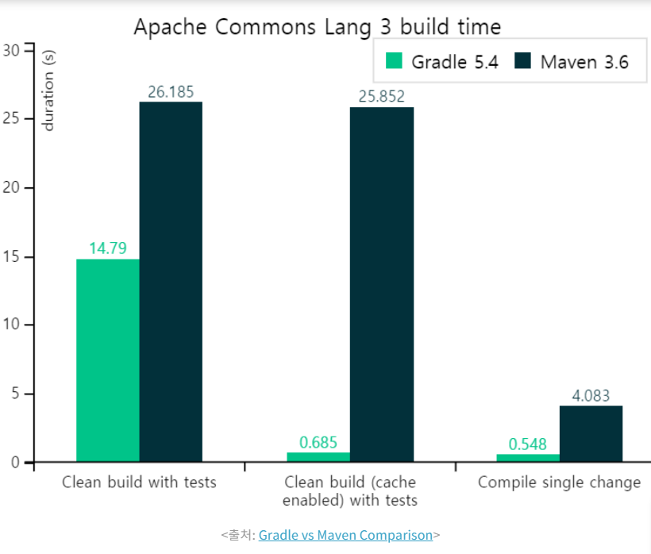

# Gradle

# 빌드 도구

- 소스 코드를 실행 가능한 애플리케이션으로 만들어준다.
    - 개발자가 스크립트를 작성, 작업을 수행 가능

## 종류

### Ant

- XML 스크립트 기반
- 자동 라이브러리 업데이트 기능이 없다
    - 레거시 시스템에만 사용된다.

### MAVEN

- XML 스크립트 기반
    - pom.xml
- 라이브러리와 의존성을 관리한다
- 라이프 사이클 개념이 도입되어 빌드 순서 등을 정의한다
    - 뭐지?

### Gradle

- 그루비(Groovy)문법을 사용한다.
    - Build.gradle
- 관리가 편하다
    - 현재 안드로이드 프로젝트의 표준 빌드 시스템이라 함
- 성능이 뛰어나다

# Gradle 사용 이유

- Groovy 문법 기반의 간결한 스크립트
    
    
    
- 빌드 속도
    - 캐싱
    - Gradle과 Maven은 빌드 캐시를 이용할 경우 최대 100배의 성능차이
    
    
    
- 데몬 프로세스
    - 한 번 빌드된 파일을 메모리상에 오랫동안 보관

- 멀티 모듈
    - 블로그 참고한다.
    
    [Spring - Gradle 멀티 모듈 프로젝트](https://backtony.github.io/spring/2022-06-02-spring-module-1/)
    
    [멀티 모듈, 그게 뭔데? 그거 어떻게 하는건데? 🧐](https://hello-judy-world.tistory.com/204)
    
    - 아직 서버 포트가 따로 열리는 개념이 익숙치 않으나
        - Interface 개념으로 공통적인 부분들의 dependency를 정의하고
        - 각각에 필요한 dependency는 또 따로 적용하여
        - 서버를 별도로 띄울 수 있다..?
