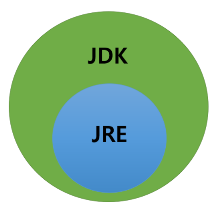

# JRE, JDK

# JRE (Java Runtime Environment)

- 자바 실행 환경
    - 자바로 만들어진 프로그램을 실행시키는데 필요한 라이브러리
    - 각종 API
    - JVM
- 개발은 안되고 실행만 된다.

# JDK (Java Development Kit)

- 자바 개발 키트
    - 자바로 개발하는데 사용
    - 개발 시 필요한 라이브러리
    - javac, javadoc 등의 개발도구
    - **당연히 JDK가 JRE를 포함한다.**
        
        
        

<aside>
💡 자바로 개발이 필요하면 JDK
자바로 만들어진 프로그램을 실행시키려면 JRE

</aside>
