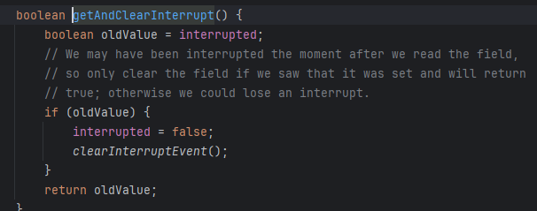

# Thread

# Thread 클래스

```java
package thread.start;

public class HelloThread extends Thread{

    @Override
    public void run() {
        System.out.println(Thread.currentThread().getName() + " : run()");
    }
}

```

```java
package thread.start;

public class HelloThreadMain {

    public static void main(String[] args) {

        // java가 만들어주는 스레드
        System.out.println(Thread.currentThread().getName() + ": main() start");

        HelloThread helloThread = new HelloThread();
        System.out.println(Thread.currentThread().getName() + ": start() 호출 전");
        helloThread.start(); // start를 호출하면 helloThread가 run을 실행. --> run()을 호출하는 것이 아닌 start()를 호출해야 함.
        /**
         * helloThread start시 helloThread를 위한 스택 공간이 할당. 즉, 이 시점에 main 스레드 스택과, helloThread 스택이 두개가 있는 상황임.
         * 별도의 이름을 부여하지 않으면 java는 Thread-0, Thread-1 ..등의 이름을 자체적으로 부여
         * main 스레드는 helloThread.start()를 통해 스레드를 실행하라(start)는 것만 지시하고, run()은 내부적으로 실행하지 않음. run은 helloThread가 실행하게 된다.
         */
        System.out.println(Thread.currentThread().getName() + ": start() 호출 후");

        System.out.println(Thread.currentThread().getName() + ": main() end");

        /**
         * 실행 결과는 스레드의 실행 순서에 따라 다를 수 있다.
         * --> Multi Thread.
         */
    }
}

```

# Runnable

```java
package thread.start;

public class HelloRunnable implements Runnable{
    
    @Override
    public void run() {
        System.out.println(Thread.currentThread().getName() + ": run()");
    }
}

```

```java
package thread.start;

public class HelloRunnableMain {

    public static void main(String[] args) {

        System.out.println(Thread.currentThread().getName() + ": main() start");

        HelloRunnable runnable = new HelloRunnable();
        Thread thread = new Thread(runnable);
        thread.start();

        System.out.println(Thread.currentThread().getName() + ": main() end");
    }
}

```

```java
package thread.start;

import static util.MyLogger.log;

public class ManyThreadMainV1 {

    public static void main(String[] args) {
        log("main() start");

        HelloRunnable runnable = new HelloRunnable();
        /**
         * 모두 runnable의 run() 메서드 실행 (
         */

        for (int i = 0; i < 100; i++) {
            Thread thread = new Thread(runnable);
            thread.start();
        }
    }
}

```

# DaemonThread

```java
package thread.start;

public class DaemonThreadMain {

    public static void main(String[] args) {
        System.out.println(Thread.currentThread().getName() + ": main() start");

        /**
         * 데몬 스레드는 사용자 스레드가 모두 종료되면 즉시 종료된다.
         */
        DaemonThread dt = new DaemonThread();
        dt.setDaemon(true); // 데몬 스레드 여부, true로 설정해야함
        dt.start();

        System.out.println(Thread.currentThread().getName() + ": main() end");
    }

    static class DaemonThread extends Thread {

        @Override
        public void run() { // 예외를 무조건 잡아야함. 설계가 그렇게 되었음.
            System.out.println(Thread.currentThread().getName() + ": run() ");
            try {
                Thread.sleep(1000);
            } catch (InterruptedException e) {
                throw new RuntimeException(e);
            }
            System.out.println(Thread.currentThread().getName() + ": run() end");
        }
    }
}

```

# Thread 기본 정보

```java
package thread.start.controll;

import thread.start.HelloRunnable;

import static util.MyLogger.log;

public class ThreadInfoMain {

    public static void main(String[] args) {

        Thread mainThread = Thread.currentThread();
        log("mainThread : " + mainThread);
        log("mainThread.threadId() : " + mainThread.threadId()); // java가 내부적으로 만들고 중복되지 않음
        log("mainThread.getName() : " + mainThread.getName()); // 스레드 이름은 중복 가능.
        log("mainThread.getPriority() : " + mainThread.getPriority()); // (1 ~ 10), 기본이 5, 높을 수록 더 많이 실행됨, OS마다 약간의 차이는 있다
        log("mainThread.getThreadGroup() : " + mainThread.getThreadGroup()); // 기본적으로 부모 스레드와 동일한 스레드 그룹에 속함
        log("mainThread.getState() : " + mainThread.getState());

        System.out.println("-----------------------");

        Thread myThread = new Thread(new HelloRunnable(), "myThread"); // main 스레드가 해당 코드를 실행했다.
        log("myThread : " + myThread);
        log("myThread.threadId() : " + myThread.threadId()); // java가 내부적으로 만들고 중복되지 않음
        log("myThread.getName() : " + myThread.getName());
        log("myThread.getPriority() : " + myThread.getPriority()); // 기본이 5, 높을 수록 더 많이 실행됨, OS마다 약간의 차이는 있다
        log("myThread.getThreadGroup() : " + myThread.getThreadGroup()); // 현재 myThread는 main 스레드가 부모 스레드가 된다
        log("myThread.getState() : " + myThread.getState()); // 스레드 상태 (NEW, RUNNABLE, BLOCKED, WAITING, TIMED_WAITING, TREMINATED
    }
}

```

# 스레드 상태

- New : 스레드 생성되었지만 아직 시작 x → start() 하지 않음.
- Runnable : 스레드가 실행 중이거나 실행 준비가 된 상태 → 스케줄러 실행 대기열에 있던, CPU에서 실행되던.
- 일시 중지 상태
    - Blocked : 스레드가 동기화 락을 기다리는 상태
        - synchronized 블록에 진입해야 하는 경우
    - Waiting : 스레드가 무기한으로 다른 스레드의 작업을 기다림 → wait(), join()
        - 다른 스레드가 notify() 또는 notifyAll()을 호출하거나, join()이 완료될 때까지.
    - Timed Waiting : 스레드가 일정 시간 동안 다른 스레드의 작업을 기다리는 상태
        - sleep(long millis), wait(long timeout), join(long millis)
- Terminated : 스레드 실행 완료
    - 스레드의 run() 메서드가 완료되는 경우

# 스레드 생명 주기

```java
package thread.start.controll;

import static util.MyLogger.log;

public class ThreadStateMain {

    public static void main(String[] args) throws InterruptedException {

        Thread myThread = new Thread(new MyRunanble(), "myThread");
        log("myThread.state : " + myThread.getState()); // NEW
        log("myThread.start");
        myThread.start();
        Thread.sleep(2000);
        log("myThread.state = " + myThread.getState()); // TIMED_WAITING
        Thread.sleep(4000);
        log("myThread.state = " + myThread.getState()); // TERMINATED
    }

    static class MyRunanble implements Runnable {

        @Override
        public void run() {
            try {
                log("start");
                log("myThread.state = " + Thread.currentThread().getState()); // RUNNABLE
                Thread.sleep(3000);
                log("sleep() end");
                log("myThread.state = " + Thread.currentThread().getState()); // RUNNABLE
                log("end()");
            } catch (InterruptedException e){

            }
        }
    }
}

```

## run()메서드에서 예외를 던지는 이유

- 메서드 재정의 규칙.
- 체크 예외
    - 부모 메서드가 체크 예외를 던지지 않는 경우, 재정의된 자식 메서드도 체크 예외를 던질 수 없다.
    - 자식 메서드는 부모 메서드가 던질 수 있는 체크 예외의 하위 타입만 던질 수 있다.

```java
package thread.start.controll;

public class CheckedExceptionMain {

    public static void main(String[] args) throws Exception {

        throw new Exception();

    }

    static class CheckRunnable implements Runnable {

				// 에러나는 코드
        @Override
        public void run() throws Exception { // 자식은 던질 수 없다. 왜? Runnable의 구현체(부모)가 예외를 던지지 않아서.

        }
    }
}

```

- ThreadUtil에서 sleep 메서드를 정의하고 RuntimeException을 던지도록 처리하는 방식을 쓰면 try catch 안 써도 되긴 한다.
    
    ```java
    package util;
    
    import static util.MyLogger.log;
    
    public abstract class ThreadUtils {
    
        public static void sleep(long millis) {
    
            try {
                Thread.sleep(millis);
            } catch(InterruptedException e) {
    
                log("인터럽트 발생 : " + e.getMessage());
                throw new RuntimeException(e);
            }
    
        }
    }
    
    ```
    

## join이 필요한 상황

- CPU 코어의 효율성 → 여러 스레드
    - main이 예를 들어 thread 2개에 + 연산 작업을 나누어 지시
        - 이후 main이 두 스레드 결과를 받아서 합치기

```java
package thread.start.controll.join;

import static util.MyLogger.log;
import static util.ThreadUtils.sleep;

public class JoinMainV1 {

    public static void main(String[] args) throws InterruptedException {

        log("start");
        log("end");
        SumTask sumTask1 = new SumTask(1, 50);
        SumTask sumTask2 = new SumTask(51, 100);

        Thread thread1 = new Thread(sumTask1, "thread-1");
        Thread thread2 = new Thread(sumTask2, "thread-2");

        thread1.start();
        thread2.start();

        // main 스레드 대기시킨다 -> WAITING 상태로 들어간다. 다른 스레드의 TERMINATED까지 무한정 대기
        log("main 스레드 대기 - thread1, 2 종료까지");
        thread1.join();
        thread2.join();
        log("main 스레드 대기 완료"); // main 스레드 RUNNABLE 상태로 변경

        log("task1.result = " + sumTask1.result);
        log("task2.result = " + sumTask2.result);

        int sum = sumTask1.result + sumTask2.result;

        log("sum = " + sum);
        log("end");

    }

    static class SumTask implements Runnable {

        int startValue;
        int endValue;
        int result = 0;

        public SumTask(int startValue, int endValue) {
            this.startValue = startValue;
            this.endValue = endValue;
        }

        public int add(int startValue, int endValue) {
            for (int i = startValue; i <= endValue; i++) {
                result += i;
            }
            return result;
        }

        @Override
        public void run() {
            log("작업 시작");
            sleep(2000);
            add(startValue, endValue);
            log("작업 결과 : " + result);
            log("작업 종료");
        }
    }
}

```

- 특정 시간만큼 대기하고 싶은 경우 join에 파라미터로 ms
    
    ```java
            log("main 스레드 대기 - thread1 종료까지");
            thread1.join(1000); // 이 때 main 스레드는 TIMED_WAITING
            log("main 스레드 대기 완료"); // main 스레드 RUNNABLE 상태로 변경
    ```
    

# Interrupt

```java
package thread.start.controll.interrupt;

import static util.MyLogger.log;
import static util.ThreadUtils.sleep;

public class ThreadStopMainV2 {

    public static void main(String[] args) {

        MyTask myTask = new MyTask();
        Thread thread = new Thread(myTask);
        thread.start();

        sleep(4000);
        log("작업 중단 지시 thread.interrupt()");
        thread.interrupt();
        log("work 스레드 상태 : " + thread.isInterrupted());

    }

    static class MyTask implements Runnable {

        @Override
        public void run() {
            try {
                /**
                 * Thread.interrupted를 받은 경우, interrupted 상태를 인지하고 반복문을 나간다.
                 * 이후 interrupted 상태를 false로 변경시켜 정상 상태로 되돌려야 한다.
                 * 그래야 마지막 자원 정리, 작업 완료가 된다.
                 * 만약 자원 회수 중 thread.sleep 같은 것을 만난 경우(가정) 다시 interrupted가 된다.
                 * 단순 상태 조회로 Thread.currentThread.isInterrupted와는 다르다.
                 * Thread.currentThread.isInterrupted 자원 정리를 하는 도중에 interrupted를 받을 영향이 있음
                 */
                while (!Thread.interrupted()) {
                    log("작업 중");
                    Thread.sleep(3000);
                }
            } catch (InterruptedException e) {
                log("work 스레드 작업 상태 : " + Thread.currentThread().isInterrupted());
                log("인터럽트 메시지 : " + e.getMessage());
                log("state : " + Thread.currentThread().getState());
            }
            log("자원 정리");
            log("작업 완료");
        }
    }
}

```


