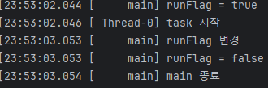

# volatile

```java
package thread.start.volatile1;

import static util.MyLogger.log;
import static util.ThreadUtils.sleep;

public class VolatileFlagMain {

    public static void main(String[] args) {

        MyTask task = new MyTask();
        Thread thread = new Thread(task);
        log("runFlag = " + task.runFlag);
        thread.start();

        sleep(1000);
        log("runFlag 변경");
        task.runFlag = false;
        log("runFlag = " + task.runFlag);
        log("main 종료");
    }

    static class MyTask implements Runnable {

        boolean runFlag = true;

        @Override
        public void run() {
            log("task 시작");
            while(runFlag) {

            }
            log("task 종료");
        }
    }
}

```

- 결과
    
    
    
    - Therad-0이 종료되지 않은 채로 CPU를 계속 잡아먹고 있다.

## 메모리 가시성

- 위의 코드에서 main 스레드와 Thread-0은 같은 메모리의 runFlag를 읽음
- 실제 메모리는 CPU의 처리 성능을 위해 **캐시 메모리**를 사용
    - 즉, CPU가 효율적으로 이를 처리하기 위해 캐시 메모리에 runFlag를 올려둠
    - **메인 메모리에 이 값이 즉시 반영되지 않음**
        - **`언제 반영될 지 알 수 없다.`**

```java
    static class MyTask implements Runnable {

        //boolean runFlag = true;
        volatile boolean runFlag = true;

        @Override
        public void run() {
            log("task 시작");
            while(runFlag) {

            }
            log("task 종료");
        }
    }
```

- 기존 코드에서 volatile을 사용하여 개선.
    - 메인 메모리에 바로 접근하라고 명령한 것.
    - 따라서 변경하자마자 메인 메모리에 반영
        - 성능은 조금 떨어지겠지.

<aside>
💡

volatile은 **`메모리 가시성`**을 위해 존재

</aside>
