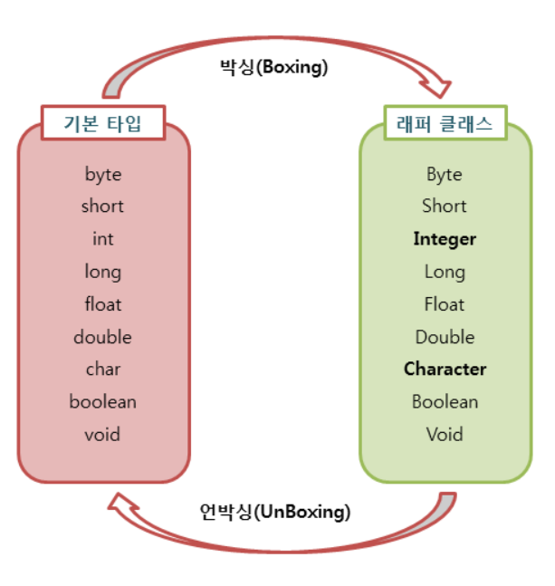

# 오토 박싱 & 오토 언박싱

# 기본 타입 & Wrapper

- 기본
    - char, shore, int, fload, double, boolean …
- Wrapper
    - Integer, Long, Float, Double, Boolean …
    - 기본형을 참조형으로 만들어야 할 경우 사용
    - 

## 박싱

- 기본 타입 → Wrapper

## 언박싱

- Wrapper → 기본 타입

<aside>
💡 오토 박싱과 언박싱은 **되도록 일어나지 않도록.**
**`동일한 타입 연산`**이 이루어지도록 하자

</aside>

- 자동으로 해주긴 하나 **내부적으로 추가 연산이 있다는 것**은
    - **`성능이 저하`**된다는 것.

- long과 Long 타입의 **오토박싱이 일어나게 하는 경우**
    - 백만 건 기준으로
    - **`약 5배의 성능 차이`**가 있다.
