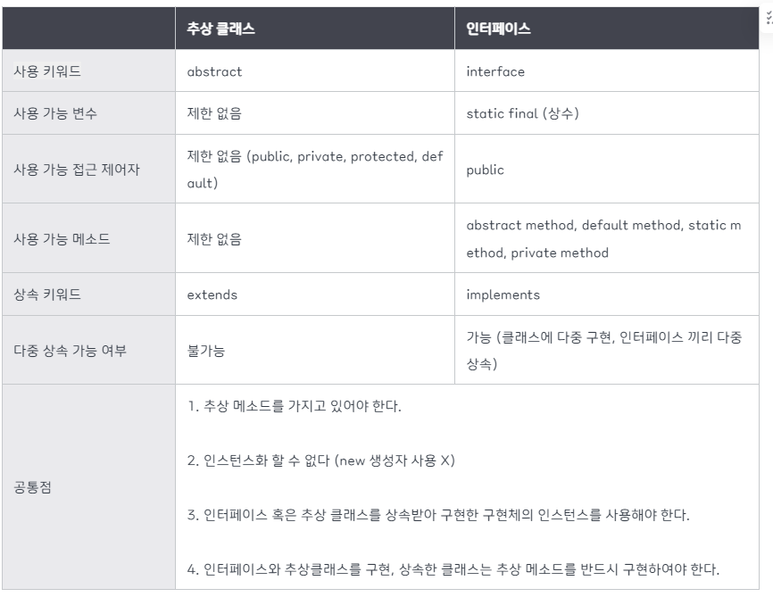

# 인터페이스, 추상클래스

[☕ 인터페이스 vs 추상클래스 용도 차이점 - 완벽 이해](https://inpa.tistory.com/entry/JAVA-☕-인터페이스-vs-추상클래스-차이점-완벽-이해하기)



# 추상 클래스

- 추상 메서드를 선언하여
    - 상속을 통해서
        - 자손 클래스에서 완성한다.
- **`미완성 설계도`**
- 상속을 위한 클래스
    - **`객체 생성 불가`**

```java
abstract class abstractClass {
		public abstract void abstractMethod();
}
```

# 인터페이스

- 기본 설계도
- 다중 상속 및 구현 가능

# 차이점

- 추상 클래스 → IS - A “~이다”
- 인터페이스 HAS - A “ ~을 할 수 있는”.

<aside>
💡 **`다중 상속 여부`**

</aside>

- 자바는 한 개만 상속이 가능
    - 클래스의 구분을 추상클래스 상속을 통해 해결
    - 인터페이스는 할 수 있는 ‘기능’

<aside>
💡 기능은 인터페이스, is - a 관계에 있는 것은 추상클래스?

</aside>

- 인간과 동물은 생명체다
    - ‘말’을 할 수 있다
    - ‘생리현상’을 한다
    - 직립보행을 한다
- **`인터페이스는 기능`**

# 언제 사용?

- 추상 클래스
    - **`논리적인 타입 묶음`**
    - 같은 조상 클래스 상속, 기능도 똑같이 필요한 경우

- 인터페이스
    - **`자유로운 타입 묶음`**
    - 다른 조상 클래스를 상속하는데, 같은 기능이 필요한 경우
    - 서로 관련성이 없는 클래스들을 묶을 때
    - 다중 상속
