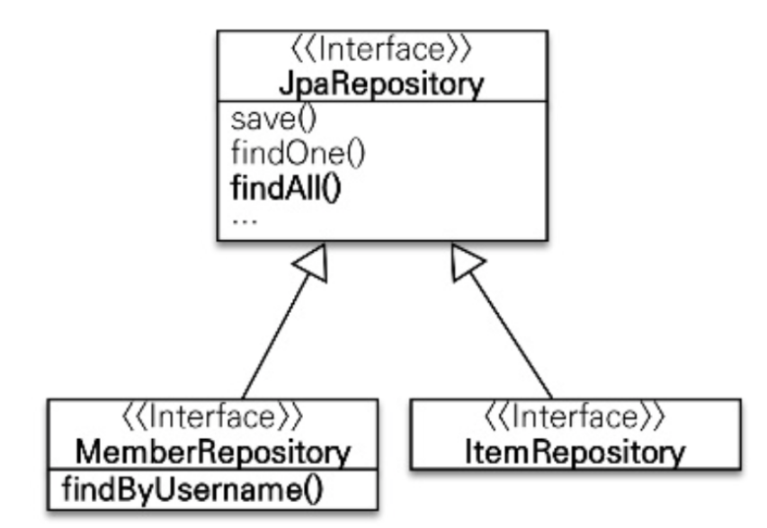
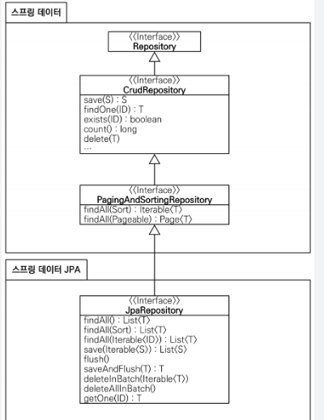

# 12. 스프링 데이터 JPA

<aside>
💡 데이터 접근 계층 개발 시 구현 클래스 없이 인터페이스만 작성해서 개발

</aside>

- CRUD를 처리하기 위한 공통 메소드
    
    ```yaml
    org.springframework.data.jpa.repository.JpaRepository 인터페이스에서 지원
    ```
    
- 예시



## 공통 인터페이스 기능

- 인터페이스 상속
    - JpaRepository
    
    ```java
    public interface MemberRepository extends JpaRepository<Member, Long {
    }
    ```
    
- JpaRepository 인터페이스 계층 구조
    
    
    
    - 스프링 데이터 프로젝트가 공통으로 사용하는 인터페이스
    - JpaRepository 인터페이스는 추가로 JPA에 특화된 기능을 제공

## 쿼리 메소드 기능

- 3가지
    - 메소드 이름으로 쿼리 생성
    - 메소드 이름으로 JPA NamedQuery 호출
    - @Query 어노테이션을 사용해서 리포지토리 인터페이스에 쿼리 직접 정의

### 메소드 이름으로 쿼리 생성

```java
public interface MemberRepository extends Repository<Member, Long> {
	List<MEmber> findByEmailAndNmae(String email, String name);
}
```

### JPA NamedQuery

- 쿼리에 이름을 부여해서 사용하는 방법

```java
@Entity
@NamedQuery (
	name = "Member.findByUsername",
	query = "select m from Member m where m.username = :username")
public class Member {
	...
}
```

```java
public class MemberRepository {
	public List <Member> findByUsername(String username) {
		List<Member> resultList = 
			em.createNamedQuery("Member.findByUsername", Member.class)
				.setParameter("username", "회원1")
				.getResultList();
	}
}
```

- 스프링 데이터 JPA로 Named 쿼리 호출
    - 프로젝트에서 사용할 형식

```java
public interface MemberRepository extends JpaRepository<Member, Long>
{
	List<Member> findByUsername(@Param("username") String username);
}

```

### @Query, 리포지토리 메소드에 쿼리 정의

- JPQL

```java
public interface MemberRepository extends JpaRepository<Member, Long>
{
	@Query("select m from Member m where m.username = ?1"
	List<Member> findByUsername(@Param("username") String username);
}
```

- 네이티브 SQL

```java
public interface MemberRepository extends JpaRepository<Member, Long>
{
	@Query(value = "select m from Member m where m.username = ?0",
				nativeQuery = true)
	Member findByUsername(String username);
}
```

## 페이징과 정렬

```java
org.springframework.data.domain.Sort
org.springframework.data.domain.Pageable (내부에 Sort 포함)

// count 쿼리 사용
Page<Member> findByName(String name, Pageable pageable);

// count 쿼리 사용 안함
List<Member> findByName(String name, Pageable pageable);

List<MEmber> findByName(String name, Sort sort);

/*
두 번째 파라미터로 받은 Pageable은 인터페이스
실제 사용할 때는 PageRequest 객체를 사용
org.springframework.data.domain.PageRequest
응답할 때는 PageResponse
*/
```

- Page 사용 예제
    - 검색 조건 : 이름이 김으로 시작하는 회원
    - 정렬 조건 : 이름으로 내림차순
    - 페이징 조건 : 첫 번째 페이지, 페이지당 보여줄 데이터는 10건

```java
PageRequest pageRequest = new PageRequest(0, 10, new Sort(Direction.DESC, "name"));

Page<Member> result = memberRepository.findByNameStartingWith("김", pageRequest);

List<Member> member = result.getContent(); // 조회된 데이터
int totalPages = result.getTotalPages(); // 전체 페이지 수
boolean hasNextPage = result.hasNextPage(); // 다음 페이지 존재 여부
```
