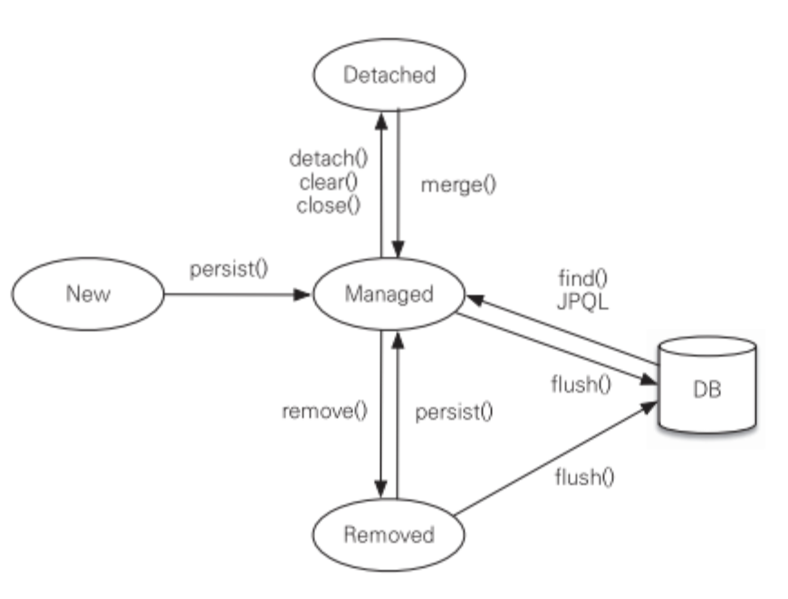

# 3. 영속성 관리

# 엔티티 매니저 팩토리와 엔티티 매니저

- 데이터베이스를 하나만 사용
    - 일반적으로 EntityManagerFactory 하나만 생성
    - 생성비용이 엄청나게 커서 한 개로 공유하도록 설계
- 엔티티 매니저 팩토리는 **`서로 다른 스레드 공유 가능`**

- 엔티티 매니저
    - 엔티티 저장, 수정, 삭제, 조회 등 엔티티와 관련된 모든 일 처리
    - 가상의 데이터베이스라 생각하자.
    - **`위와 같은 이유로 여러 스레드가 동시에 접근하면 안됨.`**
    - 데이터베이스 연결이 꼭 필요한 시점까지 커넥션을 얻지 않음
        - 트랜잭션이 시작할 때 커넥션을 획득.

# 영속성 컨테스트

- 엔티티를 영구 저장하는 환경
- 엔티티 매니저로 엔티티를 저장하거나 조회하면 영속성 컨텍스트에 엔티티를 보관, 관리
- persist() 메서드
    - em.persist(member)
        - 엔티티 메니저를 사용해서 회원 엔티티를 영속성 컨텍스트에 저장

# 엔테테의 생명 주기

- 비영속
    - 영속성 컨텍스트와 전혀 관계가 없는 상태
    - Member member = new Member();
    - member.setId(”example”);
        - **`순수한 객체상태임.`**
- 영속
    - 영속성 컨텍스트에 저장된 상태
    - 영속성 컨텍스트가 관리하는 엔티티
    - em.persist(member);
- 준영속
    - 영속성 컨텍스트에 저장되었다가 분리된 상태
    - 특정 엔티티를 준영속으로 만들기
        - em.detach();
    - em.clear()나 em.close()로 영속성 컨텍스트를 닫거나.
- 삭제
    - 삭제된 상태
    - em.remove();

# 영속성 컨텍스트의 특징

- 영속성 컨텍스트와 식별자 값
    - 엔티티를 식별자 값(@Idㅇ로 테이블의 기본키와 매핑한 값)으로 구분.
        - 영속 상태는 **`식별자 값이 반드시 있어야함`**

- 영속성 컨텍스트와 데이터베이스 저장
    - **`플러시(flush)`**
        - 트랜잭션을 **`커밋하는 순간` 영속성 컨텍스트에 새로 저장된 엔티티를 DB에 반영**
    
- 영속성 컨텍스트가 엔티티를 관리했을 때 장점
    - 1차 캐시
    - 동일성 보장
    - 트랜잭션을 지원하는 쓰기 지원
    - 변경 감지
    - 지연 로딩
    

## 엔티티 조회

- 영속성 컨텍스트는 내부에 **`캐시`**가 있음 (1차 캐시)
    - 영속 상태의 엔티티가 모두 이곳에 저장
    - 컨텍스트 내부에 Map이 있음
        - 키는 @Id로 매핑한 식별자고 값은 엔티티 인스턴스
    - em.find()를 호출하면 1차 캐시에서 에티티를 찾고
    - 1차 캐시에 없으면 데이터베이스에서 조회
- 1차 캐시는 REPEATABLE READ 등급의 트랜잭션 격리 수준을 애플리케이션 차원에서 제공한다고 함
    - 나중에 조금 알아보자

## 엔티티 등록

- 트랜잭션을 커밋하기 전까지 내부 쿼리 저장소에 INSERT SQL을 모아둠
- 트랜잭션을 커밋할 때 모여진 쿼리를 데이터베이스에 보낸다
    - **`쓰기 지연 (transactional write-behind)`**

## 엔티티 수정

- SQL 수정 쿼리의 문제
    - 수정 쿼리가 많고, 비즈니스 로직을 분석하기 위해 SQL을 계속 확인해야 함.
        - 비즈니스 → SQL 의존

### 변경 감지

- **영속성 컨텍스트가 관리하는 영속 상태의 엔티티에만 적용**
- 엔티티의 변경사항을 데이터베이스에 자동으로 반영
    - **`변경 감지(dirty checking)`**
- 엔티티를 영속성 컨텍스트에 보관할 때
    - 최초 상태를 복사해서 저장해둔다
        - **`스냅샷`**
- 순서
    - 트랜잭션 커밋 시 엔티티 매니저 내부에서 flush 호출
    - 엔티티와 스냅샷을 비교해서 변경된 엔티티 찾음
    - 변경된 엔티티가 있으면 수정 쿼리를 생성해서 쓰기 지연 SQL 저장소에 보냄
    - 쓰기 지연 저장소의 SQL을 데이터베이스에 보낸다
    - 데이터베이스 트랜잭션을 커밋

## 엔티티 삭제

- 삭제 쿼리 역시 쓰기 지연 SQL 저장소에 등록
- em.remove(memeber)
    - 호출 시 영속성 컨텍스트에서 제거
    - 얘는 재사용하지 말고 GC의 대상이 되도록 두는 것이 좋음

# 플러시

- 영속성 컨텍스트의 변경 내용을 데이터베이스에 반영
    - 변경감지가 동작
    - 쓰기 지연 SQL 저장소의 쿼리를 DB에 전송

- 방법
    - em.flush()를 직접 호출
    - 트랜잭션 커밋 시 플러시 자동 호출
    - JPQL 쿼리 실행 시 플러시 자동 호출
        - SQL로 변환되어 실행될 때 넣어두었던 것들이 반영되어야 하므로

### 플러시 모드 옵션

- 직접 지정하려면
    - javax.persistence.FlushModeType
    - em.setFlushMode(FlushModeType.COMMIT)

## 준영속

- 영속 상태의 엔티티를 준영속 상태로 만드는 방법
    - em.detach(entity)
        - 특정 엔티티만 준영속 상태로 전환
        - 1차 캐시부터 쓰기 지연 SQL 저장소까지 해당 엔티티를 관리하기 위한 모든 정보 제거
    - em.clear()
        - 영속성 컨텍스트 초기화
    - em.close()
        - 영속성 컨텍스트 종료

### 준영속 상태의 특징

- 비영속 상태에 가깝다.
- 식별자 값을 가지고 있따.
- 지연 로딩을 할 수 없다.

### 병합 : merge()

- 준영속 상태의 엔티티를 다시 영속 상태로 변경
- 준영속 상태의 엔티티를 받아서 그 정보로 새로운 영속 상태의 엔티티를 반환
- em.merge(member);
