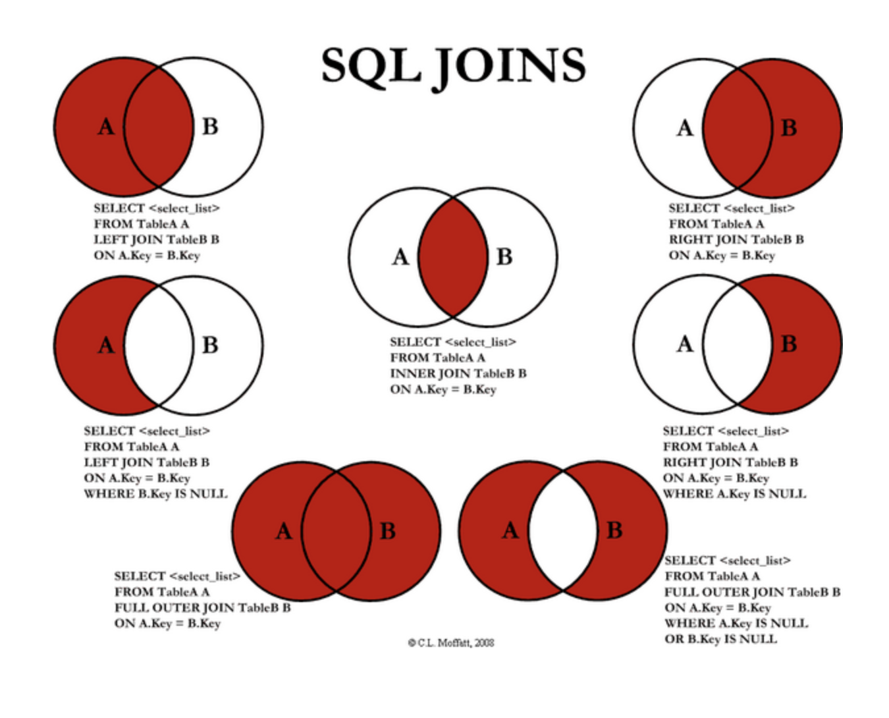

# join

태그: 그림, 샘플 코드

# 그림을 참고하여 JOIN을 이해한다.



[[MySQL] Join 깔끔한 이해와 사용법](https://yoo-hyeok.tistory.com/98)

## LEFT JOIN

- 왼쪽 테이블 A의 전체와, A와 B의 Key값이 같은 것을 반환

```
SELECT <select_list>
FROM TABLEA A
LEFT JOIN TABLEB B
ON A.Key = B.Key
```

## LEFT JOIN A만 뽑기 (교집합 제거)

```
SELECT <select_list>
FROM TABLEA A
LEFT JOIN TABLEB B
ON A.Key = B.Key
**WHERE B.Key is null**
```

## RIGHT JOIN

- 오른쪽 테이블 B의 전체와, A와 B의 Key값이 같은 것을 반환

```
SELECT <select_list>
FROM TABLEA A
RIGHT JOIN TABLEB B
ON A.Key = B.Key
```

## RIGHT JOIN B만 뽑기 (교집합 제거)

```
SELECT <select_list>
FROM TABLEA A
RIGHT JOIN TABLEB B
ON A.Key = B.Key
**WHERE A.Key is null**
```

## INNER JOIN (교집합 뽑기)

- A와 B의 공통 요소만 뽑기

```
SELECT <select_list>
FROM TABLEA A
INNER JOIN TABLEB B
ON A.Key = B.Key
```

## FULL OUTER JOIN(전체)

- MySQL은 지원 안하므로, **`LEFT JOIN과 RIGHT JOIN을 UNION`**

```
SELECT <select_list>
FROM TABLEA A
LEFT JOIN TABLEB B
ON A.Key = B.Key
**UNION**
SELECT <select_list>
FROM TABLEA A
RIGHT JOIN TABLEB B
ON A.Key = B.Key
```

## FULL OUTER JOIN (교집합 제거)

```
SELECT <select_list>
FROM TABLEA A
LEFT JOIN TABLEB B
ON A.Key = B.Key
**UNION**
SELECT <select_list>
FROM TABLEA A
RIGHT JOIN TABLEB B
ON A.Key = B.Key
WHERE A.Key is null OR B.Key is null
```
