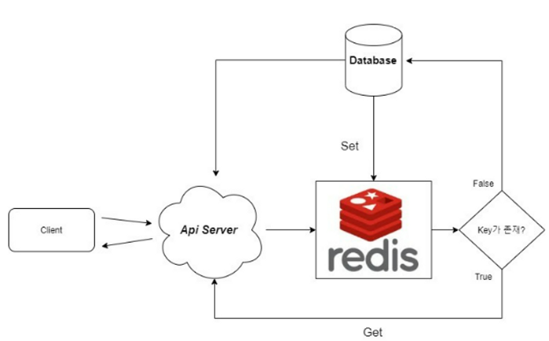

# 1. Redis 개념

# Redis (Remote Dictionary Server)

- 디스크 x
- 메모리 기반의 **`Key - Value`** 구조 데이터 저장소
- NoSQL DBMS로 분류되기도,
- In-Memory 솔루션으로 분류되기도 함

# 장점

- In-Memory에서 읽어들이는 것이 RDBMS에 비해 약 **1000배** 빠름
    - 디스크에 액세스할 필요를 없애서 검색 시간 지연 방지
        - 일반적으로 작업 실행하는데 1ms 미만 **From aws**
        
        [Redis란 무엇입니까? – Amazon Web Services(AWS)](https://aws.amazon.com/ko/elasticache/what-is-redis/)
        
- 다양한 데이터 타입 지원
    - List, String, Set, Sorted set…
- 대량의 트래픽 → RDBMS 부하 줄이고, 캐싱 전략 사용 가능
- 복제(Replication)
    - **Master-Slave**

<aside>
💡 Master-Slave 복제 지원

Master 서버에 발생하는 쓰기 작업은 Slave 서버로 비동기적 복제
Slave 서버는 Master 서버의 상태를 복제하여 데이터의 안정성과 가용성을 보장

복제를 통해 **읽기 작업 분산**, **`마스터 서버의 부하를 줄인다.`**

</aside>

- 분산 환경 (Clustering)

# 패턴

## Look aside cache

- 데이터 요청
- Redis에 있다면 가져온다.
- 없으면 DB에서 가져오고 Redis에 저장

## Write Back

- 웹서버가 모든 데이터를 Cache 서버에 저장
- Cache 서버에 특정 시간 동안 데이터가 저장
- Cache 서버에 있는 데이터를 DB에 저장
- DB에 저장된 Cache 서버의 데이터를 삭제
    - insert 쿼리 **500번** VS insert 쿼리 **500개를 모아두었다가 1번**

# 사용 사례

### 캐싱

- DB 앞에 배치 → 액세스 지연 시간 감소, DB 부하 줄이기

### 세션 관리

- 세션 키에 대한 적절한 TTL과 키 값 스토어 사용으로 간단한 세션 정보 관리

### 실시간 순위표

- Sorted Set 데이터 구조 사용 → 점수에 따라 정렬 가능.

### 채팅 및 메시징

- PUB/SUB 표준을 지원하므로 고성능 채팅방, 실시간 코멘트 스트림 및 서버 상호 통신 지원 가능

# 고려사항

- **싱글 쓰레드 기반**
    - **동시성** 및 **경합 상황**에 대해서 주의해야함
- 메모리 용량의 제한
    - 메모리 크기를 고려하여 데이터를 관리하고 적절하게 스케일링해야 한다.
- 서버 재시작, 장애 상황에서 데이터 영구 보존 어려움
- 적절한 데이터 구조 선택 필요
- 키 네이밍 규칙

# 참고

[[Redis] 레디스를 사용하는 이유](https://pinggoopark.tistory.com/797)
