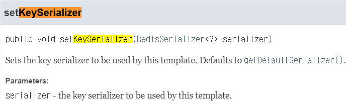
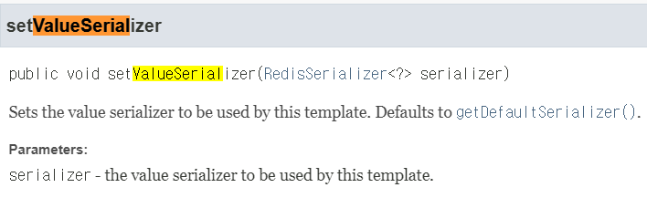
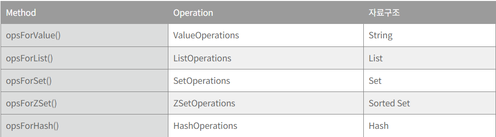

# RedisTemplate 이용

## 공식 문서

[Spring Data Redis](https://docs.spring.io/spring-data/data-redis/docs/current/reference/html/)

## 구현 참고 블로그

[Springboot + Redis 연동하는 예제 (1) 기본](https://oingdaddy.tistory.com/310)

# RedisTemplate

- 별도의 Config파일은 필요없다.
    - SpringBoot 2.0 이상에서 RedisTemplate에 대한 설정을 다 해놓았다.
- 언제 Config 파일이 필요한가?
    - Springboot 2.2이상에서는 아래 4가지들을 자동으로 설정해줌
    
    ```java
    @Autowired RedisTemplate redisTemplate;
    
    @Autowired StringRedisTemplate stringRedisTemplate;
    
    @Autowired ReactiveRedisTemplate reactiveRedisTemplate;
    
    @Autowired ReactiveStringRedisTemplate reactiveStringRedisTemplate;
    ```
    
    - 만약 위의 것들을 사용하는데 어떠한 것을 **커스터마이징해서 사용하고 싶다면**
        - Config파일이 필요하다.
- RedisTemplate<K, V>의 형태를 우리 프로젝트에 맞게 정의해서 사용해야 한다.
    - RedisTemplate<Character, TrieNode> 등
        - 이 때 **`key`**, **`value`**에 대한 **직렬화 방식**을 지정해주어야 한다.
        - **직렬화 방식을 바꿔서 설정이 필요할 때가 Config가 필요할 때임**
        
        
        
        
        

# RedisTemplate 직렬화 구조

<aside>
💡 **추후에 변경이 일어날 수 있으니 정리**

</aside>

- 현재 우리 프로젝트 RedisTemplate의 직렬화 방식(Default)
    - **`JdkSerializationRedisSerializer`**
    - key와 value가 동일
- 현재 우리 프로젝트 StringRedisTemplate의 직렬화 방식(Default)
    - **`StringRedisSerializer`**
    - key와 value가 동일
- 참고로 StringRedisTemplate은 RedisTemplate을 extends

# 메서드



##
