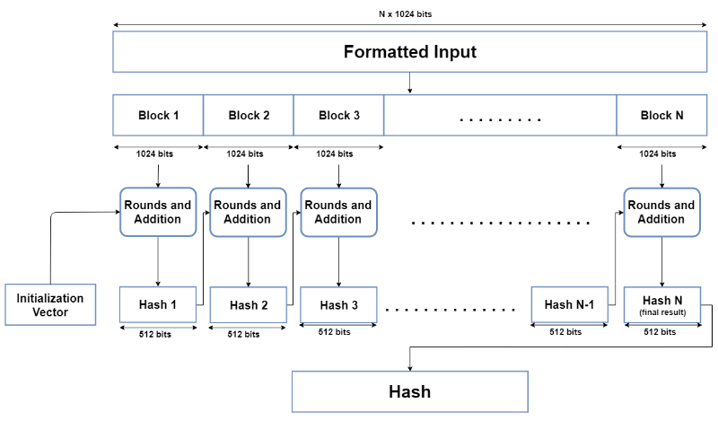
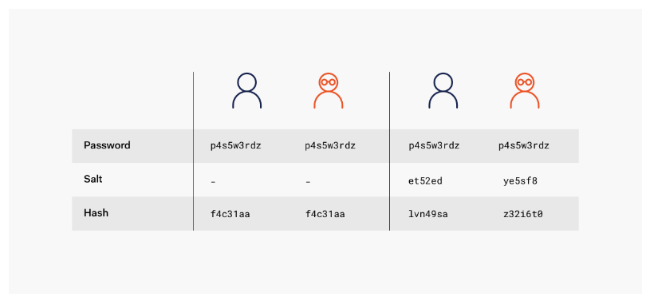

# SHA-256

## SHA-256 해시 알고리즘와 Salt를 이용한 멤버 비밀번호 단방향 암호화

### 1. 적용 알고리즘

- SHA-256 해시 알고리즘 & Salt

### 2. 알고리즘 개요

### SHA-256 해시 알고리즘

[출처 (위는 SHA-512에 관한 그림이다. 해시 값의 길이와 블록 크기가 다를 뿐, 구동 방식은 동일하다.)](https://komodoplatform.com/en/academy/sha-512/)

SHA(Secure Hash Algorithm) 알고리즘의 한 종류로, 256비트로 구성되며 64자리의 문자열을 반환한다. 복호화가 불가능한 단방향 암호화 방식이다. SHA-256은 입력값이 조금만 달라져도 출력값이 완전히 달라지며 비밀번호와 같은 중요한 정보를 안전하게 보호할 때 많이 사용된다.

- 동작 방식
    1. 입력값을 512비트 블록으로 나눈다.
    2. 초기값을 설정한다.
        - 이전의 해시 값이 없는 경우: 고정된 초기값 사용
        - 이전의 해시 값이 있는 경우: 이전 라운드에서 계산된 해시 값 사용
    3. 이전 블록의 해시값(초기값)과 현재 블록을 통해 새로운 해시값 계산한다.
    4. [2-3]단계를 모든 블록에 대하여 반복한다.
    5. 최종 해시 값을 반환한다.

### Salt

[출처](https://auth0.com/blog/adding-salt-to-hashing-a-better-way-to-store-passwords/)

해시 함수의 입력 값에 추가되어 암호화 과정을 보다 복잡하게 하여 보안성을 높이는 기술이다.

해시 함수만 사용 했을 경우, 다음과 같은 문제점이 있다.

1. 해커들이 사전에 준비한 레인보우 테이블을 통해 공격이 가능하다.
    - 레인보우 테이블: 해시 함수를 사용하여 만들어 낼 수 있는 값들을 대량으로 저장한 표
2. 서로 다른 입력값이 같은 출력값을 가질 수 있다. (해시 충돌)

하지만 Salt를 활용하면 동일한 비밀번호를 가진 사용자들이 있더라도 Salt를 각자 다르게 적용하면 다른 해시값을 가지게 되므로 레이보우 테이블 공격과 해시 충돌을 방지 할 수 있다.
