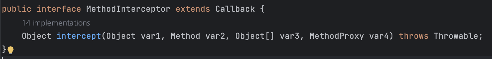
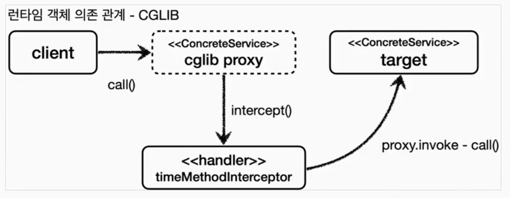

# CGLIB

## CGLIB

Code Generator Library라고 하며, 바이트코드를 조작해서 동적으로 클래스를 제공한다. JDK 동적 프록시와 다르게 인터페이스가 없어도 구체 클래스만 가지고 동적 프록시를 만들어낼 수 있다. 스프링에서는 내부 소스 코드에 이를 포함시켰으며, 별도의 외부 라이브러리를 추가하지 않아도 사용할 수 있다.

Spring의 ProxyFactory가 이를 편리하게 사용하게 해주기 때문에, 개념만 잡아두자.

CGLIB에서는 MethodInterceptor 인터페이스를 제공하며, 아래와 같은 형태를 띄고 있다.



참고로 MethodProxy는 메서드 실행을 더 빠르게 해주는 역할을 해준다고 한다. CGLIB에서 사용을 권장하고 있다.

```java
@Slf4j
public class TimeMethodInterceptor implements MethodInterceptor {

    private final Object target;

    public TimeMethodInterceptor(Object target) {
        this.target = target;
    }

    @Override
    public Object intercept(Object obj, Method method, Object[] args, MethodProxy methodProxy) throws Throwable {
        log.info("TimeProxy 실행");
        long startTime = System.currentTimeMillis();

        Object result = methodProxy.invoke(target, args);

        long endTime = System.currentTimeMillis();
        long resultTime = endTime - startTime;
        log.info("TimeProxy 종료 resultTime={}", resultTime);
        return result;
    }
}
```

CGLIB를 사용하기 위해 MethodInterceptor를 구현한다. 프록시는 항상 대상(target)을 필요로 하기 때문에 target을 생성자 주입, Override한 메서드의 로직을 작성한다.

```java
@Test
    void cglib() {
        ConcreteService target = new ConcreteService();

        Enhancer enhancer = new Enhancer();
        enhancer.setSuperclass(ConcreteService.class);
        enhancer.setCallback(new TimeMethodInterceptor(target));
        ConcreteService proxy = (ConcreteService) enhancer.create();
        log.info("targetClass={}", target.getClass());
        log.info("proxyClass={}", proxy.getClass());

        proxy.call();

    }
```

Enhancer는 프록시 객체를 생성해주는 역할을 한다고 본다. 해당 enhancer에 어떤 구체 클래스를 부모로 할 것이냐를 지정하기 위해 class 타입을 지정하고, MethodInterceptor를 구현한 클래스를 Callback에 넣어준다. 프록시에 적용할 로직을 알려주는 것이다. 이후 해당 타입의 proxy객체를 enhancer의 create 메서드를 통해 이용할 수 있다.



## 제약

클래스 기반 프록시는 ‘상속’을 사용한다. 하여 부모 클래스의 생성자를 체크해야 하고, 기본 생성자가 필요하다. 또한 Java의 기본 개념으로 final 키워드가 붙으면 상속, 메소드 오버라이딩 모두 되지 않는다. 이런 경우 CGLIB에서 예외를 발생시킨다.
