# IoC, DI

# 제어의 역전

- 제어권이 뒤바뀐다
- 클라이언트 구현 객체가 스스로 다 생성하고, 실행하고 등의 책임을 가지고 있다고 하자.
    - 이를 뒤집어 주는 것이다.
- Config라는 객체가 구현 객체의 의존성을 대신 처리해준다고 하자.
    - 그렇다면, 클라이언트 구현 객체는 생성의 역할에서 해방
    - 클라이언트는 이를 몰라도 상관없다. 오로지 실행만 하는 책임만 있음
    - 필요한 인터페이스를 호출하지만, **그 인터페이스의 구현 객체는 누군지 모른다**
    - 프로그램의 **제어 권한이 Config**에 있다
- **프로그램의 제어 흐름을 직접 제어하는 것이 아니라, `외부에서 관리한다`**

# 의존관계 주입

- 인터페이스에 의존한다 → 실제 어떤 구현 객체가 사용되는지는 모른다
- **정적인 클래스 의존관계**와, 실행 시점에 결정되는 **동적인 객체(인스턴스) 의존관**계를 분리해서 생각해야 한다.

### 정적인 클래스 의존관계

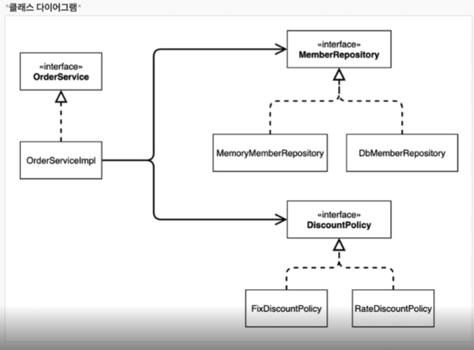

- OrderServiceImpl이 DiscountPolicy라는 추상화에 의존하고 있다.
    - 이런 클래스 의존관계 만으로는 **런타임 시 어떤 구현체를 사용하는지를 모른다**
    

### 동적인 객체 인스턴스 의존관계

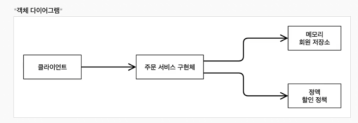

- 런타임 시에 외부에서 실제 구현 객체를 생성하고 클라이언트에 전달
- 클라이언트는 전달 받고 서버와 실제로 의존 관계를 가지게 된다
    - **`DI(의존관계 주입)`**
- 클라이언트 코드를 변경하지 않고 호출 대상의 타입 인스턴스를 변경할 수 있다.
- **정적인 클래스 의존관계를 변경하지 않고** 동적인 객체 인스턴스 관계를 변경할 수 있다.

# 스프링 컨테이너

- 설정 정보를 참고해서 애플리케이션을 구성하는 오브젝트를 생성하고 관리
    - IoC를 담당 : Bean Factory라고 하기도, ApplicationContext라기도 한다.
- **ApplicationContext** → 인터페이스
    - Bean Factory를 확장한 개념
        - 엔터프라이즈 애플리케이션을 개발하는데 필요한 기능을 추가한 것.
        - IoC와 DI를 위한 것이면서 그 이상의 기능을 가진 것이 ApplicationContext
        - 빈을 생성하고 의존 관계를 설정하는 기능 이상을 하게 된다.
- 개발자가 AppConfig를 통해 직접 객체 생성하고 DI → **스프링 컨테이너가 대체**
- **@Configuration**이 붙은 AppConfig(예시)를 구성 정보로 사용
    - **@Bean**이 붙은 메서드를 모두 호출해서 반환된 객체를 스프링 컨테이너에 등록
    - applicationContext.getBean()으로 사용할 것임.

## 컨테이너 생성

```jsx
// 사용 예시, Annotation 기반이 아니라 xml 기반으로도 가능하며 많은 ApplicationContext가 있음.

// 애노테이션 기반의 자바 설정 클래스
ApplicationContext applicationContext = new AnnotationConfigApplicationContext(AppConfig.class);
```

- AppConfig를 스프링 기반으로 변경 : @Configuration, @Bean

```jsx
@Configuration
public class AppConfig {

    @Bean
    public MemberService memberService() {
        return new MemberServiceImpl(memberRepository());
    }

    @Bean
    public MemberRepository memberRepository() {
        return new MemoryMemberRepository();
    }

    @Bean
    public OrderService orderService() {
        return new OrderServiceImpl(memberRepository(), discountPolicy());
    }

    @Bean
    public DiscountPolicy discountPolicy() {
        // return new FixDiscountPolicy();
        return new RateDiscountPolicy();
    }
}
```

- OrderApp에서 Java → Spring으로 변경 : applicationContext, getBean
- AnnotaionConfigApplicationContext : 자바 설정 클래스를 기반으로 스프링 컨테이너 만들기

```jsx
public class OrderApp {

    public static void main(String[] args) {

//        AppConfig appConfig = new AppConfig();
//        MemberService memberService = appConfig.memberService();
//        OrderService orderService = appConfig.orderService();

        ApplicationContext applicationContext = new AnnotationConfigApplicationContext(AppConfig.class);
        MemberService memberService = applicationContext.getBean("memberService",MemberService.class);
        OrderService orderService = applicationContext.getBean("orderService",OrderService.class);

        Long memberId = 1L;

        Member member = new Member(1L,"memberA", Grade.VIP);
        memberService.join(member);

        Order order = orderService.createOrder(memberId,"itemA",20000);

        System.out.println("order : " + order);
        System.out.println("order.calculatePrice : " + order.calculatePrice());
    }
}
```

## 스프링 컨테이너 생성 과정

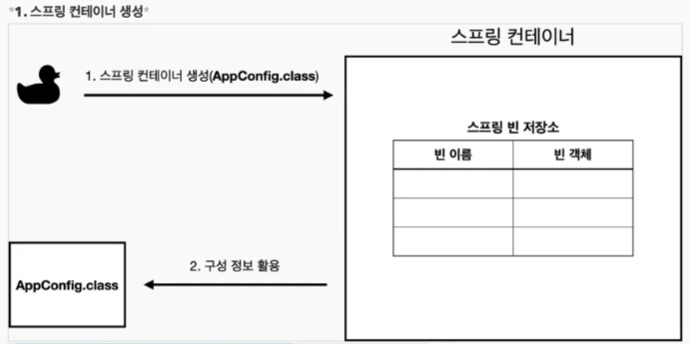

- AppConfig 정보를 활용하는 스프링 컨테이너가 위와 같이 만들어진다.
- 이 스프링 빈 저장소에 AppConfig에 @Bean이 붙은 메서드들을 빈 이름, 빈 객체로 지정한다.

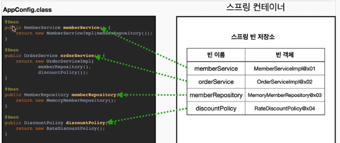

- 의존관계 주입
    
    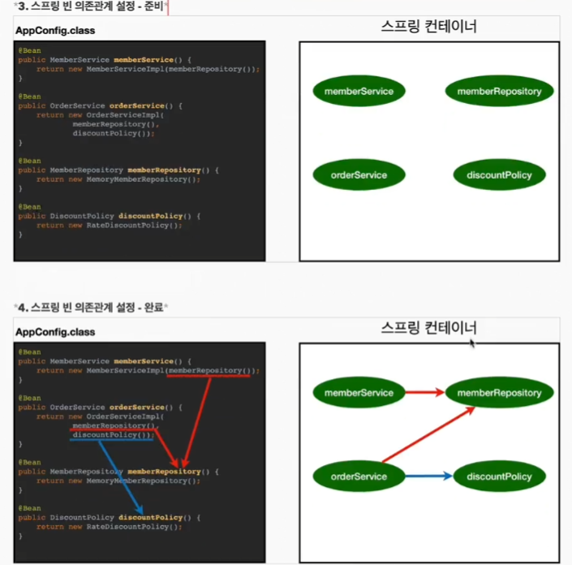
    
    - 설정 정보를 참고해서 의존 관계를 주입해준다.
    
    ## 스프링 빈 조회 - 상속 관계
    
    - 부모 타입으로 조회 → 자식 타입의 빈도 조회한다.
        - **모든 자바의 조상 Object** 타입 조회 → 모든 Bean 조회 가능
        
        ```jsx
        @Test
            @DisplayName("부모 타입으로 모두 조회하기 - Object")
            void findAllBeanByObjectType() {
                Map<String,Object> beansOfType = ac.getBeansOfType(Object.class);
                for (String key : beansOfType.keySet()) {
                    System.out.println("key = " + key + " value = " + beansOfType.get(key));
                }
            }
        ```
        
    
    # BeanFactory, ApplicationContext
    
    - BeanFactory
        - 스프링 컨테이너의 최상위 인터페이스
        - 빈을 관리, 조회하는 역할을 담당
    
    - ApplicationContext
        - BeanFactory 기능을 모두 상속하고, 추가 기능을 제공
        - 애플리케이션 개발 시 BeanFactory 기능과 더불어 다른 기능들도 필요하기 때문에 사용
    
    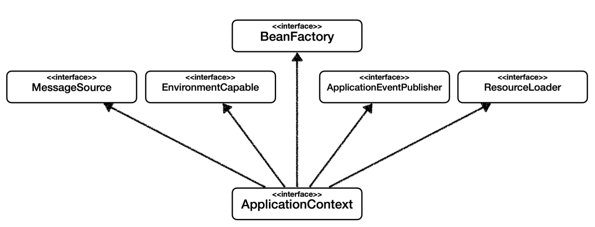
    
- 메시지 소스를 활용한 국제화 기능 제공
    - 한국어 → 한국어 출력, 영어 → 영어 출력
- 환경 변수
    - 로컬, 개발, 운영 등을 구분해서 처리
- 애플리케이션 이벤트
    - 이벤트를 발행하고 구독하는 모델을 지원
- 리소스 조회
    - 파일, 클래스패스, 외부 등에서 리소스를 편리하게 조회

## 다양한 설정 형식 지원

- Xml기반, Annotation 기반, 등등..

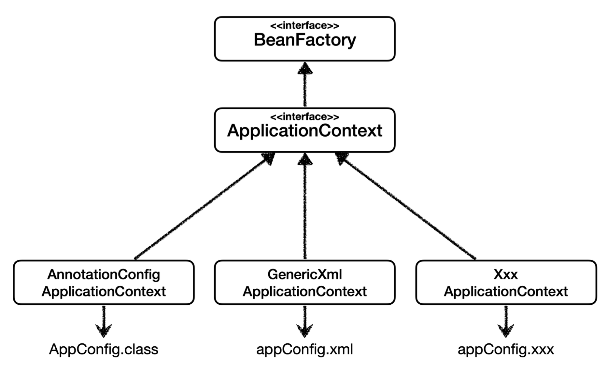

- 애노테이션 기반 코드
    - new AnnotationConfigApplicationContext(AppConfig.class);
    - 단지 자바 코드로 설정 정보를 넘겨주면 된다.
        
        ```java
        AnnotationConfigApplicationContext ac = new AnnotationConfigApplicationContext(AppConfig.class);
        
            @Test
            @DisplayName("빈 이름으로 조회")
            void findBeanByName() {
                MemberService memberService = ac.getBean("memberService",MemberService.class);
                Assertions.assertThat(memberService).isInstanceOf(MemberServiceImpl.class);
            }
        ```
        
- xml 기반
    - new GenericXmlApplicationContext(”appConfig.xml”);
    - 컴파일 없이 빈 설정 정보를 변경할 수 있는 장점이 있다.
    - 하지만 xml 방식은 많이 사용하지 않는다고 한다.
        
        ```xml
        <?xml version="1.0" encoding="UTF-8"?>
        <beans xmlns="http://www.springframework.org/schema/beans"
               xmlns:xsi="http://www.w3.org/2001/XMLSchema-instance"
               xsi:schemaLocation="http://www.springframework.org/schema/beans http://www.springframework.org/schema/beans/spring-beans.xsd">
        
            <bean id="memberService" class="hello.core.member.MemberServiceImpl" >
                <constructor-arg name= "memberRepository" ref="memberRepository" />
            </bean>
        
            <bean id="memberRepository" class="hello.core.member.MemoryMemberRepository">
        
            </bean>
        
            <bean id="orderService" class="hello.core.order.OrderServiceImpl">
                <constructor-arg name="memberRepository" ref="memberRepository"/>
                <constructor-arg name="discountPolicy" ref="discountPolicy"/>
            </bean>
        
            <bean id="discountPolicy" class="hello.core.discount.RateDiscountPolicy"></bean>
        </beans>
        ```
        
        ```java
          	@Test
            void xmlAppContext() {
                ApplicationContext ac = new GenericXmlApplicationContext("appConfig.xml");
                MemberService memberService = ac.getBean("memberService",MemberService.class);
                assertThat(memberService).isInstanceOf(MemberService.class);
            }
        ```
        

## 스프링 빈 설정 메타 정보 - BeanDefinition

- BeanDefinition은 빈 메타 설정정보라고 부른다.
    - @Bean, <bean> 하나하나가 다 메타 설정정보이다.
- 한걸음 나아가 스프링 컨테이너 입장에서 잠시 생각해보자.
    - 컨테이너가 xml 방식, java, 등등.. 구체적인 사실들에 대해 알 필요가 없게 해주자 → **추상화**
    - 컨테이너 입장에서, **BeanDefinition이로 정의된 것이라면 무엇이든 사용 가능**
        - Xml방식으로 생성하던, Java 어노테이션이든 상관없다.
        - 이 부분에 추상화가 적용되있는 것이다.
    
    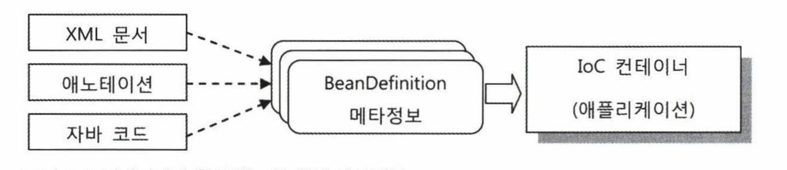
    

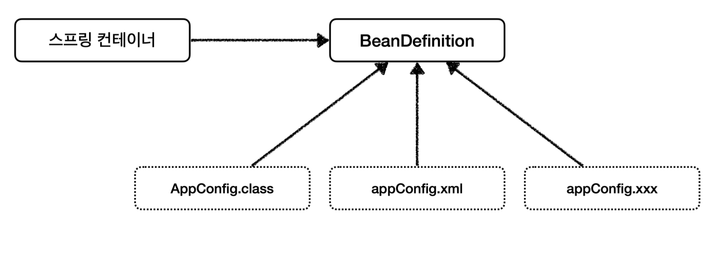

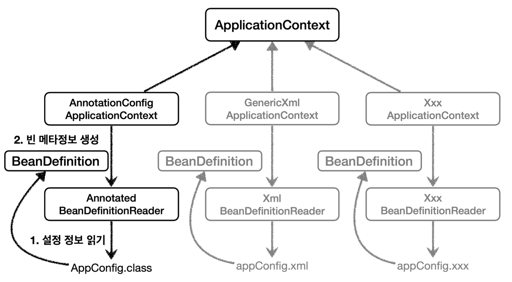

- 각 Context들 : Annotation, Xml, 기타 …
    - 모두 전용 Reader들을 가지고 있다.
    - 예시
        
        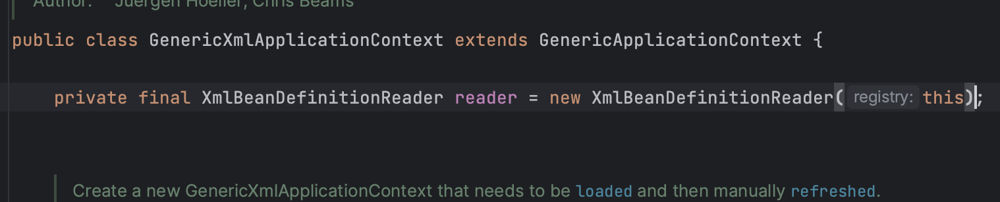
        
- Reader들이 설정 정보를 읽어서 BeanDefinition을 만드는 것

### 설정 정보

- **`BeanClassName`**: 생성할 빈의 클래스 명(자바 설정 처럼 팩토리 역할의 빈을 사용하면 없음)
    - 빈 오브젝트는 이 클래스의 인스턴스
    - 가장 중요하다. 빈은 오브젝트이고, 오브젝트 생성은 클래스를 반드시 필요로 한다
- factoryBeanName: 팩토리 역할의 빈을 사용할 경우 이름, 예) appConfig
- factoryMethodName: 빈을 생성할 팩토리 메서드 지정, 예) memberService
- Scope: 싱글톤(기본값), 프로토타입과 같은 빈의 생성 방식과 범위
    - 크게 싱글톤과 비싱글톤으로 나뉜다.
- lazyInit: 스프링 컨테이너를 생성할 때 빈을 생성하는 것이 아니라, 실제 빈을 사용할 때 까지 최대한 생성을 지연처리 하는지 여부
    - 이 값이 true라면, 컨테이너는 빈 오브젝트의 생성을 필요한 시점까지 미룬다
- InitMethodName: 빈을 생성하고, 의존관계를 적용한 뒤에 호출되는 초기화 메서드 명
- DestroyMethodName: 빈의 생명주기가 끝나서 제거하기 직전에 호출되는 메서드 명
- Constructor arguments, Properties: 의존관계 주입에서 사용한다. (자바 설정 처럼 팩토리 역할의 빈을 사용하면 없음)
