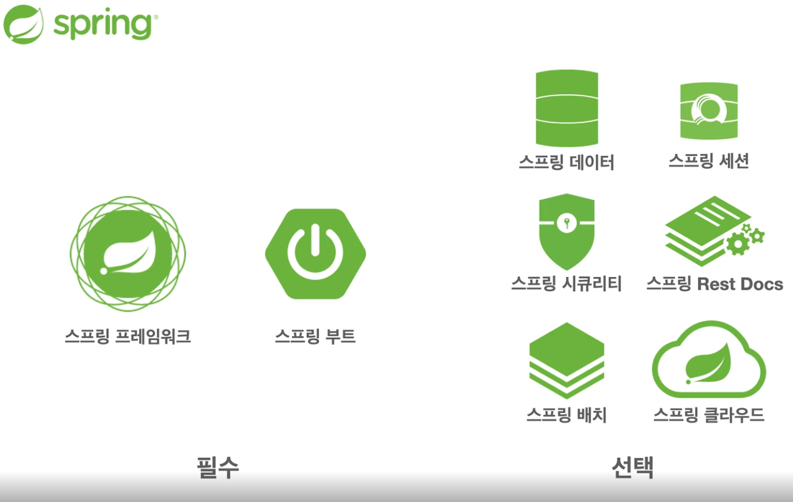
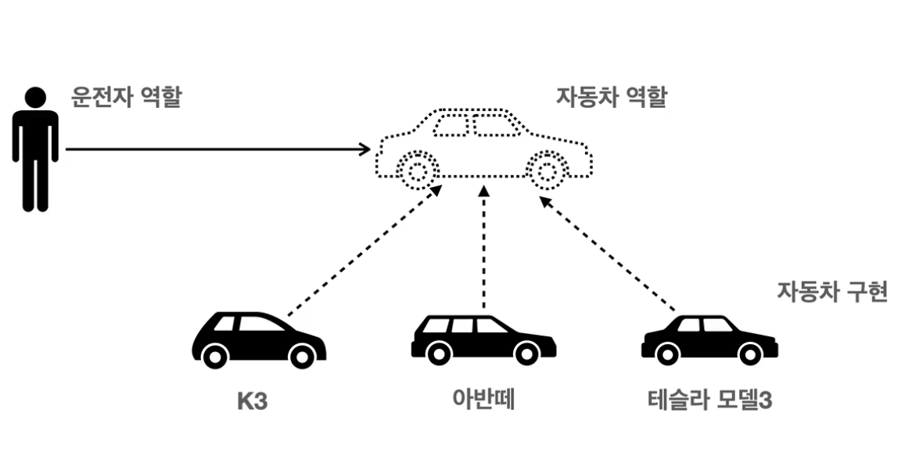
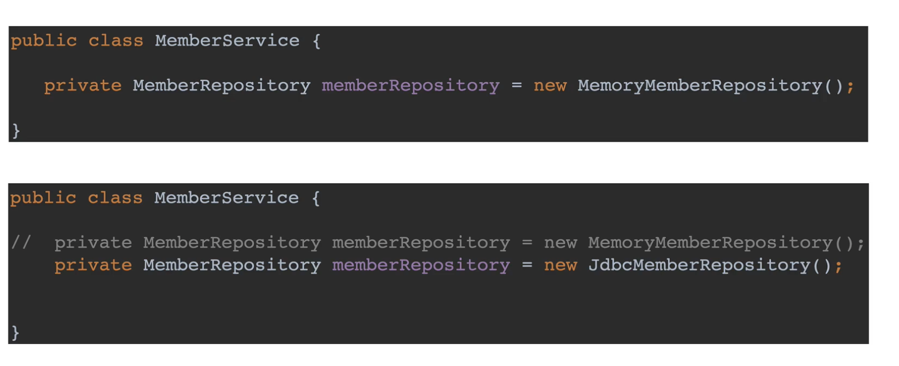

# 객체지향 설계와 스프링

## EJB의 문제점 (어렵다, 비용이 비싸다,  EJB Hell…)로부터 등장

## 스프링 선택

## 핵심 개념

- 이 기술을 왜 만들었는가
- 이 기술의 핵심 기술이 무엇인가
    - 자바 언어 기반의 프레임워크
        - **`객체지향 언어`**가 가진 특징을 살려낸 프레임워크
        - **`좋은 객체지향 애플리케이션을 개발할 수 있게`** 도와주는 프레임워크

## 다형성

- 운전자는 자동차가 바뀌어도 영향을 받지 않음
- 유연하고 변경 용이하다 = 자동차 역할이 바뀌어도 운전을 할 수 있다
- **운전자는 자동차 역할`(인터페이스)`**만 알고 있다
    - 클라이언트가 자동차 내부 구조 몰라도 상관없다
    - 내부 구조가 변경되어도 상관없다
    - 구현 대상 자체를 변경해도 영향을 받지 않는다.

<aside>
💡 **`역할과 구현`**으로 세상을 구분한다 → 자동차가 바뀌어도 클라이언트는 새로운거 안배워도 된다.

</aside>

### 자바 언어에서 다형성

- 역할 = 인터페이스
- 구현 = 인터페이스를 구현한 클래스, 구현 객체
- 객체를 설계할 때 역할과 구현을 분리
- 객체 설계 시 역할(인터페이스)를 먼저 구현하고, 그 역할을 수행하는 구현체를 만들기

### 객체의 협력이라는 관계에서

- 혼자인 객체는 없다.
- 클라이언트 : 요청, 서버 : 응답 → 객체와 객체사이의 통신은 오직 **`메시지`**
- 클라이언트 객체와, 서버 객체는 **`협력 관계`**

### 다형성의 본질

- 인터페이스를 구현한 객체 인스턴스를 실행 시점에 유연하게 변경 가능
- 클라이언트를 변경하지 않고, 서버의 구현 기능을 유연하게 변경할 수 있다.

## 스프링에서의 IoC, DI ..

- 다형성을 활용해서 역할과 구현을 편리하게 다룰 수 있도록 지원하는 기능

## 객체지향 SOLID

### SRP 단일책임원칙

- 한 클래스는 하나의 책임만.
    - 변경이 일어났을 때 파급이 적다면, 해당 원칙을 잘 따랐다고 볼 수 있다.
    - 반대로 말해, 변경이 일어나는 이유는 오직 한 가지

### OCP 개방 폐쇄 원칙

- 소프트웨어 요소가 확장에는 열려있고 변경에는 닫혀있어야 한다.
    - 다형성
    - 역할과 구현의 분리
    - 인터페이스를 구현한 새로운 클래스를 만들어서 새로운 기능을 구현
        - 이는 **기존 코드를 변경하는 것이 아님**.
- OCP가 깨진다 → 클라이언트가 기존 코드를 변경해야 한다.
    - 객체를 생성하고, 연관관계를 맺어주는 별도의 조립, 설정이 필요하다.

### LSP 리스코프 치환 원칙

- 프로그램의 객체는 프로그램의 정확성을 깨뜨리지 않으면서 하위 타입의 인스턴스로 바꿀 수 있어야 한다
    - 인터페이스 규약을 반드시 지키도록 구현하기가 중요
    - 자동차 엑셀을 밟는데 시속 -10km? 규약을 지키지 못해서 대체도 불가할 것이다.

### ISP 인터페이스 분리 원칙

- 특정 클라이언트를 위한 여러 개의 인터페이스가 범용 인터페이스 한 개보다 낫다.
- 자동차 인터페이스 → 운전 인터페이스, 정비 인터페이스로 분리

### DIP 의존관계 역전 원칙

- 프로그래머는 추상화에 의존해야 하고 구체화에 의존하면 안된다.
- 구현 클래스에 의존하지 말고, 인터페이스에 의존해야 한다.
- 역할에 의존해야 한다.

- memberservice 클라이언트가 구현 클래스를 직접 선택하고 있는 것.
    - 이는 DIP 위반

## 객체지향 설계와 스프링

- 스프링은 DI와 DI 컨테이너로 다형성과 OCP, DIP를 가능하게 한다.
