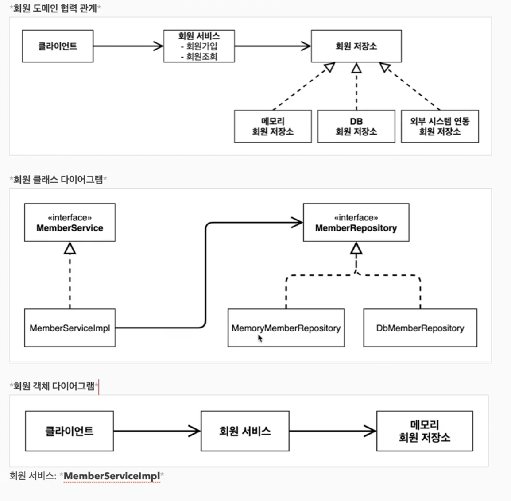
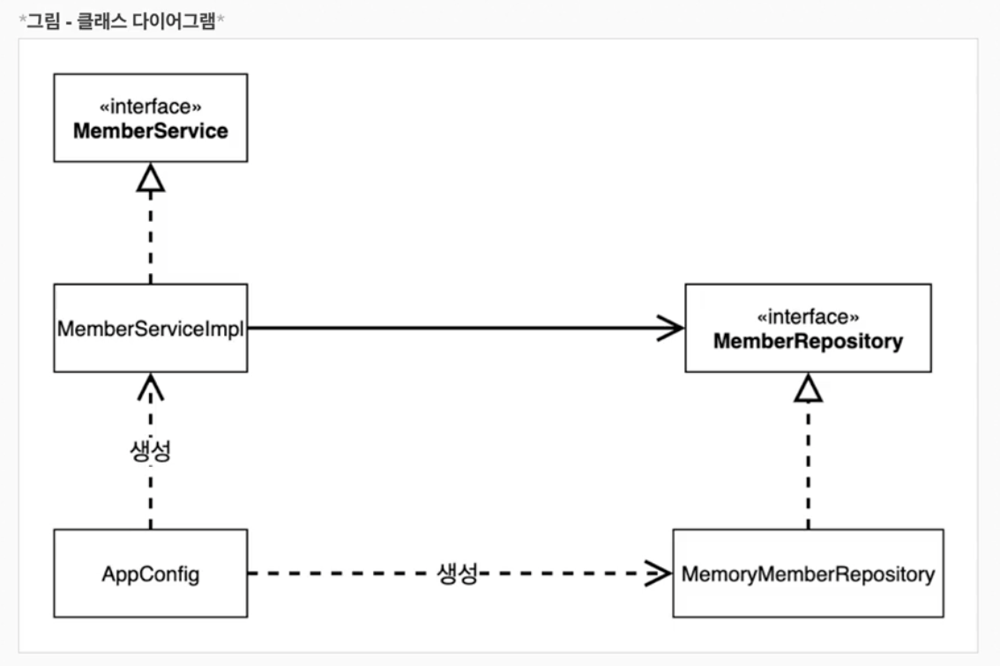
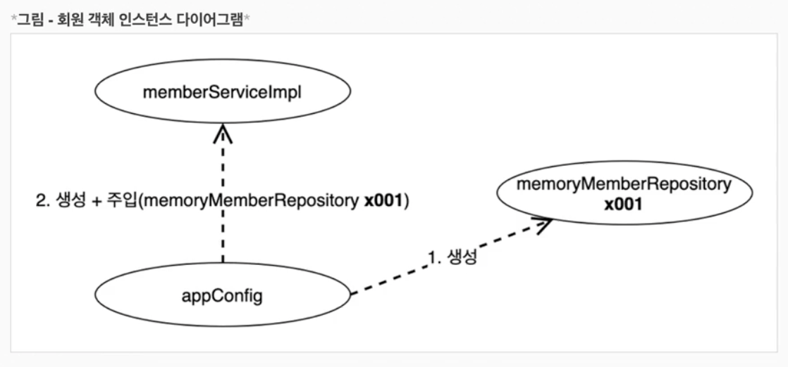
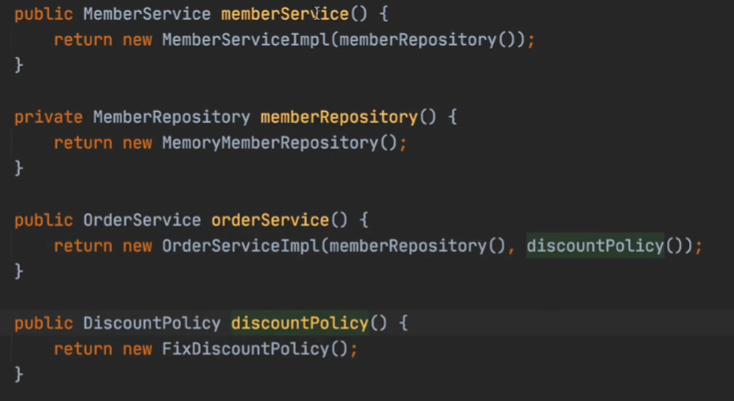
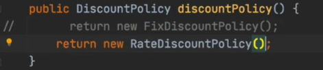

# 객체지향 원리 적용

## 관심사의 분리

- 애플리케이션의 전체 동작 방식(Config)를 구성하기 위해, 구현 객체를 생성하고 연결 하는 책임을 가지는 별도의 설정 클래스를 만든다.
- **AppConfig**
    - 애플리케이션의 실제 동작에 필요한 구현 객체 생성(Impl)
    - 생성한 객체 인스턴스의 참조(레퍼런스)를 “생성자를 통해서 주입(연결)” 해준다.
    - 의존 관계에 대한 고민은 외부에 맡기고 실행에 집중한다.

- MemberServiceImpl이 MemberRepository만 알면 된다.
    - MemoryMemberRepository를 알아야 하는 상황에서
    - AppConfig가 이 역할을 대체했기 때문에 **`DIP`**를 지키는 상황을 만든다.

- AppConfig가 memoryMemberRepository를 생성하고
- 만든 것을 memberServiceImpl에 주입해준다
- **`DI` (Dependency Injection)**
    - memberServiceImpl 입장에서는 의존관계를 마치 외부에서 주입해주는 것

## AppConfig의 역할과 구현을 명확히 분리한다.

- 메서드만 봐도 명확해지게 리팩토링
    - memberService는 현재 MemberServiceImpl을 사용하는데
        - memberRepository를 사용하는 것
    - orderService는 discountPolicy를 사용하는데
        - discountPolicy는 FixDiscountPolicy를 사용하고 있다.
- 변경이 생기면 해당 부분만만 바꿔주면 된다.

### 할인 정책(discountPolicy)을 바꾼다고 해보자

- Config에서 적용하고 있는 DiscountPolicy 단 하나만 바꾸면 된다.
- 할인 정책을 담당하고 있는 구현체만 바꿔준 것
    - 클라이언트 코드의 어떤 부분도 손댈 필요가 없다.
    

### AppConfig로 무엇이 가능해졌는가

- SRP : 클라이언트 객체가 직접 구현 객체를 생성하고, 실행하는 다양한 책임을 가지고 있었다.
    - AppConfig에게 객체를 생성하는 역할을 맡음으로써 클라이언트 객체는 이 역할에서 해방
    - **관심사의 분리**로 클라이언트 객체는 실행하는 책임만.

- OCP : **클라이언트 코드를 변경**하지 않아도 된다. 구성 영역(Config)만 변경
    - 할인 정책을 RateDiscountPolicy로 바꿔도, 클라이언트 코드를 변경한게 아님
    - **클라이언트 코드가 변경에는 닫혀있고 확장(다른 정책 사용)에는 열려있다.**
    - 소프트웨어 요소를 확장해도 사용 영역이 변경에는 닫혀있다.

- DIP : 구현체를 변경하지 않는다. **역할**만 변경하면 된다.
    - 클라이언트 코드는 인터페이스만으로 할 수 있는 것은 없다.
    - 이를 AppConfig가 대신 의존성을 주입해주어 역할을 해준 것
