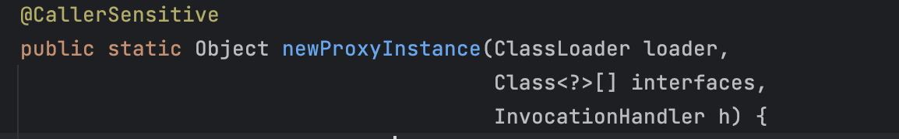

# 동적 프록시

프록시 패턴을 이용하여 프록시 클래스를 생성하고, 생성한 프록시 클래스를 대신 주입하면 비즈니스 로직을 건드리지 않고 추가 로직(접근 제어, 부가 기능 등)을 구현할 때 기존 코드를 변경하지 않고 이용할 수 있는 장점이 있다. 하지만 대상 클래스 수만큼 프록시 클래스를 만들어야하는 단점이 있다. 즉 100개의 대상 클래스가 있다면, 100개의 프록시 클래스를 만들어야 한다. 이 단점을 해결하기 위해 자바가 기본으로 제공하는 JDK 동적 프록시 기술이나 CGLIB같은 생성 오픈소스 기술을 활용하여 프록시 객체를 동적으로 만들어 낼 수 있다. 프록시를 적용할 코드를 하나만 만들어두고 프록시 객체를 계속 찍어내는 것이다.

이해하기에 앞서 프록시의 기능을 잠시 정리해보자.

1. 프록시는 타겟과 똑같은 메서드를 구현하고 있다가 호출이 일어나면 타겟 메서드를 호출한다.
2. 들어온 요청에 대해서 부가기능을 수행할 수 있다.

부가 기능을 수행하기 위해 똑같은 부가 기능의 코드가 프록시마다 추가해줘야 할 귀찮음이 존재하고, 타겟 인터페이스가 변경이 되거나 삭제가 된다면 똑같이 영향을 받는다.

예를 들어 아래와 같은 코드가 있다고 하자.

```java
@Test
    void reflection0() {
        Hello target = new Hello();

        //공통 로직1 시작
        log.info("start");
        String result1 = target.callA(); //호출하는 메서드가 다름
        log.info("result={}", result1);
        //공통 로직1 종료

        //공통 로직2 시작
        log.info("start");
        String result2 = target.callB(); //호출하는 메서드가 다름
        log.info("result={}", result2);
        //공통 로직2 종료
    }
```

코드를 잘 보면 [log.info](http://log.info)의 start와 result의 포맷은 같다. 하지만 중간에 메서드를 호출하는 부분만 다르다. 이 부분만 잘 해결할 수 있다면, 재활용을 할 수 있을 것 같지 않은가?

## 리플렉션

다이나믹(동적) 프록시는 리플렉션 기능을 이용해 프록시를 만들어준다. 리플렉션은 자바의 코드 자체를 추상화해서 접근하도록 만든 것으로, 클래스나 메서드의 메타 정보를 사용해서 동적으로 호출하는 메서드를 변경할 수 있다. 리플렉션은 java.lang.reflect 패키지에 있으며, 자세한 내용은 document를 참고해보자.

예를 들어 String의 length 메서드를 리플렉션을 통해 가져온다고 하면 아래와 같이 코드를 작성할 수 있다.

```java
Method lengthMethod = String.class.getMethod("length");
// String이 가진 메서드중 length라는 이름을 가진 메서드, 파라미터 없는 것을 가져온다.

String name = "test";

int length = lengthMethod.invoke(name); // int length = name.length();
```

아래 코드로 이해해보자.

```java
@Test
    void reflection1() throws Exception {
        //클래스 정보
        Class classHello = Class.forName("hello.proxy.jdkdynamic.ReflectionTest$Hello");

				Hello target = new Hello();
        //callA 메서드 정보
        Method methodCallA = classHello.getMethod("callA");
        Object result1 = methodCallA.invoke(target);
        log.info("result1={}", result1);

        //callB 메서드 정보
        Method methodCallB = classHello.getMethod("callB");
        Object result2 = methodCallB.invoke(target);
        log.info("result2={}", result2);
    }

```

리플렉션을 이용해 Hello 클래스의 메타 정보를 가져온다. 이후 Hello 클래스 안에 있는 메서드를 getMethod를 통해 메서드 메타정보를 가져온다. invoke 메서드를 통해 실제 타겟 인스턴스의 메서드를 호출하여 결과를 출력한다. 이를 개선해보자.

```java
private void dynamicCall(Method method, Object target) throws Exception {
        log.info("start");
        Object result = method.invoke(target);
        log.info("result={}", result);
    }
```

target.callA()나 target.callB()가 아닌 Method로 변경하여 추상화를 이용했다. 하여 공통 로직을 분리할 수 있다. 이후 최초의 코드를 아래와 같이 개선할 수 있다.

```java
@Test
    void reflection1() throws Exception {
        //클래스 정보
        Class classHello = Class.forName("hello.proxy.jdkdynamic.ReflectionTest$Hello");

				Hello target = new Hello();
        //callA 메서드 정보
        Method methodCallA = classHello.getMethod("callA");
				dynamicCall(methodCallA, target);

        //callB 메서드 정보
        Method methodCallB = classHello.getMethod("callB");
				dynamicCall(methodCallB, target);

    }

```

## 동적 프록시 기술

JDK 동적 프록시는 인터페이스를 기반으로 작동한다. 인터페이스가 없다면 JDK 동적 프록시는 사용할 수 없다. InvocationHandler를 구현해야 한다.

```java
@Slf4j
public class TimeInvocationHandler implements InvocationHandler {

    private final Object target;

    public TimeInvocationHandler(Object target) {
        this.target = target;
    }

    @Override
    public Object invoke(Object proxy, Method method, Object[] args) throws Throwable {
        log.info("TimeProxy 실행");
        long startTime = System.currentTimeMillis();

        Object result = method.invoke(target, args);

        long endTime = System.currentTimeMillis();
        long resultTime = endTime - startTime;
        log.info("TimeProxy 종료 resultTime={}", resultTime);
        return result;
    }
}
```

InvocationHandler의 invoke 메서드는 동적 프록시의 메서드가 호출되었을 때 사용된다. 즉 클라이언트의 요청은 invoke 메서드로 전달된다. InvocationHandler를 구현한 TimeInvocationHandler 클래스를 작성하고 Override하면 3가지 파라미터를 가지는 메서드 invoke가 정의되어 있다. 해당 위치에 넘어온 method로 invoke를 메서드를 작성한다. args는 메서드 호출에 필요한 파라미터들을 받는다.

테스트를 위해 아래와 같은 코드를 작성해둔다.

```java
public interface AInterface {
    String call();
}
```

```java
@Slf4j
public class AImpl implements AInterface {
    @Override
    public String call() {
        log.info("A 호출");
        return "a";
    }
}
```

```java
@Test
    void dynamicA() {
        AInterface target = new AImpl();
        TimeInvocationHandler handler = new TimeInvocationHandler(target);

        AInterface proxy = (AInterface) Proxy.newProxyInstance(AInterface.class.getClassLoader(), 
                                        new Class[]{AInterface.class}, handler);

        proxy.call();
        log.info("targetClass={}", target.getClass());
        log.info("proxyClass={}", proxy.getClass());
    }
```

프록시 객체는 타겟을 반드시 필요로 한다. 하여 Handler에 target을 지정해주어야 한다. Proxy.newProxyInstance는 런타임 시점에 프록시 클래스를 만들어준다. 해당 메서드의 형태를 보면 아래와 같다. Object를 반환받지만 AInterface를 구현한 상태이기 때문에 캐스팅이 가능하다.



프록시 클래스를 만들 클래스, 어떤 인터페이스를 구현해야하는지(하나 이상일 수 있기 때문에 배열로 받는다), 메서드가 호출되었을 때 어떤 핸들러가 실행되야 하는지를 필요로 한다. 예를들면 아래와 같은 코드이다.

```java
AInterface proxy = (AInterface) Proxy.newProxyInstance
                   (AInterface.class.getClassLoader(), 
                    new Class[]{AInterface.class}, handler);
```

## 다이나믹 프록시의 확장

직접 만든 프록시 클래스보다 다이나믹 프록시를 이용하면 장점이 있다. 만약 프록시 클래스를 일일이 구현한 상황에서 인터페이스에 새로운 메서드가 추가된다고 하자. 그렇다면 구현한 프록시에 계속해서 코드를 추가해주어야 한다.

다이나믹 프록시를 이용하면 추가된 메서드는 건드릴 필요가 없다. 왜냐하면 다이나믹 프록시를 이용하여 만들어질 때 이미 메서드가 추가되어 만들어지기 때문이다.

## 출처

스프링 핵심 원리 고급편 - 김영한님

토비의 스프링 Vol.1 이해와 원리 - 이일민님
