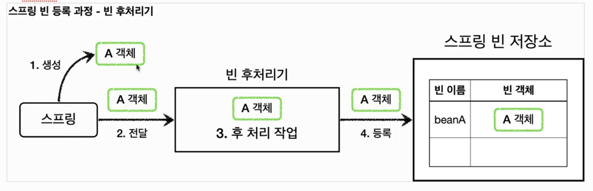

# 빈 후처리기

스프링이 빈 저장소에 등록할 목적으로 생성한 객체를 빈 저장소에 등록하기 직전에 조작하고 싶다면 빈 후처리기를 사용하면 된다. 스프링 빈 오브젝트가 만들어지고 난 이후, 다시 빈 오브젝트를 가공할 수 있게 해준다. 순서로 정리하면 아래와 같다.

1. 생성 : 스프링 빈 대상이 되는 객체를 생성한다 (@Bean, 컴포넌트 스캔의 대상 등)
2. 전달 : 생성된 빈을 **스프링 빈 저장소에 등록하기 전에** 빈 후처리기로 전달
3. 후 처리 작업 : 전달받은 빈으로 원하는 작업을 수행 (객체 조작, 다른 빈으로 바꿔치기 등)
4. 등록 : 빈 후처리기로부터 받은 객체를 스프링 빈 저장소에 등록

빈 후처리기를 사용하기 위해서는 빈 후처리기 자체를 빈으로 등록하면 된다. 빈 후처리기를 등록하면 스프링은 등록될 빈을 모두 빈 후처리기로 보내서 작업을 진행하게 된다. 프로퍼티를 수정하거나, 객체를 바꿔치는 작업 등의 강력한 작업을 모두 빈 후처리기에서 수행할 수 있다. 또한 이를 잘 이용하면, 원본 객체를 빈으로 등록하는 것이 아닌 프록시 객체를 빈으로 등록하는 작업 또한 가능하다.
