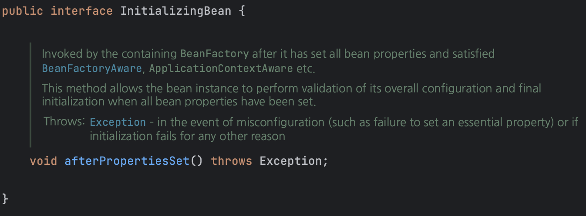
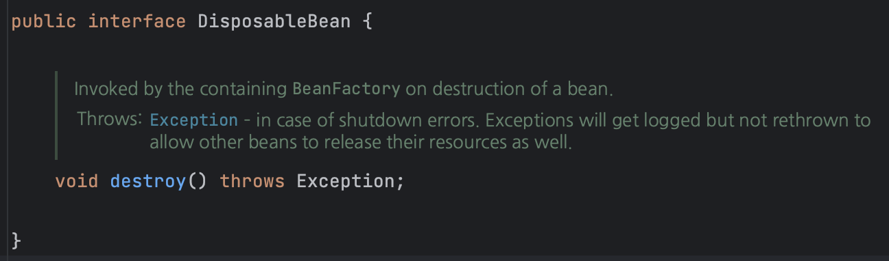

# 스프링 빈 생명주기

## 빈 생명주기 콜백

데이터베이스 커넥션, 네트워크 소켓 등 미리 연결이 필요한 것들은 시작 시점에 연결이 모두 완료가 되고, 종료 시점에 연결이 모두 종료되는 작업이 필요하다. 이런 작업들을 하려면, 객체의 초기화와 종료 작업이 필요하다.

객체를 생성한 다음에 별도로 값을 넣어줘야 데이터가 존재할 수 있다. 하여 스프링에서는 다음과 같은 라이프사이클을 가지게 된다.

**객체 생성 → 의존관계 주입**

스프링 빈은 객체를 생성하고 의존관계 주입이 모두 완료가 된 뒤에 데이터를 사용할 수 있는 준비가 된다. 개발자 입장에서 이 의존관계 주입이 모두 완료된 시점을 파악하고 알고 싶을 때, 또는 종료 시점을 알고 싶을 때 스프링의 콜백 메서드를 이용해 초기화 시점을 파악할 수 있으며, 종료 직전에는 소멸 콜백을 통해 종료를 알 수 있다.

## 스프링 빈 이벤트 라이프사이클

**스프링 컨테이너 생성 → 스프링 빈 생성 → 의존관계 주입 → 초기화 콜백 → 사용 → 소멸전 콜백 → 종료**

**초기화 콜백**이 일어나는 시점이 의존관계 주입이 완료된 시점 직후이며, 종료가 일어나기 전에는 **소멸전 콜백**이 일어난다. 

또한 스프링은 다양한 방식으로 생명주기 콜백을 지원한다.

**참고: 객체의 생성과 초기화를 분리**
생성자는 필수 정보(파라미터)를 받고, 메모리를 할당해서 객체를 생성하는 책임을 가진다. 

초기화는 생성된 값들을 활용해서 외부 커넥션을 연결하는등 무거운 동작을 수행한다.
따라서 생성자 안에서 무거운 초기화 작업을 함께 하는 것 보다는 객체를 생성하는 부분과 초기화 하는 부분을 명
확하게 나누는 것이 유지보수 관점에서 좋다. 초기화 작업이 단순한 경우, 생성자에서 처리할 수도 있다.

## 초기화 메서드

빈 오브젝트가 생성되고 DI 작업을 마친 후 실행되는 메서드이다. DI를 통해 모든 프로퍼티가 주입이 된 후에 초기화 작업이 필요한 경우도 있는데, 이럴 때 사용할 수 있다.

1. 초기화 콜백 인터페이스

InitializingBean 인터페이스를 구현해서 빈을 작성한다. 해당 인터페이스에는 afterPropertiesSet() 메서드를 오버라이드하여 사용할 수 있는데, 해당 인터페이스는 **“스프링 전용” 인터페이스이다.** 즉 해당 코드가 스프링 인터페이스에 의존하며, 초기화 메서드의 이름을 변경할 수 없다는 단점이 있다.



해당 메서드를 Override하여 안에 초기화 작업이 필요한 내용을 넣으면, 의존관계 작업이 모두 마친 후 afterPropertiesSet 안에 있는 내용이 실행된다.

1. 빈 등록 초기화 메서드 지정

설정 정보에 **@Bean(initMethod = “init”)** 처럼 초기화 메서드를 지정할 수 있다. initMethod의 이름을 따로 지정하여 초기화 메서드의 이름을 변경할 수 있으며, 스프링 빈이 스프링 코드에 의존하지 않는다.

아래와 같이 사용하면 된다. 물론, initMethod가 클래스에 정의가 되있어야 한다.

```java
@Configuration
    static class LifeCycleConfig {

        @Bean(initMethod = "init")
        public NetworkClient networkClient (){
            NetworkClient networkClient = new NetworkClient();
            networkClient.setUrl("http://kkalgo.tistory.com");
            return networkClient;
        }
    }
```

해당 코드를 작성해두고 NetworkClient 클래스에 init 메서드가 정의되어 있다면 init메서드가 의존관계 작업 이후 실행된다.

1. @PostConstruct

초기화를 담당할 메서드에 @PostConstruct 애노테이션을 부여하는 방법이다. 스프링에서 제일 권장하는 방식이며, 특히 해당 애노테이션은 자바 표준 공통 애너테이션(JSR-250)이므로 스프링이 아니더라도 작동한다. 또한 코드에서 초기화 메소드가 존재한다는 사실을 가장 쉽게 파악할 수 있다. 하지만 외부 라이브러리에는 적용하지 못하기 때문에, 외부 라이브러리 적용이 필요한 경우는 @Bean의 initMethod를 사용하면 된다.

아래는 실제로 해당 애노테이션을 적용한 예시이다.

```java
private List<String> companyList;
private List<String> typeList;

    @PostConstruct
    public void initalize(){
        companyList = queryCardPersistencePort.findAllCompany();
        typeList = queryCardPersistencePort.findAllType();
        Collections.sort(companyList);
        Collections.sort(typeList);
    }
```

company와 type은 서비스가 제대로 동작하기 위해 초기에 개발자들이 직접 세팅한 데이터이며, 애플리케이션이 작동하는 동안 **전혀 사용자에 의해 갱신될 위험이 없는 요소**이다. 사용자가 요청할 때마다 Read하여 값만 반환해주면 되는 것이다. 이 경우 Disk에 계속 접근하여 값을 가져올 필요가 없으므로 초기화 작업에 세팅을 다 해두면 좋을 것이다. 하지만 값을 가져오기 위해서는 queryCardPersistencePort들이 이미 의존 관계 주입이 모두 완료가 되있어야 한다. 하여 **모든 의존관계가 주입이 끝난 뒤에** 초기화 작업을 통해 최초 한 번만 미리 값을 넣어두고, 그 이후부터는 디스크 접근 없이 재사용을 꾀할 수 있다.

## 제거 메서드

컨테이너가 종료될 때 호출돼서 빈이 사용한 리소스를 반환하거나 종료 전에 처리해야할 작업을 수행한다.

1. DisposableBean

InitializingBean과 동일하다. 해당 인터페이스를 구현해서 destroy()를 구현하면 된다. 단점 역시 동일하다.



1. 빈 등록 소멸 메서드 지정

Bean의 기능을 이용하며, destroyMethod에 해당하는 이름을 바꿔서 사용할 수 있다.

```java
@Configuration
    static class LifeCycleConfig {

        @Bean(initMethod = "init", destroyMethod = "destroy")
        public NetworkClient networkClient (){
            NetworkClient networkClient = new NetworkClient();
            networkClient.setUrl("http://kkalgo.tistory.com");
            return networkClient;
        }
    }
```

1. @PreDestroy

컨테이너가 종료될 때 실행할 메서드에 해당 애노테이션을 붙인다. @PostConstruct와 동일한 방식을 공유한다. 사용할 메서드에 해당 애노테이션을 붙이면 된다.

## 정리

1. @PostConstruct와 @PreDestroy 어노테이션을 사용한다.
2. 코드를 고칠 수 없는 외부 라이브러리에 사용해야 한다면 @Bean에서 제공하는 기능을 사용한다.

## 출처

스프링 기본 원리 - 김영한님

토비의 스프링 3.1 Vol2 스프링의 기술과 선택 - 이일민님
