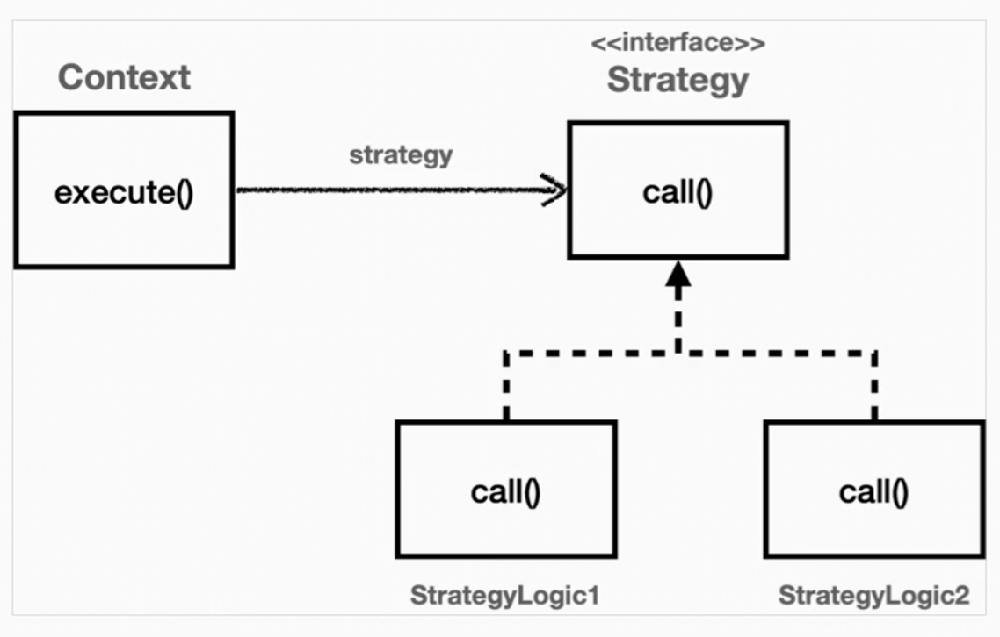

# 전략 패턴

**변하지 않는 부분을 Context**라는 곳을 두고, **변하는 부분을 Strategy**라는 인터페이스를 만들고 해당 인터페이스를 구현하도록 해서 문제를 해결한다. **상속이 아닌 위임**으로 문제를 해결한다.

Context가 변하지 않는 템플릿이 되고, Strategy가 변하는 알고리즘 역할을 하게 된다.



핵심은 Context라는 클래스는 Strategy라는 인터페이스를 바라보고 있는 것이다. 즉,  Strategy의 구현체를 변경하거나 새로 만들어도 Context에 전혀 영향을 주지 않는 상태이다.

## 선 조립 후 실행

```java
@Test
void templateMethodV1() {
    AbstractTemplate template1 = new SubClassLogic1();
    template1.execute();

    AbstractTemplate template2 = new SubClassLogic2();
    template2.execute();
}
```

Context 내부에 Strategy가 있다고 생각하자. 그렇다면 **실행 전에 미리 조립(Spring DI와 유사)**이 되어있어야 한다. Context와 Strategy가 조립이 완료되었다면, 그 이후에는 Context를 실행하기만 하면 된다. 이 방식의 단점은 조립 이후에 전략을 변경하기가 번거롭다는 것이다. 전략을 실시간으로 변경하려면, Context를 새로 생성하고 다른 Strategy를 주입하는 것이 더 나을 수 있다. 위의 예시처럼 다른 전략을 적용할 경우 AbstractTemplate이 2개가 만들어지는 것이다.

## 전략을 실행할 때 파라미터로 넘기기

```java
@Test
void strategyV1() {
    ContextV2 context = new ContextV2();
    context.execute(new StrategyLogic1());
    context.execute(new StrategyLogic2());
}
```

클라이언트는 Context를 실행하는 시점에 원하는 전략을 주입한다. 하나의 Context만 생성하면 되기 때문에 선 조립 후 실행 방식에 비해 유연함을 가져갈 수 있다. 물론 StrategyLogic1을 lambda로 대체할 수 있다.
