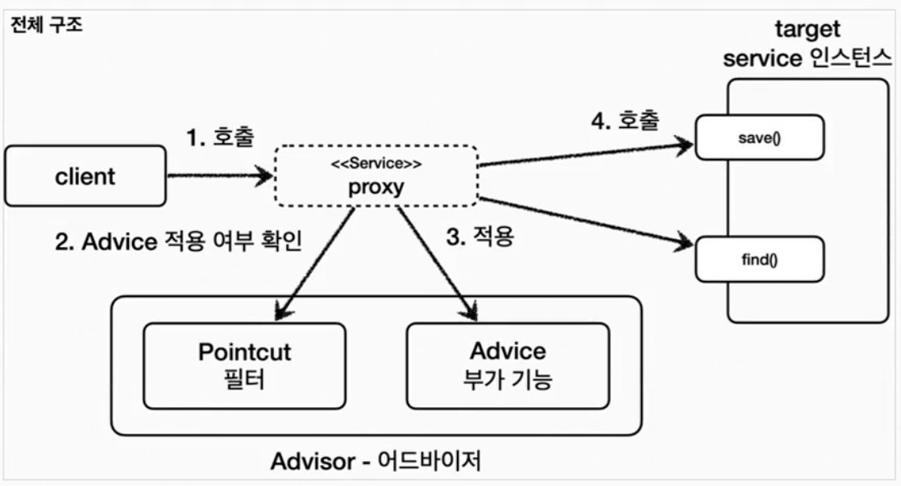

# 포인트컷, 어드바이스, 어드바이저

## 포인트 컷

어디에 부가 기능을 적용할 지, 적용하지 않을지 판단하는 필터링 로직으로 주로 클래스와 메서드 이름으로 필터링

## 어드바이스

프록시가 호출하는 부가 로직

## 어드바이저

하나의 포인트 컷과 하나의 어드바이스를 가지고 있는 것

## 역할과 책임의 관점

포인트 컷은 대상 여부를 확인하는 필터링 기능만 담당하고, 어드바이스는 부가 로직 기능만 담당한다. 이렇게 함으로써 단일 책임 원칙을 지킬 수 있다.
