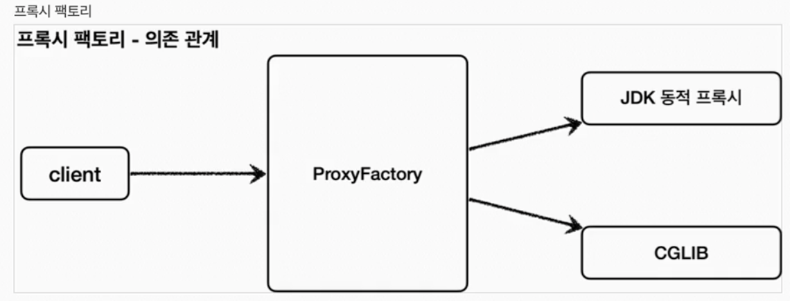
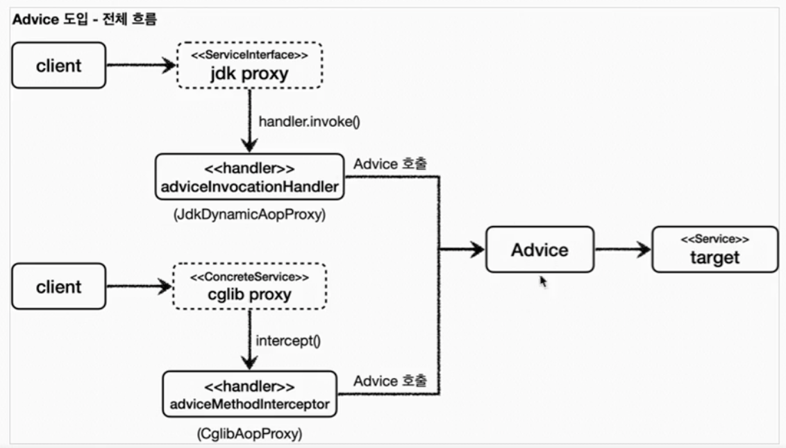
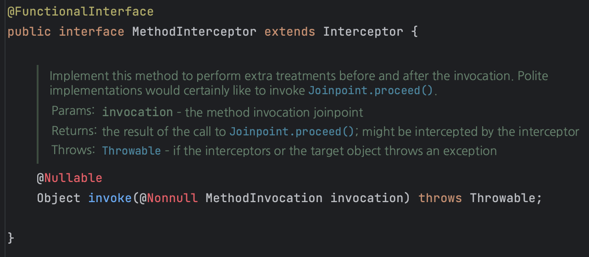

# 프록시 팩토리

JDK 동적 프록시는 인터페이스를 필요로 하며, CGLIB는 인터페이스가 없어도 사용할 수 있다. 그렇다면 경우에 따라 나누어 사용할 수 있는데, 둘 다 필요로 하는 경우에는 둘 다 구현해야 하나?라는 생각이 들 수 있다. 스프링에서는 동적 프록시를 통합해서 편리하게 만들어주는 ProxyFactory라는 기능을 제공하며, 이 팩토리로 두 방식을 모두 처리할 수 있다. 쉽게 말해 ProxyFactory는 인터페이스가 있으면 JDK를, 없으면 CGLIB를 내부적으로 선택한다. 또한 이 설정을 변경할 수도 있다. 그림으로 보면 아래와 같다.



JDK 동적 프록시 방식이던, CGLIB던 상관없이 모두 처리하기 위해 ProxyFactory에서는 Advice 개념을 도입한다. 결과적으로 InvocationHandler, MethodInterceptory와 상관 없이 안에서 advice를 호출하게 된다.



또한 특정 조건에 맞는 경우에 프록시 로직이 실행되게 하고 싶은 경우도 있다. 이 때는 Pointcut을 이용한다.

## Advice

프록시에 적용하는 부가 로직이며, MethodInterceptor와 InvocationHandler같은 역할이며, 둘을 추상화한 것이다. ProxyFactory를 사용하면 Advice를 이용하면 된다. 방법은 여러가지이지만, 기본적인 방법은 MethodInterceptor 인터페이스를 구현한다. 여기서 말하는 MethodInterceptor는 cglib의 MethodInterceptor가 아님을 주의하자.



package org.aopalliance.intercept에 정의되있는 MethodInterceptor이다.

아래 코드로 예시를 보자.

```java
@Slf4j
public class TimeAdvice implements MethodInterceptor {
    @Override
    public Object invoke(MethodInvocation invocation) throws Throwable {
        log.info("TimeProxy 실행");
        long startTime = System.currentTimeMillis();

        Object result = invocation.proceed();

        long endTime = System.currentTimeMillis();
        long resultTime = endTime - startTime;
        log.info("TimeProxy 종료 resultTime={}", resultTime);
        return result;
    }
}
```

프록시는 target을 요구하는데, 클래스에서 target이 보이지 않는다. invocation.proceed()를 통해 필요한 행위를 수행한다. ProxyFactory를 사용하면, target 정보를 미리 넘겨받는다. 하여 target이 더이상 필요없게 된다. 

아래 코드에서 ProxyFactory에 넘겨받는 코드를 확인할 수 있다.

```java
   	@Test
    void interfaceProxy() {
        ServiceInterface target = new ServiceImpl();
        ProxyFactory proxyFactory = new ProxyFactory(target);
        proxyFactory.addAdvice(new TimeAdvice());
        ServiceInterface proxy = (ServiceInterface) proxyFactory.getProxy();
        log.info("targetClass={}", target.getClass());
        log.info("proxyClass={}", proxy.getClass());

        proxy.save();

        assertThat(AopUtils.isAopProxy(proxy)).isTrue();
        assertThat(AopUtils.isJdkDynamicProxy(proxy)).isTrue();
        assertThat(AopUtils.isCglibProxy(proxy)).isFalse();
    }
```

사용할 target을 proxyFactory에 넘겨준다. ProxyFactory는 넘겨받은 정보를 기반으로 프록시를 생성한다. 이 때 넘겨받은 target이 인터페이스를 구현했다면 JDK 동적 프록시를, 아니라면 CGLIB를 사용하게 된다. 또한 proxyFactory.addAdvice를 통해 수행할 부가 로직도 넘겨준다. addAdvice는 MethodInterceptor, InvocationHandler와 동일한 역할을 한다고 보면 된다. 이를 통해 proxy의 로직을 수행하면, 넘겨받은 TimeAdvice의 로직을 수행하게 된다.
