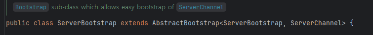
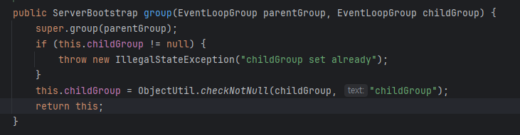
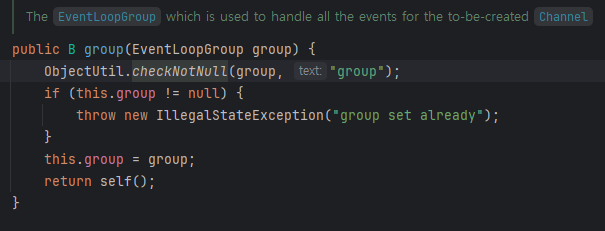
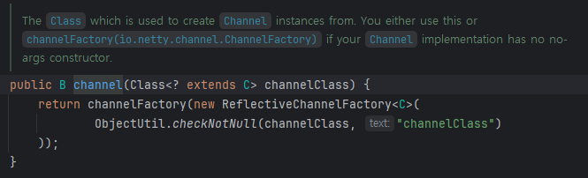
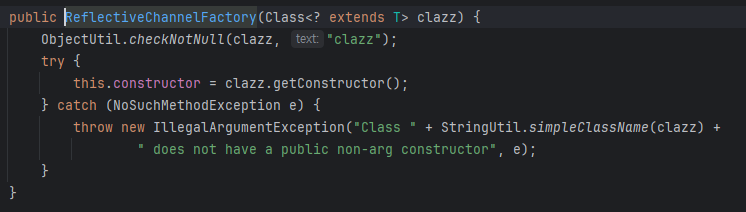
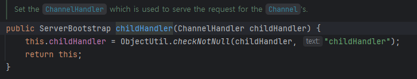
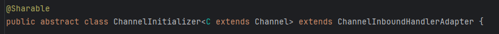
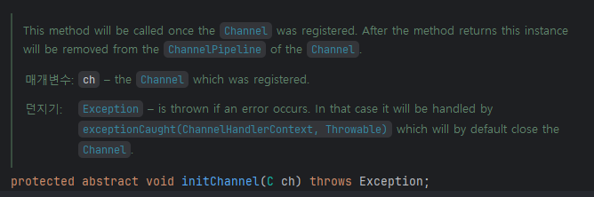
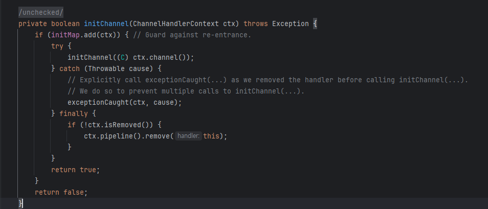
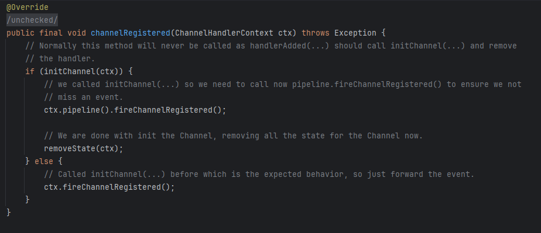

# Boss/Worker 생성 코드 까기

```java
package kks.proj.request.controller;

import io.netty.bootstrap.ServerBootstrap;
import io.netty.channel.Channel;
import io.netty.channel.ChannelFuture;
import io.netty.channel.ChannelInitializer;
import io.netty.channel.ChannelPipeline;
import io.netty.channel.EventLoopGroup;
import io.netty.channel.nio.NioEventLoopGroup;
import io.netty.channel.socket.nio.NioServerSocketChannel;
import io.netty.handler.codec.string.StringDecoder;
import io.netty.handler.codec.string.StringEncoder;
import jakarta.annotation.PreDestroy;
import org.slf4j.Logger;
import org.slf4j.LoggerFactory;
import org.springframework.web.bind.annotation.GetMapping;
import org.springframework.web.bind.annotation.RestController;

@RestController
public class NettyController {

    private static final Logger log = LoggerFactory.getLogger(NettyController.class);

    private final EventLoopGroup bossGroup = new NioEventLoopGroup(1);
    private final EventLoopGroup workerGroup = new NioEventLoopGroup();
    private ChannelFuture channelFuture;

    public NettyController() {
        log.info("NettyController instantiated. Boss and Worker groups created.");
    }

    @GetMapping("/start-netty")
    public String startNettyServer() {
        log.info("Attempting to start Netty server...");
        try {
            log.info("1. Creating ServerBootstrap.");
            ServerBootstrap b = new ServerBootstrap();

            log.info("2. Configuring ServerBootstrap with Boss and Worker groups.");
            b.group(bossGroup, workerGroup)
                .channel(NioServerSocketChannel.class)
                .childHandler(new ChannelInitializer<Channel>() {
                    @Override
                    protected void initChannel(Channel ch) throws Exception {
                        log.info("5. Initializing a new Channel.");
                        ChannelPipeline pipeline = ch.pipeline();
                        pipeline.addLast(new StringDecoder());
                        pipeline.addLast(new StringEncoder());
                        log.info("6. Channel's pipeline configured.");
                        // Add your custom handlers here
                    }
                });

            log.info("3. Binding server to port 8081.");
            // Bind and start to accept incoming connections.
            channelFuture = b.bind(8081).sync();
            log.info("4. Netty server started and listening on port 8081.");

            return "Netty server started on port 8081";

        } catch (InterruptedException e) {
            log.error("Failed to start Netty server", e);
            Thread.currentThread().interrupt();
            return "Failed to start Netty server: " + e.getMessage();
        }
    }

    @GetMapping("/stop-netty")
    public String stopNettyServer() {
        log.info("Attempting to stop Netty server...");
        if (channelFuture != null) {
            log.info("1. Closing server channel.");
            channelFuture.channel().close();
            channelFuture = null;
            log.info("2. Netty server channel closed.");
            return "Netty server stopped.";
        }
        log.warn("Netty server is not running, nothing to stop.");
        return "Netty server not running.";
    }

    @PreDestroy
    public void shutdown() {
        log.info("Shutdown hook triggered. Shutting down Netty server gracefully.");
        stopNettyServer();
        log.info("Shutting down Boss event loop group.");
        bossGroup.shutdownGracefully();
        log.info("Shutting down Worker event loop group.");
        workerGroup.shutdownGracefully();
        log.info("Netty server shutdown complete.");
    }
}

```

- b.group(bossGroup, workerGroup)
    
    
    
    
    
    - SeverBootstrap의 super.group을 호출 (AbstractBootstrap)
        
        
        
        - 간단하게 not null 검사만 하고 bossGroup을 설정해주는 듯
    - 이후 childGroup도 똑같이 세팅해준다
- .channel(NioServerSocketChannel.class)
    
    
    
    - channelFactory를 return하도록 한다
    - ReflectiveChannelFactory는 class 자체를 인자로 받는다 (이건 Java Reflection 사용하는 듯)
    
    
    
    - NioServerSocketChannel.class를 인자로 보냈기 때문에
    - NioServerSocketChannel을 그대로 return해준다
    - 그 말은 다른 ServerSocketChannel도 보낼 수 있다는 뜻

```java
.childHandler(new ChannelInitializer<Channel>() {
                    @Override
                    protected void initChannel(Channel ch) throws Exception {
                        log.info("5. Initializing a new Channel.");
                        ChannelPipeline pipeline = ch.pipeline();
                        pipeline.addLast(new StringDecoder());
                        pipeline.addLast(new StringEncoder());
                        log.info("6. Channel's pipeline configured.");
                        // Add your custom handlers here
                    }
                });
```



- ChannelHandler를 등록해주는 코드
    
    [ChannelHandler](channelhandler/README.md)
    
- ChannelInitializer
    
    
    
    - Channel이 EventLoop에 등록되면 쉽게 초기화할 수 있는 방법을 제공하는 ChannelInboundHandler
    - 지금 코드에서는 Child, 즉 Worker용 Handler를 설정하고 있지만 Boss용도 설정할 수 있다.
    - Initializer의 initChannel
        - 전반적으로 Initializer는 채널에 필요한 것들을 등록해주고 바로 사라지는 **`일회성`**
        
        
        
        - 사용자가 구현해야 하는 것
        - Channel이 등록될 때 사용되고 이후 ChannelPipeline에서 제거된다
            - 채널이 등록될 때마다 실행된다
            - 채널을 등록하고 나면 해당 로직은 필요없기 때문에 Pipeline에서 제거하는 듯 하다
            - Channel 생애주기에 일회성인 듯
        - 실제로 호출되는 놈은 이놈 같은데.. 뭐지?
            
            
            
            - 이미 초기화되어있는지 확인하고 channel 등록해주는게 끝인 듯
    - initChannel(C ch)가 호출되면 바로 registered를 호출
        
        
        
    
    ```java
    [새 클라이언트 연결]
            ↓
    [Boss Thread: accept()]
            ↓
    [Worker에 Channel 할당]
            ↓
    [EventLoop에 등록]
            ↓
    [handlerAdded() 호출]  ← ChannelInitializer
            ↓
    [initChannel() 실행]   ← 사용자 구현 메서드
            ↓
    [Pipeline에 Handler들 추가]
            ↓
    [ChannelInitializer 제거]  ← 자동으로 제거됨!
            ↓
    [channelRegistered() 이벤트 전파]
            ↓
    [Channel 준비 완료]
    ```
    
- ChannelPipeline pipeline = ch.pipeline();
    - 공식문서 보니 handler 추가에 관련한 메서드와, 기타 정보를 얻는 것에 대한 메서드들만 나열
    - 채널이 만들어지면 파이프라인을 생성해서 뒤에다가 Handler를 붙여준다
    - Pipeline은 Handler들의 chain (링크드리스트일 듯)
    - [Channel] → [Pipeline] → [Handler1] → [Handler2] → [Handler3] → ...
    
    ```java
    pipeline.addLast("decoder", new StringDecoder());
    pipeline.addLast("encoder", new StringEncoder());
    pipeline.addLast("business", new MyBusinessHandler());
    ```
    
    - 이 파이프라인의 경우 decoder → encoder → business로 실행되는 것
    - 이벤트 흐름
        
        ```java
        class EventFlow {
            
            public void flowDiagram() {
                /*
                                            I/O Request
                                       via Channel or Context
                                                |
                +-------------------------------+---------------------------+
                |               ChannelPipeline                             |
                |                                                           |
                |   Inbound (↑ 위로)              Outbound (↓ 아래로)       |
                |                                                           |
                |   [Inbound Handler N]           [Outbound Handler 1]     |
                |           ↑                              ↓                |
                |   [Inbound Handler N-1]         [Outbound Handler 2]     |
                |           ↑                              ↓                |
                |   [Inbound Handler 2]           [Outbound Handler M-1]   |
                |           ↑                              ↓                |
                |   [Inbound Handler 1]           [Outbound Handler M]     |
                |           ↑                              ↓                |
                +-----------|------------------------------|----------------+
                            |                              |
                +-----------|-----------------------------|----------------+
                |    [ Socket.read() ]          [ Socket.write() ]         |
                |                                                           |
                |       Netty Internal I/O Threads                          |
                +-----------------------------------------------------------+
                
                핵심 규칙:
                1. Inbound: 아래에서 위로 (1 → 2 → ... → N)
                2. Outbound: 위에서 아래로 (1 → 2 → ... → M)
                */
            }
        }
        ```
        
    - 한 가지 예시
        
        ```java
                // Decoder/Encoder는 EventLoop에서 실행 (빠름)
                pipeline.addLast("decoder", new MyProtocolDecoder());
                pipeline.addLast("encoder", new MyProtocolEncoder());
                
                // Business Handler는 별도 스레드풀에서 실행 (블로킹 작업 가능)
                pipeline.addLast(businessExecutor, "handler", 
                                new MyBusinessLogicHandler());
        ```
        
        - 이렇게 블로킹 작업을 별도의 스레드풀에서 실행할 수도 있게 한다 (병렬)

```java
/**
 * 7. 코드에서 Selector 관련 부분 추적
 * ====================================
 */
class SelectorInCode {
    
    public String startNettyServer() {
        log.info("Attempting to start Netty server...");
        
        try {
            ServerBootstrap b = new ServerBootstrap();
            
            b.group(bossGroup, workerGroup)  // EventLoopGroup 설정
             .channel(NioServerSocketChannel.class)
             .childHandler(new ChannelInitializer<Channel>() {
                 @Override
                 protected void initChannel(Channel ch) throws Exception {
                     ChannelPipeline pipeline = ch.pipeline();
                     pipeline.addLast(new StringDecoder());
                     pipeline.addLast(new StringEncoder());
                 }
             });
            
            // ⭐⭐⭐ 여기서 Boss Selector 생성 및 시작! ⭐⭐⭐
            channelFuture = b.bind(8081).sync();
            
            /*
            bind(8081) 내부에서 일어나는 일:
            
            1. Boss EventLoopGroup.next() 호출
               → Boss EventLoop 선택 (보통 1개뿐)
            
            2. Boss EventLoop 스레드 시작
               → new Thread(eventLoop).start()
            
            3. NioEventLoop.run() 실행 시작
               → Selector selector = Selector.open() ← 생성!
               → while(true) { selector.select(); ... } ← 시작!
            
            4. ServerSocketChannel 생성 및 등록
               → serverChannel.register(selector, OP_ACCEPT)
            
            5. 포트 8081 바인딩
               → serverChannel.bind(8081)
            
            이제 Boss Selector가 accept 이벤트를 계속 감지 중!
            */
            
            log.info("Netty server started and listening on port 8081.");
            return "Netty server started on port 8081";
            
        } catch (InterruptedException e) {
            log.error("Failed to start Netty server", e);
            Thread.currentThread().interrupt();
            return "Failed to start Netty server: " + e.getMessage();
        }
    }
    
    /*
    이 메서드가 return 한 후에도:
    - Boss Selector는 백그라운드에서 계속 실행 중
    - while(true) { selector.select(); ... }
    - 새 연결을 계속 감지 중
    
    클라이언트 연결 시:
    - Boss Selector.select() 반환
    - Worker에 할당
    - Worker Selector 생성 및 시작
    - Worker Selector가 READ/WRITE 이벤트 감지
    */
}
```
