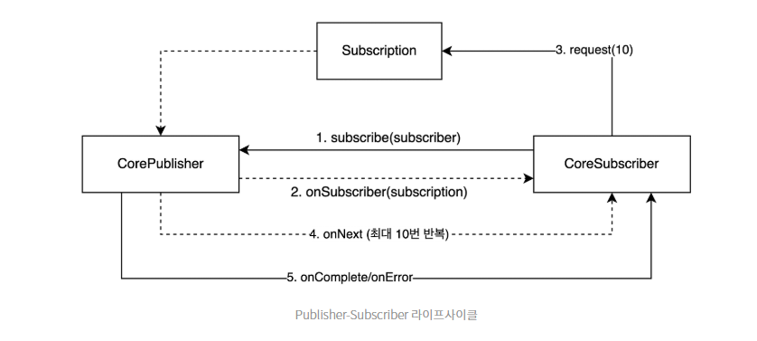

# Mono

# Publisher

```java
public interface Publisher<T> {

    /**
     * {@link Publisher}에게 데이터 스트리밍을 시작하도록 요청합니다.
     * <p>
     * 이것은 "팩토리 메서드"이며 여러 번 호출될 수 있고, 매번 새로운 {@link Subscription}을 시작합니다.
     * <p>
     * 각 {@link Subscription}은 단 하나의 {@link Subscriber}에 대해서만 작동합니다.
     * <p>
     * {@link Subscriber}는 단일 {@link Publisher}에 단 한 번만 구독해야 합니다.
     * <p>
     * {@link Publisher}가 구독 시도를 거부하거나 실패할 경우,
     * {@link Subscriber#onError(Throwable)}를 통해 에러를 신호로 보냅니다.
     *
     * @param s 이 {@link Publisher}로부터 신호를 소비할 {@link Subscriber}
     */
    public void subscribe(Subscriber<? super T> s);
}
```

- 데이터를 발행하는 주체
- subscribe()를 통해 구독 시작
- 하나의 구독은 하나의 구독자만 가진다
- Subscriber 인스턴스를 넘기며 구독을 요청한

# CorePublisher

```java
public interface CorePublisher<T> extends Publisher<T> {

    /**
     * {@link Hooks#onLastOperator(Function)} 포인트컷을 우회하는
     * 내부용 {@link Publisher#subscribe(Subscriber)}입니다.
     * <p>
     * {@link Publisher#subscribe(Subscriber)}가 예상하는 대로 제어된 방식으로
     * 동작하는 것 외에도, 구독 시점에 직접 {@link Context}를 전달하는 것을 지원합니다.
     *
     * @param subscriber 발행된 시퀀스에 관심이 있는 {@link Subscriber}
     * @see Publisher#subscribe(Subscriber)
     */
    void subscribe(CoreSubscriber<? super T> subscriber);
```

- Hooks의 포인트 컷을 우회한다는 것은 뭘까..
- Reactor 내부 최적화를 위한 인터페이스? 모르겠다.

# Subscriber

```java
/**
 * {@link Publisher#subscribe(Subscriber)}에 {@link Subscriber} 인스턴스를 전달한 후
 * {@link #onSubscribe(Subscription)}가 한 번 호출됩니다.
 * <p>
 * {@link Subscription#request(long)}가 호출될 때까지 더 이상의 알림은 수신되지 않습니다.
 * <p>
 * 수요(demand)를 신호한 후:
 * <ul>
 * <li>{@link Subscription#request(long)}로 정의된 최대 개수까지 {@link #onNext(Object)}가 한 번 이상 호출됩니다</li>
 * <li>{@link #onError(Throwable)} 또는 {@link Subscriber#onComplete()}가 단 한 번 호출되며, 
 * 이는 종료 상태를 나타내고 이후 더 이상의 이벤트는 전송되지 않습니다.</li>
 * </ul>
 * <p>
 * {@link Subscriber} 인스턴스가 더 많은 처리를 할 수 있을 때마다 
 * {@link Subscription#request(long)}를 통해 수요를 신호할 수 있습니다.
 *
 * @param <T> 신호로 전달되는 요소의 타입
 */
public interface Subscriber<T> {

    /**
     * {@link Publisher#subscribe(Subscriber)} 호출 후 실행됩니다.
     * <p>
     * {@link Subscription#request(long)}가 호출될 때까지 데이터 흐름이 시작되지 않습니다.
     * <p>
     * 더 많은 데이터가 필요할 때마다 {@link Subscription#request(long)}를 호출하는 것은
     * 이 {@link Subscriber} 인스턴스의 책임입니다.
     * <p>
     * {@link Publisher}는 {@link Subscription#request(long)}에 대한 응답으로만 알림을 보냅니다.
     * 
     * @param s {@link Subscription#request(long)}를 통해 데이터를 요청할 수 있는 {@link Subscription}
     */
    public void onSubscribe(Subscription s);

    /**
     * {@link Subscription#request(long)} 요청에 대한 응답으로 
     * {@link Publisher}가 보낸 데이터 알림입니다.
     * 
     * @param t 신호로 전달된 요소
     */
    public void onNext(T t);

    /**
     * 실패한 종료 상태입니다.
     * <p>
     * {@link Subscription#request(long)}를 다시 호출하더라도 더 이상의 이벤트는 전송되지 않습니다.
     *
     * @param t 신호로 전달된 예외
     */
    public void onError(Throwable t);

    /**
     * 성공한 종료 상태입니다.
     * <p>
     * {@link Subscription#request(long)}를 다시 호출하더라도 더 이상의 이벤트는 전송되지 않습니다.
     */
    public void onComplete();
}
```

- onSubscribe()로 구독 시작
- request() : 백프레셔(요청한 만큼만)
- onNext() : 요청한 만큼 데이터를 받음(0~N)번

# Lifecycle



#
