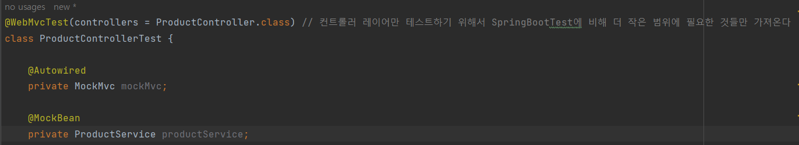

# 강의 5일차

태그: Presentation Layer

# Presentation Layer

- 외부 세계의 요청을 가장 먼저 받는 계층
- 파라미터에 대한 최소한의 검증을 수행
    
    <aside>
    🧐 Controller test
    
    </aside>
    

# Mock

- 테스트하기 위해서 준비해야 하는게 너무 많다.
- 테스트를 **“가짜”**로 처리하고 싶다.
- 테스트 작성을 위한 환경 구축이 어렵거나, 테스트가 의존적인 경우 필요

## MockMvc

- Mock 객체를 사용하여 Spring MVC를 테스트

# 요구사항

- 관리자 페이지에서 신규 상품을 등록할 수 있다.
- 상품명, 상품 타입, 판매 상태, 가격 등을 입력받는다.

## @Transactional(readOnly = true)

- 읽기 전용
- CRUD에서 CUD 동작 x, only Read
- JPA : CUD 스냅샷 저장, 변경감지 x (성능 향상)
- CQRS - Command / Query를 분리하자.
    - 왜? Read가 압도적으로 많기 때문에.

### 추천

- 서비스 상단에 readOnly = true
- CUD 작업이 있다면 메서드에 transactional 따로

# Controller Test



- MockBean
    - 컨테이너에 Mockito로 만든 Mock 객체를 넣어주는 역할
    - 없다면 예외 발생

```java
mockMvc.perform(
                MockMvcRequestBuilders.post("/api/v1/products/new")
                        .content(objectMapper.writeValueAsString(request))
                        .contentType(MediaType.APPLICATION_JSON)
                )
                .andDo(print())
                .andExpect(MockMvcResultMatchers.status().isOk());
```

- mockMvc.perform 메서드를 열어서
- **MockMvcRequestBuilders**로 요청에 대한 end-point를 작성하고
- requestbody에 들어온 것을 직렬화, 역직렬화 하기 위해 objectMapper로 이용
- contentType을 설정해준다.
- andDo안에 있는 print() 메서드
    - MockMvcResultHandlers의 static 메서드로, 세부적인 내용을 담아주고
- andExpect로 예상되는 결과를 넣어준 것.

### Validation 검증 간 NotBlank, NotNull, NotEmpty

- NotEmpty
    - 공백은 통과
- NotBlank
    - 아무것도  통과하지 못함
- NotNull
    - null만 아니면 통과

### 패키지 의존 분리

- Controller에서 request를 Service로 보내서 request를 그대로 사용하는 경우
    - Service가 Dto를 알고 있어야 하는 경우임.
- 상위는 하위를 알아야 되나 하위는 상위를 알 필요가 없다.
    - 그렇다면 똑같은 Request를 Service에도 만들어, Controller에서 처리한 검증을 제외하고
    - Service에서 따로 사용하게 하면 **의존성을 없앨 수 있다**.

# 추가로 알아두어야 할 것

- Layered Architecture
- Hexagonal Architecture
    - 의존성을 domain을 향해서.
    - 서비스가 너무 커져버렸는데, Jpa를 사용하고 싶지 않다.
    - 그럴 때 Layered Architecture 같은 경우 Jpa와 너무 강결합이기 때문에 쉽지 않다.
- Optimistic Lock, Pessimistic Lock
- CQRS
