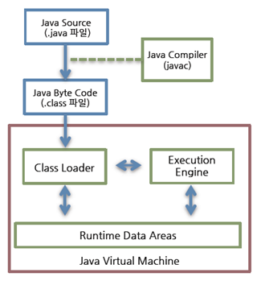

# JVM 자세한 설명 (1)

---

- 단 여기 설명은 구버전 설명
    - 현재는 인터프리터가 거의 안쓰이나??
    - 옛날에는 한 줄씩 읽는게 맞았는데 지금은 MG, JIT가 뚝딱뚝딱 OS에 맞게 번역시켜놓고 쓰이는 것 같음.
        - JIT는 여전히 인터프리터와 같이 진행. MG에 같이 들어있나??

## JVM의 특징

- 스택 기반의 가상 머신
    - 인텔 x86, ARM 아키텍쳐와 같은 하드웨어는 레지스터 기반으로 동작하나 JVM은 스택 기반(메모리 기반)으로 동작한다.
- Symbolic Reference
- Garbage Collection
- 기본 자료형을 명확하게 정의하여 플랫폼 독립성 보장
- network byte order
- JVM 자체는 platform dependent. 즉 플랫폼 의존적.

# 클래스 파일 포맷

- Java는 보통 메서드 크기가 65535바이트를 넘을 수 없음.
    - JVM 명세 자체의 제한
        - 이거때문에 사람들 욕 많이하는듯.
        - java bytecode의 goto와 jsr 명령어를 사용해서 넘어갈 수도 있지 않을까?
            - 이것도 안된답니다. 클래스 파일 포맷 제한이 상당하다네요.
            - 클래스 파일 포맷의 자세한것들은 D2에서 참고.
- JVM 클래스 파일 검증과정 수행은 TCK(Technology Compatibility Kit)를 통해 확인해보세요.

# JVM 구조

- 수행과정 간단하게 살펴보자
    1. 클래스로더가 컴파일된 자바코드 runtime data area에 로드
    2. 실행 엔진이 자바 바이트코드를 실행.

## 클래스 로더

- 자바는 동적 load, 즉 런타임에 클래스 처음 참조시에 해당 클래스를 로드하고 링크. 이 역할을 클래스 로더가 해준다.
    - 계층 구조: 클래스 로더끼리 부모-자식 관계를 이루어 계층 구조로 생성된다. 최상위 클래스 로더는 부트스트랩 클래스 로더(Bootstrap Class Loader)이다.
    - 위임 모델: 계층 구조를 바탕으로 클래스 로더끼리 로드를 위임하는 구조로 동작한다. 클래스를 로드할 때 먼저 상위 클래스 로더를 확인하여 상위 클래스 로더에 있다면 해당 클래스를 사용하고, 없다면 로드를 요청받은 클래스 로더가 클래스를 로드한다.
    - 가시성(visibility) 제한: 하위 클래스 로더는 상위 클래스 로더의 클래스를 찾을 수 있지만, 상위 클래스 로더는 하위 클래스 로더의 클래스를 찾을 수 없다.
    - 언로드 불가: 클래스 로더는 클래스를 로드할 수는 있지만 언로드할 수는 없다. 언로드 대신, 현재 클래스 로더를 삭제하고 아예 새로운 클래스 로더를 생성하는 방법을 사용할 수 있다.
- 각 클래스로더는 로드된 클래스를 보관하는 namespace를 가짐.
- 클래스 로드시 이미 로드된 클래스인지 확인하기 위해 namespace에 보관된 FQCN(Fully Qualified Class Name)을 기준으로 클래스를 찾음.
    - FQCN이 같아도 namespace 다르면, 즉 다른 클래스로더가 로드한 경우 다른 클래스로 간주.

### 클래스로더 종류

- 부트스트랩 클래스 로더
    - JVM을 기동할 때 생성되며, Object 클래스들을 비롯하여 자바 API들을 로드한다. 다른 클래스 로더와 달리 자바가 아니라 네이티브 코드로 구현되어 있다.
- 익스텐션 클래스 로더(Extension Class Loader)
    - 기본 자바 API를 제외한 확장 클래스들을 로드한다. 다양한 보안 확장 기능 등을 여기에서 로드하게 된다.
- 시스템 클래스 로더(System Class Loader)
    - 부트스트랩 클래스 로더와 익스텐션 클래스 로더가 JVM 자체의 구성 요소들을 로드하는 것이라 한다면, 시스템 클래스 로더는 애플리케이션의 클래스들을 로드한다고 할 수 있다. 사용자가 지정한 $CLASSPATH 내의 클래스들을 로드한다.
- 사용자 정의 클래스 로더(User-Defined Class Loader): 애플리케이션 사용자가 직접 코드 상에서 생성해서 사용하는 클래스 로더이다.

## 실행 엔진

- java bytecode를 명령어 단위로 읽어서 실행.
    - 이때 얘는 기계가 바로 수행할 수 있는 언어보다는 비교적 인간이 보기 편한 형태로 기술된 것.
    - 이걸 읽어들이는 방식 2가지가 있음.
1. 인터프리터
    1. byte code 명령어를 하나씩 읽어서 해석하고 실행. 바이트코드 하나하나의 해석은 빠르나, interpreting 결과의 실행은 느리다.
    2. 즉, 바이트코드라는 언어는 기본적으로 인터프리터 방식으로 동작.
        1. 왜 이렇게 작동할까?
            1. 컴파일러로 native code로 한꺼번에 변환시키면 편할텐데
            2. 인터프리터로 변환과 동시에 결과값을 반환함으로서 platform independent해지기 때문.
            3. platform 독립적인 java bytecode로 컴파일 한 뒤에, JVM을 통해 OS에 이를 이해시켜줌.
2. JIT Compiler
    1. 자주 쓰이는 메소드 JVM에서 판단해서 JIT로 native code 변환.
        1. 이후에는 인터프리팅 안하고 네이티브 코드로 직접 실행한다.
        - 자주쓰이는 애를 어떻게 판단하느냐?
            - invocation count가 0에 도달했을 때.
                - 사전에 정의된 compilation threshold value에서 호출할 때마다 하나씩 빼준다.
    2. JIT 컴파일러가 컴파일하는 과정은 바이트코드를 하나씩 인터프리팅하는 것보다 훨씬 오래 걸림.
        1. 따라서 한번만 실행되는 코드면 컴파일 안하고 인터프리팅하는것이 유리.

### 현재

## 참고

[NAVER D2](https://d2.naver.com/helloworld/1230)

[How Java achieve Platform Independency](https://medium.com/javarevisited/java-platform-independency-2dddd92a53f8)

[How does the JVM decided to JIT-compile a method (categorize a method as "hot")?](https://stackoverflow.com/questions/35601841/how-does-the-jvm-decided-to-jit-compile-a-method-categorize-a-method-as-hot)
