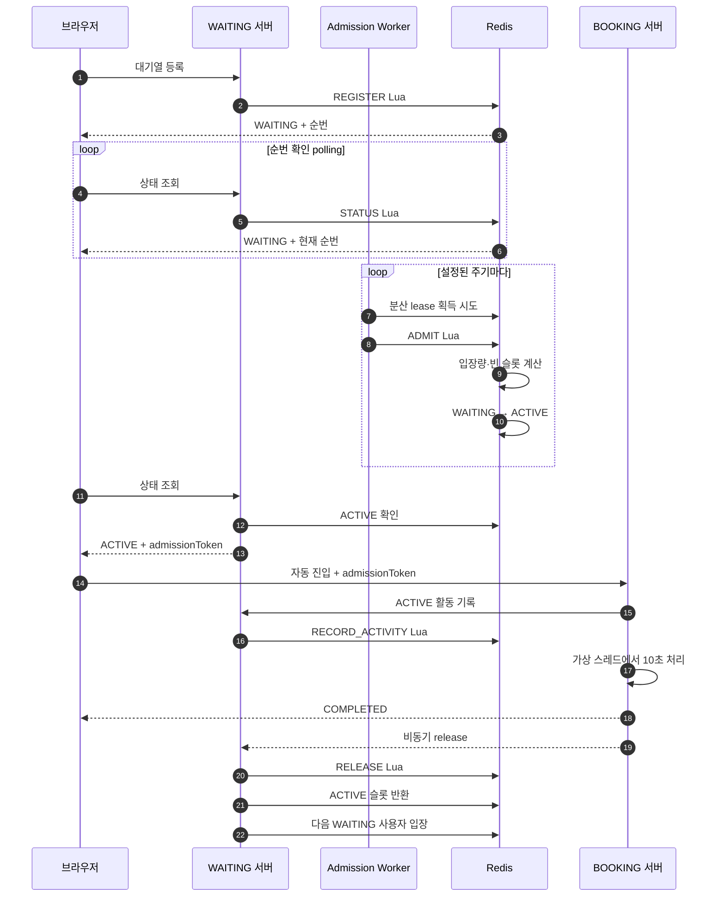

# Ticket Waiting Queue

티켓 예매 서버가 감당할 수 있는 범위만 사용자를 입장시키기 위한 Redis 기반 대기열이다. WAITING 서버는 순번과 입장 상태를 관리하고, BOOKING 서버는 ACTIVE 권한을 받은 요청만 처리한다.

## 1. 아키텍처



### 컴포넌트 역할

| 컴포넌트 | 역할 |
|---|---|
| 브라우저 | 대기열 등록, 순번 polling, ACTIVE 감지 후 BOOKING 자동 진입 |
| WAITING 서버 | 대기열 API, Admission Worker, 토큰 발급, 슬롯 반환 처리 |
| Redis | 모든 분산 서버가 공유하는 WAITING·ACTIVE 상태와 입장량 저장 |
| Admission Worker | 입장 가능한 인원을 계산하고 FIFO 순서로 ACTIVE 전환 |
| BOOKING 서버 | admissionToken 검증, 테스트용 10초 처리, 완료 후 비동기 슬롯 반환 |

WAITING 서버가 여러 대이더라도 사용자 상태는 Redis에 저장한다. Admission Worker 또한 모든 서버에서 실행되지만 이벤트별 분산 lease를 획득한 서버만 해당 시점의 ADMIT 작업을 수행한다.

## 2. 기술 선택

### 2.1 대기열: Redis

이 시스템의 대기열은 메시지를 한 번 소비하는 구조가 아니라 다음 상태를 반복해서 조회하고 변경하는 공유 상태다.

- 사용자의 정확한 현재 순번
- WAITING과 ACTIVE 상태
- 대기열과 ACTIVE 영역의 크기
- 초당 입장 가능 인원
- 사용자별 만료 시각
- 중복 등록과 중복 처리 여부

Redis는 Sorted Set과 Lua를 통해 이 요구사항을 한 저장소에서 처리할 수 있다.

| 후보 | 장점 | 이 대기열에서의 한계 |
|---|---|---|
| 서버 로컬 메모리 | 가장 단순하고 빠름 | 서버별 상태가 달라지고 장애·재시작 시 유실됨 |
| RDBMS | 영속성과 트랜잭션 제공 | 대량 순번 조회와 잦은 상태 변경에서 락 경합과 DB 부하가 커짐 |
| Kafka | 높은 처리량, 내구성 있는 이벤트 로그, 재처리 | 현재 순번·ACTIVE 수·중복 상태를 즉시 조회하기 어려워 별도 상태 저장소가 필요함 |
| RabbitMQ 등 메시지 큐 | 비동기 작업 전달과 소비자 부하 조절에 적합 | 메시지 소비 중심이므로 사용자별 현재 순번과 상태 조회에 적합하지 않음 |
| Redis | 빠른 상태 조회, Sorted Set 순위, 원자적 Lua, 분산 서버 공유 | 메모리 용량 관리가 필요하고 긴 Lua 실행은 Redis 전체 요청을 지연시킬 수 있음 |

따라서 현재 상태를 빠르게 조회·변경해야 하는 대기열에는 Redis를 사용한다. 예매 완료 이벤트처럼 재처리와 전달 보장이 중요한 비동기 통신은 Kafka 같은 메시지 큐를 사용하는 것이 적합하다.

#### Redis 자료구조

| 데이터 | 자료구조 | 저장 내용 |
|---|---|---|
| WAITING | ZSET | score에 증가하는 sequence를 저장하여 FIFO 유지 |
| WAITING lastSeen | ZSET | score에 마지막 상태 조회 시각 저장 |
| ACTIVE | ZSET | score에 ACTIVE 만료 시각 저장 |
| 사용자 상태 | HASH | 사용자별 `WAITING` 또는 `ACTIVE` |
| 사용자 sequence | HASH | 재등록·이전 입장 권한 구분 |
| ACTIVE 시작·마지막 요청 | HASH | 유휴 만료와 절대 사용 시간 계산 |
| Admission budget | HASH | 현재 tokens와 마지막 충전 시각 |
| Worker lease | STRING | 해당 시점에 Admission을 실행할 서버 선택 |

FIFO score에는 timestamp 대신 Redis `INCR`로 발급한 sequence를 사용한다. 동일 밀리초에 여러 요청이 들어와도 score가 충돌하지 않고 완전한 순서를 만들 수 있기 때문이다.

### 2.2 WebFlux

WAITING 서버는 대규모 등록 요청과 브라우저 상태 polling처럼 Redis I/O를 기다리는 요청이 많다. 요청마다 플랫폼 스레드를 점유하지 않도록 Spring WebFlux와 Reactive Redis를 사용한다.

```text
HTTP 요청
→ Mono 파이프라인 생성
→ Reactive Redis 요청
→ 스레드를 점유하지 않고 Redis 응답 대기
→ 결과 변환
→ HTTP 응답
```

`Mono<T>`는 최대 한 개의 결과 또는 에러를 비동기로 전달한다.

- `map`: 현재 값을 다른 일반 값으로 변환한다.
- `flatMap`: 현재 값을 이용해 다음 `Mono` 작업을 연결한다.
- `Mono.error`: 파이프라인에 오류를 전달한다.
- WebFlux가 Controller에서 반환된 `Mono`를 구독하고 응답을 완성한다.

WebFlux는 Redis의 처리 성능 자체를 높이지 않는다. 많은 요청이 Redis 응답을 기다리는 동안 WAITING 서버의 스레드 점유를 줄이는 역할이다. Lua가 너무 오래 실행되면 Redis가 병목이 되므로 Lua의 반복 명령과 배치 크기는 별도로 관리해야 한다.

BOOKING 서버는 현재 테스트에서 요청 하나가 10초 동안 대기하는 단순한 동기 흐름이므로 Spring MVC와 Java 가상 스레드를 사용한다.

## 3. 대기열 작동 방식

### 3.1 대기열 등록

브라우저가 WAITING 서버의 등록 API를 호출한다.

```text
POST /api/v1/waiting-events/{eventId}/queue
```

REGISTER Lua는 다음 작업을 원자적으로 처리한다.

1. 이벤트 존재 여부와 OPEN 상태를 확인한다.
2. 기존 ACTIVE 사용자라면 현재 ACTIVE 상태를 반환한다.
3. 기존 WAITING 사용자라면 기존 위치를 제거한다.
4. 대기열 상한을 확인한다.
5. `INCR`로 새로운 sequence를 발급한다.
6. WAITING ZSET과 lastSeen ZSET에 사용자를 추가한다.
7. WAITING 상태와 현재 순번을 반환한다.

WAITING 상태에서 등록 API를 다시 호출하면 새로운 sequence를 받아 대기열 마지막으로 이동한다. 별도의 pageSessionId는 사용하지 않는다.

### 3.2 순번 확인

브라우저는 상태 API를 주기적으로 호출한다.

```text
GET /api/v1/waiting-events/{eventId}/queue/status
```

STATUS Lua는 `ZRANK`로 사용자의 0-based rank를 구한다. 응답에서는 `rank + 1`을 사용자 순번으로 표시하며, 동시에 WAITING lastSeen을 갱신한다.

브라우저 polling은 현재 위치에 따라 간격을 조절하고 jitter를 추가하여 같은 시점에 요청이 몰리는 현상을 완화한다. 일정 시간 동안 상태 조회가 없는 WAITING 사용자는 연결이 끊어진 것으로 판단하여 제거한다.

### 3.3 입장 허용

Admission Worker는 설정된 주기마다 열린 이벤트를 조회한다. 이벤트별 lease를 획득한 Worker만 ADMIT Lua를 실행한다.

입장 인원은 다음 값 중 최솟값이다.

```text
입장 인원 = min(
    현재 admission tokens,
    maxActiveUsers - 현재 ACTIVE 인원,
    admissionBatchSize
)
```

`admission-budget`은 여러 서버와 여러 실행 회차가 공유하는 토큰 버킷이다. 예를 들어 초당 입장량이 100명이면 시간 경과에 따라 초당 최대 100개의 토큰이 충전된다.

ADMIT Lua는 `ZPOPMIN`으로 WAITING 선두 사용자를 한 번에 추출하고 ACTIVE 상태를 일괄 기록한다. 따라서 입장 순서와 ACTIVE 슬롯 제한, 토큰 차감이 하나의 원자적 작업으로 처리된다.

### 3.4 BOOKING 자동 진입

브라우저의 다음 상태 polling에서 ACTIVE와 admissionToken을 받으면 사용자 조작 없이 BOOKING API를 자동 호출한다. 서버 push 방식이 아니므로 실제 이동 시점은 ACTIVE 전환 후 다음 polling 시점이다.

BOOKING 서버는 토큰을 확인한 뒤 WAITING 서버에 활동 기록을 요청한다. 이 요청이 유효해야 예매 처리를 시작한다. 단순 상태 polling은 ACTIVE 시간을 연장하지 않는다.

ACTIVE 만료 시각은 다음 두 조건 중 빠른 시각이다.

```text
min(
    최초 ACTIVE 시각 + 절대 사용 시간,
    마지막 실제 요청 시각 + 유휴 허용 시간
)
```

### 3.5 완료와 슬롯 반환

현재 BOOKING 테스트는 가상 스레드에서 10초간 대기한 뒤 성공한 것으로 처리한다. 완료 후 WAITING 서버의 release API를 비동기로 호출한다.

RELEASE Lua는 ACTIVE 상태와 sequence가 일치하는지 확인한 뒤 사용자의 ACTIVE 데이터를 제거한다. 반환된 슬롯에는 `admitNow()`를 통해 다음 WAITING 사용자를 즉시 입장시킨다.

실제 운영에서는 BOOKING 서버가 완료 이벤트를 메시지 큐에 발행하고 WAITING 측 소비자가 슬롯을 반환하는 방식으로 대체할 수 있다.

### 3.6 이탈과 만료

| 상황 | 처리 |
|---|---|
| WAITING 브라우저 종료 | 상태 polling이 중단되고 유휴 제한 이후 대기열에서 제거 |
| WAITING에서 새로고침 | 등록 API가 다시 실행되어 대기열 마지막으로 이동 |
| ACTIVE 상태 조회만 반복 | ACTIVE 시간은 연장되지 않음 |
| ACTIVE 후 BOOKING 미진입 | 유휴 제한 이후 ACTIVE 슬롯 반환 |
| BOOKING 요청 수행 | 실제 요청 시 ACTIVE 유효 시간 갱신 |
| ACTIVE 절대 시간 초과 | 활동 여부와 관계없이 슬롯 반환 |
| BOOKING 완료 | 비동기 release 후 슬롯 즉시 반환 |
